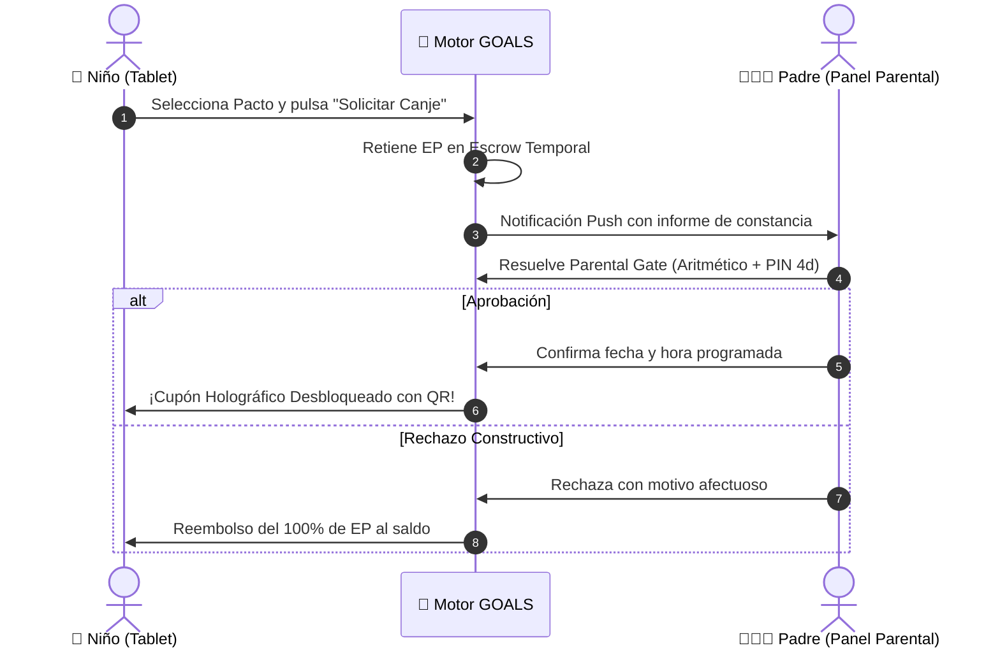

# 🚀 ESPECIFICACIÓN CANÓNICA: SISTEMA DE GAMIFICACIÓN ÉTICA DE GOALS Y MINIAPP CRITERIO
**Documento Canónico de Arquitectura, Psicometría, Economía Virtual y Especificación de Producto (SSOT 2026)**  
**Ecosistema:** GOALS Educational Platform (`GoalsKid`, React 18.3.1 + TypeScript 5.4.5 + Vite + TailwindCSS 3.4)  
**Ubicación:** `.agents/plan/01_gamificacion_criterio_spec.md`  
**Fecha:** Agosto 2026 • **Estado:** `🟢 CANÓNICO / LISTO PARA PRODUCCIÓN`

---

# ÍNDICE GENERAL
1. **SECCIÓN I: ECOSISTEMA DE GAMIFICACIÓN ÉTICA Y META-PROGRESIÓN DE GOALS**
   - 1.1 Principios Rectores y Matriz de Regulación Ética (White Hat vs Black Hat)
   - 1.2 "The Master Key" (GOALS School como Reactor de 15 Minutos)
   - 1.3 Las 5 Monedas de Dominio y la Economía Dual (*Cosmetic XP* vs *Effort Points*)
   - 1.4 Fórmulas Matemáticas de XP, Entropía de Shannon ($\Phi_{\text{harmony}}$), Curvas de Nivel, IRT 2PL y ELO Dialéctico
   - 1.5 Los 10 Rangos Cósmicos (Tiers I a X, Niveles 1 a 100 y Umbrales Exactos)
   - 1.6 Avatar Modular Evolutivo (Visual Rig de 5 Ranuras)
   - 1.7 Insignias de Sinergia Cruzada Multi-App (*Cross-App Synergy Badges*)
   - 1.8 Psicología del Desarrollo y Calibración en 3 Franjas de Edad (6–8a, 9–11a, 12–15a)
   - 1.9 Pactos Familiares, Recompensas del Mundo Real y Safe-Social Gaming
   - 1.10 Contratos TypeScript de Gamificación Listos para Producción
2. **SECCIÓN II: ESPECIFICACIÓN DE PRODUCTO DE LA MINIAPP CRITERIO**
   - 2.1 Identidad, Propuesta de Valor y Rol como App Gratuita de Reclamo (*Lead Magnet*)
   - 2.2 Qué Enseña Criterio: Sesgos, Falacias, Método Elenchus, Verificación Lateral y OSINT Infantil
   - 2.3 Estructura de Contenidos: 12 Módulos Didácticos, 35 Unidades Curriculares y 10 Laboratorios Forenses
   - 2.4 Tipología de Ejercicios y Experiencias Interactivas
   - 2.5 Flujos de Usuario Principales (*User Journeys*)
   - 2.6 Arquitectura de Inteligencia Artificial y Laboratorio MATIZA
   - 2.7 Sistema de Diseño y UI/UX de Criterio
   - 2.8 Contratos TypeScript de Criterio Listos para Producción
3. **SECCIÓN III: MATRIZ DE DEMARCACIÓN — QUÉ PIEZAS DE CRITERIO REQUIEREN GAMIFICACIÓN Y CUÁLES NO**
   - 3.1 Componentes Gamificados
   - 3.2 Componentes No Gamificados (Sobrios y Forenses)
   - 3.3 Justificación Neuroeducativa

---

# SECCIÓN I: ECOSISTEMA DE GAMIFICACIÓN ÉTICA Y META-PROGRESIÓN DE GOALS

```
┌────────────────────────────────────────────────────────────────────────────────────────┐
│                              ARQUITECTURA DUAL GOALS                                   │
├────────────────────────────────────────────────────────────────────────────────────────┤
│ 1. 📐 THE REACTOR CORE: GOALS SCHOOL (15-20 min diarios obligatorios)                  │
│    • Naturaleza: Núcleo académico formal LOMLOE (España) & UK NC (KS1-KS4).            │
│    • Metodología: Método Singapur (CPA), heurística de Pólya y Tutor Socrático.        │
│    • Telemetría: Registro BKT, detección de lagunas y reporte automático a padres.     │
│    • NO ES UN JUEGO: Entorno de estudio enfocado sin distracciones.                    │
│                                           │                                            │
│                 🔑 [ SESIÓN COMPLETADA CON HONESTIDAD >= 0.80 ]                        │
│                                           ▼                                            │
│ 2. 🚀 THE STELLAR HYPERDRIVE: 4 EXPERIENCIAS GAMIFICADAS                               │
│    • 🌌 Cosmos 3D: Astrofísica orbital Three.js (Stardust).                           │
│    • 🤖 Cortex: IA Lab, Python Wasm, algoritmos (Bytes).                               │
│    • 🗣️ Vox: Idiomas, fonética WebAudio, prosodia (Flow).                              │
│    • ⚖️ Criterio: Pensamiento crítico, detección de falacias y OSINT (Synapse).        │
└────────────────────────────────────────────────────────────────────────────────────────┘
```

---

## 1.1. Principios Rectores y Matriz de Regulación Ética

GOALS rechaza frontalmente la *Gamificación Extractiva* (diseñada para inflar métricas DAU mediante adicción y frustración) y adopta una *Gamificación Estructural Ética* basada en el Framework Octalysis de Yu-kai Chou adaptado a menores:

```
┌────────────────────────────────────────────────────────────────────────────────────────┐
│                        MATRIZ DE REGULACIÓN ÉTICA DE JUEGO                             │
├────────────────────────────────────────────────────┬───────────────────────────────────┤
│ 🚫 MECÁNICAS BLACK HAT ESTRICTAMENTE PROHIBIDAS   │ 🛡️ MECÁNICAS WHITE HAT ADOPTADAS  │
├────────────────────────────────────────────────────┼───────────────────────────────────┤
│ 1. Cajas de botín aleatorias / Gacha / Ruletas.    │ 1. Túnel de Foco de 15 min diarios│
│ 2. Vidas o corazones que bloquean el estudio.      │ 2. Constelaciones de Maestría BKT │
│ 3. Ligas de descenso con estrés horario de cierre. │ 3. Andamiaje socrático progresivo │
│ 4. Streak-shaming o notificaciones de culpa.       │ 4. Racha compasiva con escudo     │
│ 5. Paywalls discriminatorios entre menores.        │ 5. Sandbox creativo (Python/3D)   │
│ 6. Temporizadores angustiantes en preguntas base.  │ 6. Tokenomics cerrado no fiat     │
│ 7. Chat abierto sin moderación entre menores.      │ 7. Avatar evolutivo por mérito    │
└────────────────────────────────────────────────────┴───────────────────────────────────┘
```

---

## 1.2. "The Master Key" (GOALS School como Reactor)

1. **Estado en Reposo (Standby):** Las mini-apps (Cosmos, Cortex, Vox, Criterio) operan con multiplicador base .0\times$ XP y las mazmorras de conocimiento avanzado permanecen selladas.
2. **Activación Diaria:** Al completar la sesión diaria de 15–20 minutos en **GOALS School** con honestidad pedagógica ({\text{score}} \ge 0.80$, tiempo de lectura verificado y tasa de adivinanza {\text{guess}} \le 0.30$):
   - **Multiplicador Global Activado:** {\text{school}} = 2.0\times$ (o .5\times$ con racha de 7 días consecutivos).
   - **Desbloqueo de Mazmorras:** Acceso a simulaciones avanzadas en Cosmos 3D, retos de programación en Cortex, salas de debate en Vox y casos forenses reales en Criterio.
   - **Cristales Estelares de Forja:** Acreditación de moneda exclusiva para crafteo en el Avatar Modular.

---

## 1.3. Las 5 Monedas de Dominio y la Economía Dual

### 1.3.1. Monedas de Dominio Temático
1. **Stardust ($\mathcal{S}$):** Obtenido en *Cosmos 3D* (Astrofísica, mecánica celeste).
2. **Bytes ($\mathcal{B}$):** Obtenido en *Cortex / AI Lab* (Algoritmos, Python Wasm, redes neuronales).
3. **Flow ($\mathcal{F}$):** Obtenido en *Vox* (Idiomas, fonética, fluidez lectora).
4. **Synapse ($\mathcal{Y}$):** Obtenido en *Criterio* (Pensamiento crítico, detección de falacias, forense).
5. **Cristales Estelares de Forja / Polvo Estelar ($\mathcal{C}$):** Obtenido en *GOALS School* (Matemáticas, ciencias y currículo formal).

### 1.3.2. Economía Dual: Cosmetic XP vs Effort Points (EP)
| Parámetro | Cosmetic XP (Polvo Cósmico) | Effort Points / Puntos de Esfuerzo (EP) |
| :--- | :--- | :--- |
| **Propósito** | Progresión dentro de la app | **Recompensas reales en el hogar** |
| **Cómo se Obtiene** | Lecciones, trivias, exploración 3D, rachas | **Esfuerzo de alto valor:** superar fallos previos, sesiones de foco de 15 min y proyectos |
| **Dónde se Canjea** | Skins del avatar, fondos, títulos | **Pactos Familiares co-creados con los padres** |
| **Control Anti-Abuso**| Ilimitado para estudio | **Soft-Cap diario de 50 EP máx** (no acumulable con trampas) |

---

## 1.4. Fórmulas Matemáticas de Gamificación y Progresión

### 1.4.1. Factor de Armonía de Shannon y Ecuación de Fusión Universal ($\mathcal{U}_{XP}$)
Para evitar el estancamiento mono-materia y premiar el aprendizaje equilibrado entre las 5 áreas:
894931\mathbf{p} = \left( p_{\mathcal{S}}, p_{\mathcal{B}}, p_{\mathcal{F}}, p_{\mathcal{Y}}, p_{\mathcal{C}} \right) \quad \text{donde } p_i = \frac{\text{XP}_i + \epsilon}{\sum_{j=1}^5 (\text{XP}_j + \epsilon)} \quad (\epsilon = 1.0)894931

894931H(\mathbf{p}) = -\sum_{i=1}^5 p_i \log_5(p_i) \quad \implies \Phi_{\text{harmony}}(\mathbf{p}) = 1.0 + 0.5 \cdot H(\mathbf{p}) \in [1.0, 1.5]894931

894931\mathcal{U}_{XP} = \left( \sum_{d=1}^5 \text{XP}_d \right) \times \Phi_{\text{harmony}}(\mathbf{p}) \times M_{\text{streak}} \times M_{\text{school}}894931

*Donde:*
- $\Phi_{\text{harmony}} = 1.0$ si el alumno solo practica 1 materia (entropía mínima).
- $\Phi_{\text{harmony}} = 1.5$ (+50% bonificación) si distribuye su esfuerzo equitativamente entre las 5 áreas ( = 0.20$).
- {\text{streak}} = 1.0 + 0.05 \cdot \min(\text{días_racha}, 10) \in [1.0, 1.5]$.
- {\text{school}} \in \{1.0, 2.0, 2.5\}$ (The Master Key).

### 1.4.2. Costo de Niveles Cósmicos (1 a 100)
894931\text{XP_Required}(L) = \lfloor 120 \cdot L^{1.85} + 250 \cdot L \rfloor894931

### 1.4.3. Curva de Progresión Específica de Criterio (25 Niveles a 365 Días)
894931\text{XP}_{\text{req}}(L) = \lfloor 58.5 \cdot (L-1)^{2.08} + 91.5 \cdot (L-1) \rfloor = 45.000\text{ XP acumulados}894931
- **Soft-cap diario de Criterio:** 50\text{ XP}$ con multiplicador de racha de indagación.

### 1.4.4. Modelo Psicométrico IRT 2PL (Item Response Theory)
Probabilidad de acierto ante un ítem $ con dificultad $ y discriminación $:
894931P_i(\theta) = \frac{1}{1 + e^{-1.702 \cdot a_i (\theta - b_i)}}894931
- $\theta \in [-3.0, +3.0]$: Nivel de habilidad latente de pensamiento crítico / razonamiento.
- **Zona de Flujo Óptima:** (\theta) \in [0.70, 0.85]$.
- Si (\theta) < 0.60$ (Ansiedad/Frustración): Activación de andamiaje socrático MAIEUTIC-4 L1 $\to$ L2.
- Si (\theta) > 0.90$ (Aburrimiento): Incremento adaptativo de dificultad o propuesta de reto de indagación abierta.

### 1.4.5. Rating ELO Dialéctico en Grafos Conceptuales
894931R'_{\text{alumno}} = R_{\text{alumno}} + K \cdot (S - E)894931
894931E = \frac{1}{1 + 10^{\frac{R_{\text{desafío}} - R_{\text{alumno}}}{400}}}894931
- **Escala:** 800 (*Pensador Intuitivo*) $\to$ 1500 (*Razonador Crítico*) $\to$ 2400 (*Gran Maestro Dialéctico*).

### 1.4.6. Puntuación en Ligas Seguras Anónimas
894931\text{Puntos Semanales} = (\text{Días de Racha} \times 100) + (\text{Problemas Superados tras Fallo} \times 30) + (\text{Minutos de Foco} \times 5)894931

---

## 1.5. Los 10 Rangos Cósmicos (Cosmic Tiers)

| Tier | Rango Cósmico | Niveles | XP Acumulada | Halo Distintivo | Color Hex |
| :--- | :--- | :--- | :--- | :--- | :--- |
| **I** | **Cadete Planetario** | Lvl 1 - 10 | bash - 18.450$ XP | Verde Esmeralda | `#10B981` |
| **II** | **Piloto Orbital** | Lvl 11 - 20 | 8.451 - 68.900$ XP | Azul Celeste | `#0284C7` |
| **III** | **Navegante Estelar** | Lvl 21 - 30 | 8.901 - 158.200$ XP | Índigo Cósmico | `#6366F1` |
| **IV** | **Estratega de Sistemas**| Lvl 31 - 40 | 58.201 - 291.500$ XP | Púrpura Nebular | `#8B5CF6` |
| **V** | **Comandante Cuántico** | Lvl 41 - 50 | 91.501 - 473.800$ XP | Ámbar Solar | `#F59E0B` |
| **VI** | **Maestro de Constelaciones**| Lvl 51 - 60 | 73.801 - 709.200$ XP | Rubí Pulsar | `#EF4444` |
| **VII** | **Arquitecto Galáctico** | Lvl 61 - 70 | 09.201 - 1.001.500$ XP | Cian Hiperlumínico | `#06B6D4` |
| **VIII**| **Guardián del Hiperespacio**| Lvl 71 - 80| .001.501 - 1.354.800$ XP| Obsidiana Iridiscente | `#1E1B4B` |
| **IX** | **Oráculo del Vacío** | Lvl 81 - 90 | .354.801 - 1.773.200$ XP| Prisma Neutrónico | `#E0E7FF` |
| **X** | **Almirante Supremo Universal**| Lvl 91 - 100| .773.201 - 2.260.950$ XP| Luz Singular Primigenia | `#FFFFFF` |

---

## 1.6. Avatar Modular Evolutivo (Visual Rig de 5 Ranuras)

El avatar de GOALS es un explorador espacial en 3D / SVG interactivo compuesto por 5 piezas independientes que evolucionan exclusivamente mediante mérito en cada mini-app:

```
                  ┌─────────────────────────────────────┐
                  │    SLOT 1: CASCO / VISOR NEURAL     │ ◄── Cortex (Bytes)
                  └──────────────────┬──────────────────┘
                                     │
      ┌──────────────────────────────┼──────────────────────────────┐
      ▼                              ▼                              ▼
┌──────────────┐             ┌───────────────┐              ┌──────────────┐
│   SLOT 2:    │             │    SLOT 4:    │              │   SLOT 3:    │
│  PROPULSOR / │             │   ESCUDO /    │              │ COMUNICADOR  │
│ ALAS ORBITAL │             │ CORAZA ÉGIDA  │              │    VOCAL     │
└──────┬───────┘             └───────┬───────┘              └──────┬───────┘
       ▲                             ▲                             ▲
       │                             │                             │
   Cosmos 3D                     Criterio                         Vox
  (Stardust)                     (Synapse)                       (Flow)
                                     │
                  ┌──────────────────┴──────────────────┐
                  │      SLOT 5: DRON ACOMPAÑANTE       │ ◄── School (Reactor)
                  └─────────────────────────────────────┘
```

- **Slot 1 (Casco / Visor):** Evoluciona con **Cortex** (desde *Visor Básico de Cristal* hasta *Corona Neuronal Cuántica*).
- **Slot 2 (Propulsor / Alas):** Evoluciona con **Cosmos 3D** (desde *Mochila Cohete Química* hasta *Anillos de Curvatura Warp*).
- **Slot 3 (Comunicador Vocal):** Evoluciona con **Vox** (desde *Micrófono de Solapa* hasta *Esfera de Resonancia Universal*).
- **Slot 4 (Escudo / Coraza):** Evoluciona con **Criterio** (desde *Peto Táctico Forense* hasta la *Égida Axiomática de la Verdad*).
- **Slot 5 (Dron Acompañante):** Evoluciona con **GOALS School** (desde `Sprocket-01` hasta el `Archimedes Singular`).

---

## 1.7. Insignias de Sinergia Cruzada Multi-App (*Cross-App Synergy Badges*)

1. **`Astro-Coder`** (🌌 Cosmos 3D + 🤖 Cortex): Simular las Leyes de Kepler en órbita 3D y verificar las trayectorias con un script en Python Wasm.
2. **`Cónsul de la Verdad`** (🗣️ Vox + ⚖️ Criterio): Realizar un debate oral fluido en inglés desmintiendo una noticia falsa de impacto internacional.
3. **`Topógrafo Estelar`** (📐 School + 🌌 Cosmos): Dominar la notación científica y trigonometría en School y aplicarla al cálculo de paralaje estelar en Cosmos 3D.
4. **`Arquitecto Ético`** (🤖 Cortex + ⚖️ Criterio): Entrenar un clasificador neuronal en Cortex y auditar sus sesgos algorítmicos y representatividad con las herramientas de Criterio.
5. **`Polimatía Cósmica`** (🌟 5 Mini-Apps): Alcanzar Nivel $\ge 20$ en todas las áreas del ecosistema GOALS.

---

## 1.8. Psicología del Desarrollo y Calibración en 3 Franjas de Edad

```
       ESTADIO PIAGETIANO          NEURODESARROLLO PREFRONTAL          ARQUETIPO GOALS
 ┌─────────────────────────────┐  ┌─────────────────────────────┐  ┌─────────────────────────────┐
 │ 6-8 Años: Transición        │  │ Corteza DLPFC Inmadura      │  │ FRANJA 1:                   │
 │ Preoperacional a Concreta   │  │ Memoria de Trabajo: 3 Chunks│  │ "El Explorador Curioso"     │
 └──────────────┬──────────────┘  └──────────────┬──────────────┘  └──────────────┬──────────────┘
                ▼                                ▼                                ▼
 ┌─────────────────────────────┐  ┌─────────────────────────────┐  ┌─────────────────────────────┐
 │ 9-11 Años: Operaciones      │  │ Mielinización Fascículos    │  │ FRANJA 2:                   │
 │ Concretas Plenas            │  │ Autoeficacia (Erikson)      │  │ "El Constructor de Maestría"│
 └──────────────┬──────────────┘  └──────────────┬──────────────┘  └──────────────┬──────────────┘
                ▼                                ▼                                ▼
 ┌─────────────────────────────┐  ┌─────────────────────────────┐  ┌─────────────────────────────┐
 │ 12-15 Años: Operaciones     │  │ Poda Sináptica Frontal      │  │ FRANJA 3:                   │
 │ Formales y Abstractas       │  │ Estatus entre Pares / Proof │  │ "El Estratega Autónomo"     │
 └─────────────────────────────┘  └─────────────────────────────┘  └─────────────────────────────┘
```

### Matriz Comparativa Tridimensional de Franjas
| Dimensión | Franja 1 (6–8 años): "El Explorador Curioso" | Franja 2 (9–11 años): "El Constructor de Maestría" | Franja 3 (12–15 años): "El Estratega Autónomo" |
| :--- | :--- | :--- | :--- |
| **Curso Escolar** | 1.º a 3.º de Primaria | 4.º a 6.º de Primaria | 1.º a 4.º de ESO |
| **Estadio Cognitivo** | Preoperacional $\to$ Concreto inicial | Operaciones Concretas plenas | Operaciones Formales abstractas |
| **Deep Work Span** | 5 – 10 minutos por sesión | 15 – 25 minutos por sesión | 30 – 45 minutos por sesión |
| **Latencia de Feedback**| Inmediato ($<300\text{ ms}$) sensorial | Rápido ($<800\text{ ms}$) estructurado | Analítico / Telemetría en tiempo real |
| **Recompensa Principal**| Criaturas cósmicas (*Astro-Critters*) y naves | Cristales, crafteo y árboles de talento | Títulos aeroespaciales, telemetría y mastery |
| **Filosofía del Error** | **Zero-Penalty**: Calibración sin pérdida | **Refactorización**: Pista socrática guiada | **Auditoría de Hipótesis**: Contraejemplo |
| **Entorno Social** | Individual / Diploma familiar | Gremios familiares y co-op hermanos | Peer Mastery / Matrices de telemetría |
| **Audio (Web Audio)** | Acordes pentatónicos mayores Do Mayor | Arpegios armónicos sintetizados | Notificaciones discretas tipo cockpit |
| **Diseño UI / UX** | Botones gigantes, 1 foco, cero distracciones | Tarjetas Bento modulares, inventario | Dark Glassmorphism, terminal de control |
| **Soft-Cap Diario** | 00\text{ XP}$ (50\text{ XP}$ soft-threshold) | 80\text{ XP}$ (50\text{ XP}$ soft-threshold) | 00\text{ XP}$ (50\text{ XP}$ soft-threshold) |

---

## 1.9. Pactos Familiares, Recompensas del Mundo Real y Safe-Social Gaming



### 1.9.1. Catálogo de Pactos Familiares Negociados
- **Categoría A (Ocio Digital Controlado):** $+30\text{ min}$ de consola el fin de semana (0\text{ EP}$), $+60\text{ min}$ de juego cooperativo familiar (40\text{ EP}$).
- **Categoría B (Experiencias Fuera de Pantalla):** Visita al Planetario / Museo de Ciencias (00\text{ EP}$), Tarde de cine elegida por el niño (50\text{ EP}$), Noche de observación astronómica con acampada (50\text{ EP}$).
- **Categoría C (Objetos STEM & Pasiones):** Libro/cómic de divulgación científica (80\text{ EP}$), Set de robótica / LEGO Technic (00\text{ EP}$), Telescopio / Microscopio (00\text{ EP}$).
- **Categoría D (Autonomía Doméstica):** Elegir el menú de la cena del viernes (0\text{ EP}$), Construir un súper fuerte de cojines en el salón (00\text{ EP}$).

### 1.9.2. Misión Familiar Cósmica (Reactor de Hermanos)
- **Reactor Compartido:** Los hermanos no compiten; tripulan una nave común donde cada uno aporta el 50% de la energía diaria cumpliendo su tiempo de foco adaptado a su edad.
- **Racha Compartida de 5 Días:** Desbloquea un premio familiar conjunto (ej. *"Pizza casera gigante el sábado"*).
- **Sibling Shield:** Si un hermano enferma o tiene un examen, el otro puede resolver un reto especial para proteger la racha de la tripulación.

### 1.9.3. Ligas Seguras Anónimas (COPPA / RGPD-Kids)
- Cero chat abierto; identidades anónimas generadas automáticamente (ej. `LinceEstelar #204`).
- Interacción restringida a 6 *Cosmic Cheers* pre-aprobados (`🚀 ¡Imparable constancia!`, `💡 ¡Brillante deducción!`, `🛡️ ¡Gran persistencia!`).

---

## 1.10. Contratos TypeScript de Gamificación Listos para Producción

```typescript
// ==========================================
// GOALS UNIFIED GAMIFICATION SYSTEM CONTRACTS
// ==========================================

export type CosmicTierId = 'I' | 'II' | 'III' | 'IV' | 'V' | 'VI' | 'VII' | 'VIII' | 'IX' | 'X';
export type DomainCurrency = 'stardust' | 'bytes' | 'flow' | 'synapse' | 'forgeCrystals';
export type AgeBracketId = 'explorer_6_8' | 'builder_9_11' | 'strategist_12_15';

export interface DomainXPBreakdown {
  stardust: number;    // Cosmos 3D
  bytes: number;       // Cortex / AI Lab
  flow: number;        // Vox
  synapse: number;     // Criterio
  forgeCrystals: number;// School
}

export interface CosmicRankTier {
  tier: CosmicTierId;
  name: string;
  minLevel: number;
  maxLevel: number;
  minCumulativeXP: number;
  maxCumulativeXP: number;
  haloColorHex: string;
  haloGlowCss: string;
}

export interface MasterKeyState {
  isUnlockedToday: boolean;
  unlockedAtTimestamp?: number;
  schoolSessionMinutes: number;
  pedagogicalHonestyScore: number; // 0.0 - 1.0 (>= 0.80 req)
  multiplier: 1.0 | 2.0 | 2.5;
  unlockedAdvancedDungeons: boolean;
}

export interface ModularAvatarState {
  slot1_helmet: { id: string; name: string; tier: number; assetUrl: string; unlockedVia: 'cortex' };
  slot2_wings: { id: string; name: string; tier: number; assetUrl: string; unlockedVia: 'cosmos' };
  slot3_communicator: { id: string; name: string; tier: number; assetUrl: string; unlockedVia: 'vox' };
  slot4_shield: { id: string; name: string; tier: number; assetUrl: string; unlockedVia: 'criterio' };
  slot5_companionDrone: { id: string; name: string; tier: number; assetUrl: string; unlockedVia: 'school' };
}

export interface CrossAppSynergyBadge {
  id: 'astro_coder' | 'consul_of_truth' | 'stellar_surveyor' | 'ethical_architect' | 'cosmic_polymath';
  name: string;
  description: string;
  requiredApps: ('cosmos' | 'cortex' | 'vox' | 'criterio' | 'school')[];
  isUnlocked: boolean;
  unlockedAt?: string;
  xpBonus: number;
}

export interface FamilyPactItem {
  id: string;
  title: string;
  category: 'digital_leisure' | 'offline_experience' | 'stem_passion' | 'domestic_autonomy';
  effortPointsCost: number;
  description: string;
  status: 'available' | 'in_escrow' | 'approved_coupon' | 'fulfilled' | 'rejected';
  escrowTimestamp?: number;
  approvalPinVerified?: boolean;
  scheduledExecutionDate?: string;
  holographicQrCode?: string;
}

export interface SiblingCoopMission {
  crewId: string;
  crewName: string;
  members: {
    childId: string;
    displayName: string;
    ageBracket: AgeBracketId;
    dailyTargetMinutes: number;
    minutesCompletedToday: number;
    contributedFuelPercentage: number;
  }[];
  totalSharedFuelPercentage: number; // 0 - 100%
  sharedStreakDays: number;
  weeklyTargetDays: 5;
  activeSharedReward: string;
}

export interface FullGamificationProfile {
  userId: string;
  ageBracket: AgeBracketId;
  cosmicLevel: number; // 1 - 100
  cosmicTier: CosmicTierId;
  universalXP: number;
  domainXP: DomainXPBreakdown;
  shannonHarmonyIndex: number; // 1.0 - 1.5
  effortPointsBalance: number; // For Family Pacts
  dailyEffortPointsEarned: number; // Max 50/day
  streakDays: number;
  streakShields: number;
  masterKey: MasterKeyState;
  avatar: ModularAvatarState;
  synergyBadges: CrossAppSynergyBadge[];
  activeFamilyPacts: FamilyPactItem[];
  siblingCoop?: SiblingCoopMission;
}
```

---

# SECCIÓN II: ESPECIFICACIÓN DE PRODUCTO DE LA MINIAPP CRITERIO

```
┌────────────────────────────────────────────────────────────────────────┐
│                        MINI APP CRITERIO (GOALS)                       │
│                                                                        │
│  ┌───────────────────────┐  ┌───────────────────────────────────────┐  │
│  │ 12 Módulos Didácticos │  │ Laboratorio de Feed & Algoritmos      │  │
│  └───────────────────────┘  └───────────────────────────────────────┘  │
│  ┌───────────────────────┐  ┌───────────────────────────────────────┐  │
│  │ 60 Misiones de Campo  │  │ Laboratorio Forense de IA & Deepfakes │  │
│  └───────────────────────┘  └───────────────────────────────────────┘  │
│                                                                        │
│  ┌──────────────────────────────────────────────────────────────────┐  │
│  │ 🛠️ LABORATORIO MATIZA (Herramienta Especializada de Contraste)   │  │
│  │ - Descomposición de afirmaciones en 4 capas de rigor             │  │
│  │ - Puntuación de certeza y detección de contexto faltante         │  │
│  │ - Conclusión matizada y enlaces a fuentes primarias verificadas  │  │
│  └──────────────────────────────────────────────────────────────────┘  │
└────────────────────────────────────────────────────────────────────────┘
```

## 2.1. Identidad, Propuesta de Valor y Rol como App de Reclamo

- **Nombre Oficial:** **CRITERIO** (Identificador técnico: `verify` / `criterio`)
- **Tagline:** *Aprender a Informarse en la Era Digital y de la IA*
- **Pregunta Insignia:** *«¿Y tú cómo lo sabes?»*
- **Target:** Estudiantes de 6 a 18 años, Familias y Docentes.
- **¿Por qué es la App Gratuita de Reclamo (*Lead Magnet*)?**
  1. **Dolor Universal Urgente:** El 92% de familias y colegios están alarmados por la desinformación en TikTok/WhatsApp, el abuso de ChatGPT y la vulnerabilidad de los niños ante deepfakes.
  2. **Posicionamiento de Máximo Rigor y Neutralidad:** Cero sesgo partidista; enseña el *método científico de contrastación* y el marco internacional UNESCO MIL / Stanford SHEG.
  3. **Puerta de Entrada Ética:** Se ofrece 100% gratuita para captar usuarios escolares y familiares, demostrando la superioridad pedagógica de GOALS y canalizando de forma natural al usuario hacia el reactor de *GOALS School* y el ecosistema integral.

---

## 2.2. Qué Enseña Criterio

### 2.2.1. Catálogo de 20 Sesgos Cognitivos en Jóvenes
1. **Sesgo de Confirmación:** Buscar únicamente pruebas que respalden la creencia previa.
2. **Sesgo de Anclaje:** Quedarse fijado en el primer dato recibido (precio inflado inicial).
3. **Heurística de Disponibilidad:** Sobreestimar la frecuencia de eventos vívidos o impactantes.
4. **Efecto Dunning-Kruger:** Sobreestimar la propia competencia en etapas iniciales.
5. **Sesgo de Endogrupo (Tribalismo):** Favorecer acríticamente al propio grupo o comunidad online.
6. **Efecto Halo:** Atribuir cualidades morales o intelectuales por atractivo físico o simpatía.
7. **Sesgo de Encuadre (Framing):** Reaccionar de forma dispar ante proposiciones idénticas según su redacción.
8. **Falacia del Coste Hundido:** Persistir en algo perjudicial solo por el tiempo ya invertido.
9. **Sesgo de Autoridad:** Aceptar afirmaciones sin pruebas por el número de seguidores del emisor.
10. **Descuento Hiperbólico:** Preferir gratificación inmediata insignificante a recompensas mayores futuras.
11. **Efecto Arrastre (Bandwagon):** Creer o hacer algo simplemente porque la mayoría lo hace.
12. **Error Fundamental de Atribución:** Juzgar fallos ajenos por defectos de carácter y propios por circunstancias.
13. **Apofenia / Ilusión de Causalidad:** Ver patrones o causas donde solo hay azar o ruido.
14. **Sesgo de Supervivencia:** Centrarse solo en casos de éxito ignorando los fracasos.
15. **Ilusión de Control:** Creer que se puede influir sobre eventos puramente estocásticos.
16. **Sesgo de Negatividad:** Mayor impacto emocional de 1 crítica que de 10 elogios equivalentes.
17. **Reactancia Psicológica:** Impulso de hacer lo prohibido solo porque está restringido.
18. **Sesgo de Falso Consenso:** Sobreestimar cuánta gente comparte la opinión personal.
19. **Ilusión de Profundidad Explicativa (Keil & Rozenblit):** Creer entender mecanismos complejos hasta que se intenta explicarlos paso a paso.
20. **Sesgo de Punto Ciego:** Reconocer sesgos en los demás mientras se cree ser 100% objetivo.

### 2.2.2. Catálogo de 20 Falacias Lógicas
1. **Ad Hominem:** Atacar al individuo en lugar de refutar el argumento.
2. **Hombre de Paja (Strawman):** Caricaturizar la postura del oponente para derribarla.
3. **Post Hoc Ergo Propter Hoc:** Confundir correlación o sucesión temporal con causalidad física.
4. **Falso Dilema:** Reducir un espectro amplio a dos opciones extremas excluyentes.
5. **Ad Populum:** Defender que algo es verdadero porque la mayoría lo apoya.
6. **Ad Verecundiam:** Apelar a una autoridad ilegítima o fuera de su campo.
7. **Ad Ignorantiam:** Afirmar que algo es verdadero porque no se ha probado su falsedad.
8. **Petición de Principio (Circular):** Incluir la conclusión en las premisas de partida.
9. **Pendiente Resbaladiza:** Encadenar consecuencias extremas sin justificar su necesidad causal.
10. **Generalización Precipitada:** Pasar de una sola observación a una ley universal ($\exists x \to \forall x$).
11. **Apelación a la Emoción:** Sustituir razones lógicas por chantaje sentimental.
12. **Francotirador de Texas:** Seleccionar únicamente los datos que encajan con la hipótesis (*cherry-picking*).
13. **Afirmación del Consecuente:**  \to q, q \vdash p$ (Inválido formal).
14. **Negación del Antecedente:**  \to q, \neg p \vdash \neg q$ (Inválido formal).
15. **Término Medio No Distribuido:** Falacia silogística estructural.
16. **Equívoco / Ambigüedad Semántica:** Cambiar el significado de un término a mitad del argumento.
17. **Ningún Escocés Verdadero:** Modificar ad-hoc la definición de un grupo para eludir contraejemplos.
18. **Falacia Genética:** Descalificar una idea basándose exclusivamente en su origen.
19. **Falacia de Composición / División:** Atribuir propiedades de las partes al todo (o viceversa).
20. **Falacia del Punto Medio (Ad Temperantiam):** Asumir que la postura intermedia siempre es la verdadera.

### 2.2.3. Algoritmo Socrático Elenchus en 6 Fases
```
1. Tesis Inicial (T) ──► 2. Extracción de Premisas Latentes (p, q) ──► 3. Deducción Lógica Formal
                                                                             │
5. Aporía Reflexiva ◄── 4. Contraejemplo / Contradicción Demostrada ◄────────┘
        │
        ▼
6. Mayéutica y Tesis Refinada Matizada (T')
```

### 2.2.4. Herramientas de Verificación y OSINT Infantil
- **Marco Stanford SHEG (Lectura Lateral):** Salir de la página sospechosa, abrir pestañas paralelas y verificar: ¿Quién respalda la web? ¿Quién la financia? ¿Qué dicen otras fuentes independientes?
- **Cronolocalización con Sombras (SunCalc API):** Cálculo trigonométrico $\tan \gamma = h/s$ para determinar si la sombra de una foto coincide con la fecha/hora alegada.
- **Forense de Medios Sintéticos & C2PA:** Detección de artefactos en manos, dientes, reflejos en ojos, asincronía labial y lectura de metadatos criptográficos de procedencia (JUMBF / Content Credentials).
- **El Método PAUSA (5 Pasos Conductuales):**
  - **P (Parar):** Detener el impulso de reenviar o reaccionar (30s de enfriamiento emocional).
  - **A (Autor):** Identificar quién firma la información y qué autoridad real tiene.
  - **U (Ubicación & Contexto):** Comprobar fecha, lugar y si el vídeo/foto es antiguo o sacado de contexto.
  - **S (Soporte):** Analizar si hay pruebas empíricas o solo adjetivos hiperbólicos.
  - **A (Alternativas):** Consultar 2 fuentes primarias independientes antes de emitir un juicio.

---

## 2.3. Estructura de Contenidos

### 2.3.1. Los 12 Módulos Didácticos Fundamentales
| ID | Módulo | Edad | Competencia | Descripción Pedagógica |
| :--- | :--- | :--- | :--- | :--- |
| **01** | **¿Por qué informarme?** | 8–18a | Toma de Decisiones | La calidad de la información moldea las elecciones de la vida real. |
| **02** | **El mundo que ves** | 8–12a | Percepción vs Realidad | Comprender qué es una fuente; la pantalla no es toda la realidad. |
| **03** | **Tu cerebro también participa** | 10–16a | Psicología & Emoción | La trampa de la emoción inmediata (rabia, miedo, sorpresa). |
| **04** | **El viaje de una información** | 10–16a | Cadena de Transmisión | Cómo un hecho real se deforma y titula con clickbait al reenviarse. |
| **05** | **Los algoritmos y la atención** | 12–18a | Alfabetización Algorítmica| Cómo el feed optimiza tiempo de permanencia y amplifica polarización. |
| **06** | **Hecho, Opinión y Evidencia** | 10–18a | Análisis Epistémico | Distinguir hecho comprobable de juicio de valor subjetivo o anuncio. |
| **07** | **Aprender a buscar** | 12–18a | Lectura Lateral | Preguntas eficaces, operadores booleanos y contraste paralelo. |
| **08** | **IA: Cuando la máquina inventa** | 12–18a | Seguridad en LLMs | Alucinaciones, citas inventadas y sesgos en modelos de lenguaje. |
| **09** | **IA: Lo que ves puede ser fabricado**| 12–18a | Medios Sintéticos | Deepfakes de vídeo, clonación de voz y metadatos C2PA. |
| **10** | **El Método PAUSA** | 8–18a | Desaceleración Conductual | Los 5 pasos para detenerse y sopesar pruebas antes de actuar. |
| **11** | **Misiones de Campo** | 8–18a | Aplicación Adaptativa | 60 casos de entrenamiento clasificados por temas de la vida real. |
| **12** | **Investigación & MATIZA** | 14–18a | Indagación Autónoma | Análisis libre de afirmaciones complejas con la herramienta MATIZA. |

### 2.3.2. Mapa Curricular en 5 Tramos de Edad (35 Unidades Didácticas)
- **Tramo 1 (6–7 años):** U1.1 Hechos vs Opiniones, U1.2 Ilusiones Ópticas, U1.3 Teléfono Roto, U1.4 Teoría de la Mente, U1.5 Los 3 Porqués, U1.6 La Promesa y la Verdad, U1.7 Reglas Justas.
- **Tramo 2 (8–9 años):** U2.1 ¿Quién lo Dice? (Fuentes), U2.2 Generalización Apresurada, U2.3 Causa vs Coincidencia, U2.4 Emociones en la Publicidad, U2.5 Si-Entonces Condicional, U2.6 Cambiar de Opinión con Pruebas, U2.7 Tribunal de los Animales.
- **Tramo 3 (10–11 años):** U3.1 Falacias I (Ad Hominem / Hombre de Paja), U3.2 Falacias II (Ad Populum / Autoridad), U3.3 Lectura Lateral Stanford, U3.4 Detección de Clickbait, U3.5 Sesgo de Confirmación, U3.6 Estructura AER (Afirmación-Evidencia-Razonamiento), U3.7 Dilemas Éticos Escolares.
- **Tramo 4 (12–13 años):** U4.1 Lógica Proposicional L0, U4.2 Modelo de Toulmin, U4.3 Cronolocalización Solar (SunCalc), U4.4 Forense Deepfakes & C2PA, U4.5 Burbujas de Filtro en Redes, U4.6 Falso Dilema y Pendiente Resbaladiza, U4.7 Debate Karl Popper.
- **Tramo 5 (14–15 años):** U5.1 Juicio Reflexivo de King & Kitchener, U5.2 Modelado Argdown L1, U5.3 Prebunking & Inmunología Cognitiva, U5.4 Matrices Morales de Haidt, U5.5 EU AI Act & Sesgo Algorítmico, U5.6 Dilema del Tranvía y Coches Autónomos, U5.7 El Juicio de Sócrates Revisitado.

### 2.3.3. Catálogo de 10 Laboratorios Forenses Reales
1. **LAB-01:** *El Enigma de la Luna Verde* (Lectura lateral y WHOIS).
2. **LAB-02:** *El Testigo que no Vio Nada* (Sesgo de memoria y sugestión).
3. **LAB-03:** *La Foto Misteriosa del Atardecer* (Cronolocalización con SunCalc API).
4. **LAB-04:** *El Deepfake del Presidente* (Espectrogramas y manifiesto C2PA).
5. **LAB-05:** *La Vitamina Milagrosa* (Correlación vs Causalidad en biomedicina).
6. **LAB-06:** *El Río Contaminado* (Grafo dialéctico en Argdown).
7. **LAB-07:** *Auditoría a la IA de Becas* (Equidad algorítmica y DIR).
8. **LAB-08:** *El Boicot del Influencer* (Sesgo de confirmación en feeds).
9. **LAB-09:** *El Coche Autónomo sin Frenos* (Ética cuantitativa de riesgos).
10. **LAB-10:** *El Juicio al Generador de Deepfakes* (Simulación bajo EU AI Act).

---

## 2.4. Tipología de Ejercicios y Experiencias Interactivas

1. **Visor de Módulo en 5 Pasos (`ModuleViewerModal`):**
   - *Paso 1:* El Dilema / Contexto visual de impacto.
   - *Paso 2:* El Mecanismo Técnico (Micro-simulador SVG interactivo).
   - *Paso 3:* Pregunta de Razonamiento Socrático con opciones matizadas.
   - *Paso 4:* Revelación de la Evidencia & Cotejo de Fuentes Primarias.
   - *Paso 5:* Conclusión Matizada & Recompensa en Synapse XP.
2. **Banco de 60 Misiones de Campo (`TrainingMissionsModal`):**
   - Casos categorizados en: *Colegio*, *Redes Sociales*, *Ciencia*, *Sorteos/Estafas*, *IA & Deepfakes*.
   - Evaluación en 3 niveles de calidad de respuesta: `impulsive` (0 pts), `skeptical` (50 pts), `nuanced_correct` (100 pts).
3. **Simulador de Algoritmos de Feed (`FeedSimulatorLab`):**
   - Interfaz que reproduce un feed tipo red social. Al dar Like, Compartir o demorarse en un post sensacionalista, la telemetría muestra cómo el algoritmo estrecha la burbuja de filtros en tiempo real.
4. **Laboratorio Forense de IA (`AIFilterLabModal`):**
   - Slider comparativo de imágenes reales vs sintéticas, caza de alucinaciones en textos de LLMs y verificación de clones de voz por canal seguro.
5. **Laboratorio MATIZA (`MatizaToolModal`):**
   - Caja de análisis libre en 4 capas (Afirmación, Hechos confirmados, Contexto faltante, Fuentes verificadas).

---

## 2.5. Flujos de Usuario Principales (*User Journeys*)

```
[FLUJO A: MICRO-LEARNING DIARIO (5 MIN)]
1. Entrada a Criterio ──► 2. Misión Diaria ──► 3. Activar PAUSA (30s) ──► 4. Cotejar Fuentes ──► 5. Juicio Matizado (+35 XP)

[FLUJO B: CONSULTA FORENSE EN MATIZA]
1. Alumno copia rumor ──► 2. Pega en MATIZA ──► 3. Análisis 4 Capas ──► 4. Fuentes Oficiales ──► 5. Ficha de Rigor Exportable
```

---

## 2.6. Arquitectura de Inteligencia Artificial y Laboratorio MATIZA

### 2.6.1. Directivas del Tutor Socrático
- **Regla de la Contrapregunta:** La IA nunca da el veredicto masticado. Formula preguntas guía (*"¿Te has fijado en si la noticia incluye la fecha exacta del suceso o solo dice 'ocurrió ayer'?"*).
- **Reconocimiento Explícito de la Incertidumbre:** Enseña que no todo es blanco o negro (*"Con los datos disponibles hasta hoy sabemos X, pero falta evidencia sobre Y"*).
- **Adaptación por Edad:** 6–10 años (metáforas de detectives, pistas visuales), 11–14 años (lenguaje dinámico de redes y memes), 15–18 años (epistemología formal y modelos matemáticos).

### 2.6.2. Motor MATIZA de Análisis en 4 Capas
```json
{
  "claim": "¿El entrenamiento de la IA consume volúmenes desproporcionados de agua?",
  "verdict": "Parcialmente Cierto / Falta Contexto",
  "confidenceScore": 88,
  "confirmedFacts": [
    "Los centros de datos de gran escala requieren refrigeración por evaporación y electricidad con consumo hídrico.",
    "El entrenamiento de modelos fundacionales tiene un consumo medible documentado por la Universidad de California Riverside."
  ],
  "uncertainOrMissing": [
    "La eficiencia hídrica varía radicalmente en centros de datos modernos con circuitos cerrados.",
    "Comparar el consumo con 'una ciudad entera' sin especificar plazos ni tamaños genera una falsa equivalencia."
  ],
  "nuancedConclusion": "Es un reto ambiental y energético real en constante optimización tecnológica, pero no una catástrofe inmediata descontrolada como sugieren los titulares sensacionalistas.",
  "verifiedSources": [
    { "title": "Making AI Less Thirsty (UC Riverside / UTA)", "domain": "arxiv.org", "authorityLevel": "Académica" },
    { "title": "Informe de Sostenibilidad Ambiental", "domain": "iea.org", "authorityLevel": "Oficial / Primaria" }
  ]
}
```

---

## 2.7. Sistema de Diseño y UI/UX de Criterio

- **Estética:** *Linear Glassmorphism & Tactile Forensics* sobre fondo oscuro espacial (`#020617`).
- **Paleta Semántica:**
  - **Ámbar Forense (`#F59E0B`):** Identidad visual de Criterio, botones principales y badges de radar.
  - **Dorado Rigor (`#EAB308`):** Métricas de confianza y puntuaciones epistémicas.
  - **Esmeralda Evidencia (`#10B981`):** Hechos comprobados por fuentes primarias.
  - **Rosa/Rojo Alerta Emocional (`#EF4444`):** Lenguaje hiperbólico, clickbait y manipulación afectiva.
  - **Cian Incertidumbre (`#06B6D4`):** Falta de contexto y zonas grises de indagación.
- **Tipografía:** `Space Grotesk` (Títulos y números), `Inter` (Cuerpo de texto) y `JetBrains Mono` (Metadatos forenses, fechas y fuentes primarias).

---

## 2.8. Contratos TypeScript de Criterio Listos para Producción

```typescript
// ==========================================
// CRITERIO MINIAPP SPEC & DATA CONTRACTS
// ==========================================

export type CriterioAgeBracket = '8-10' | '10-12' | '12-14' | '14-16' | '16-18' | '8-18' | '14-18';

export type CriterioCompetencyId = 
  | 'sources'        // C1: Rastreo de fuentes primarias
  | 'fact_opinion'   // C2: Distinción hecho vs opinión
  | 'context'        // C3: Identificación de contexto faltante
  | 'algorithms'     // C4: Comprensión de algoritmos y atención
  | 'ai_literacy'    // C5: Detección de alucinaciones y deepfakes
  | 'lateral_search' // C6: Búsqueda y lectura lateral
  | 'pause_method'   // C7: Desaceleración y método PAUSA
  | 'nuance';        // C8: Juicio matizado e incertidumbre

export interface CriterioStep {
  id: number;
  type: 'concept' | 'interactive_diagram' | 'socratic_question' | 'evidence_reveal' | 'reflection';
  title: string;
  subtitle?: string;
  content: string;
  keyTakeaway: string;
  diagramType?: 'funnel' | 'chain' | 'network' | 'split' | 'loop' | 'scale';
  wowFact?: string;
  question?: {
    prompt: string;
    options: {
      id: string;
      text: string;
      isNuanced: boolean;
      score: number;
      explanation: string;
    }[];
  };
  sources?: {
    name: string;
    domain: string;
    url?: string;
    type: 'primary' | 'academic' | 'regulatory' | 'factcheck';
    description: string;
  }[];
}

export interface CriterioModule {
  id: number;
  slug: string;
  title: string;
  subtitle: string;
  shortDescription: string;
  fullDescription: string;
  ageBracket: CriterioAgeBracket;
  competency: CriterioCompetencyId;
  iconName: string;
  badgeTag: string;
  accentColor: string;
  xpReward: number;
  durationMinutes: number;
  keyTakeaways: string[];
  steps: CriterioStep[];
}

export interface CriterioMission {
  id: string;
  title: string;
  category: 'colegio' | 'redes' | 'ciencia' | 'sorteos' | 'ia_deepfakes';
  minAge: number;
  situation: string;
  authorHandle?: string;
  authorBadge?: string;
  mediaType?: 'text' | 'image_prompt' | 'chat_capture' | 'voice_memo';
  initialClaim: string;
  emotionalHook?: string;
  missingContext: string;
  options: {
    id: string;
    text: string;
    quality: 'impulsive' | 'skeptical' | 'nuanced_correct';
    criterioScore: number;
    feedback: string;
  }[];
  revealedEvidence: string;
  primarySourceUrl?: string;
  primarySourceName?: string;
  trickExplanation: string;
}

export interface SocialFeedPost {
  id: string;
  authorName: string;
  authorHandle: string;
  authorAvatar: string;
  verified: boolean;
  timeAgo: string;
  content: string;
  category: 'sensational' | 'scientific' | 'gaming' | 'extreme_debate' | 'wholesome';
  stats: {
    likes: number;
    shares: number;
    comments: number;
  };
  emotionalIntensity: number; // 1-10
  factualBacking: number;     // 1-10
  algorithmImpact: string;
}

export interface AIForensicCase {
  id: string;
  type: 'text_hallucination' | 'image_synthetic' | 'voice_clone';
  title: string;
  scenario: string;
  aiOutput: string;
  realFact: string;
  inspectionClues: string[];
  howToCatch: string;
  difficulty: 'fácil' | 'medio' | 'experto';
  realImageSample?: string;
  fakeImageSample?: string;
}

export interface MatizaAnalysisResult {
  claim: string;
  verdict: 'Comprobado con Evidencia Sólida' | 'Falso / Desinformación' | 'Parcialmente Cierto / Falta Contexto' | 'Opinión o Especulación';
  confidenceScore: number; // 0 - 100
  confirmedFacts: string[];
  uncertainOrMissing: string[];
  nuancedConclusion: string;
  verifiedSources: {
    title: string;
    domain: string;
    url?: string;
    authorityLevel: 'Oficial / Primaria' | 'Académica' | 'Periodística';
  }[];
}
```

---

# SECCIÓN III: MATRIZ DE DEMARCACIÓN — QUÉ PIEZAS DE CRITERIO REQUIEREN GAMIFICACIÓN Y CUÁLES NO

```
┌────────────────────────────────────────────────────────────────────────────────────────┐
│                        MATRIZ DE DEMARCACIÓN DE CRITERIO                               │
├────────────────────────────────────────────────────┬───────────────────────────────────┤
│ 🎮 COMPONENTES GAMIFICADOS                         │ 🏛️ COMPONENTES NO GAMIFICADOS    │
├────────────────────────────────────────────────────┼───────────────────────────────────┤
│ 1. Progresión de los 12 Módulos Didácticos (XP).   │ 1. Laboratorio MATIZA de Contraste│
│ 2. Misiones Diarias y Banco de 60 Casos Prácticos. │ 2. Temporizador Conductual PAUSA  │
│ 3. Radar de 8 Competencias y Medidores de Dominio. │ 3. Análisis de Fuentes Primarias  │
│ 4. Evolución del Slot 4 del Avatar (Égida).        │ 4. Auditoría Forense de Metadatos │
│ 5. Desbloqueo de Mazmorras vía "The Master Key".   │ 5. Dilemas Éticos y Juicios Moral │
│ 6. Badges Cruzados (Cónsul de la Verdad, etc.).    │ 6. Explicaciones de Aporía Elenchus│
└────────────────────────────────────────────────────┴───────────────────────────────────┘
```

---

## 3.1. Componentes que Requieren Gamificación

1. **Ruta de Aprendizaje de los 12 Módulos:** Otorgan 0 - 50\text{ XP}$ (moneda *Synapse*) por completitud y alimentan el factor de armonía de Shannon $\Phi_{\text{harmony}}$.
2. **Banco de 60 Misiones de Campo:** Calificadas según el matiz de la respuesta (`impulsive` $\to 0$, `skeptical` $\to 50$, `nuanced_correct` $\to 100$), otorgando insignias de detective forense.
3. **Radar de 8 Competencias:** Visualiza el progreso del alumno en un diagrama polar de 8 ejes estimulando la maestría personal (Octalysis CD2).
4. **Slot 4 del Avatar Modular (La Égida Axiomática):** Evoluciona visualmente a medida que el alumno acumula experiencia en Criterio.
5. **The Master Key:** Requiere haber completado School para recibir el bono .0\times$ XP en los módulos de Criterio.
6. **Insignias de Sinergia Cruzada:** Logros que combinan Criterio con Vox (`Cónsul de la Verdad`) o con Cortex (`Arquitecto Ético`).

---

## 3.2. Componentes que NO Requieren Gamificación (Deben Permanecer Sobrios)

1. **Laboratorio MATIZA de Análisis de Afirmaciones:**
   - *Por qué NO:* MATIZA es una herramienta de trabajo profesional y forense. Gamificarla con puntos o animaciones degradaría la percepción de rigor científico al contrastar una noticia real.
2. **Temporizador Conductual del Método PAUSA:**
   - *Por qué NO:* Los 30 segundos de respiración y enfriamiento emocional tienen como objetivo desactivar el Sistema 1 (impulsivo). Añadir cronómetros angustiantes de cuenta atrás o penalizaciones por tiempo arruinaría el efecto neuroeducativo de desaceleración.
3. **Visor de Documentos y Fuentes Primarias Oficiales (BOE, NASA, ESA, CSIC):**
   - *Por qué NO:* La consulta de la fuente original debe presentarse en formato limpio y tipografía de lectura (`JetBrains Mono` / `Inter`), sin confeti ni fanfarrias lúdicas.
4. **Dilemas Éticos Abiertos y Juicios Morales (U3.7, U5.6, U5.7):**
   - *Por qué NO:* Los problemas éticos reales (ej. el dilema del coche autónomo, denunciar una trampa escolar o el juicio a Sócrates) no admiten una respuesta binaria "correcta" o "incorrecta". Forzar un puntaje lúdico trivializaría el juicio moral reflexivo.
5. **Fase de Aporía en el Algoritmo Socrático Elenchus:**
   - *Por qué NO:* El momento en que el alumno descubre una contradicción en su propio razonamiento exige reflexión introspectiva silenciosa, no recompensas instantáneas.

---

## 3.3. Justificación Neuroeducativa

La separación estricta entre **entrenamiento guiado gamificado** y **herramientas forenses sobrias** previene el *Efecto de Sobrejustificación* (Deci & Ryan): si se recompensa artificialmente cada acto de comprobación, el alumno solo verificará cuando reciba puntos. Al mantener MATIZA, el Método PAUSA y las fuentes primarias como herramientas desnudas de rigor, se cultiva la **motivación intrínseca pura**: el placer autónomo de descubrir la verdad por uno mismo (*«¿Y tú cómo lo sabes?»*).

---
*(Fin de la Especificación Canónica)*
