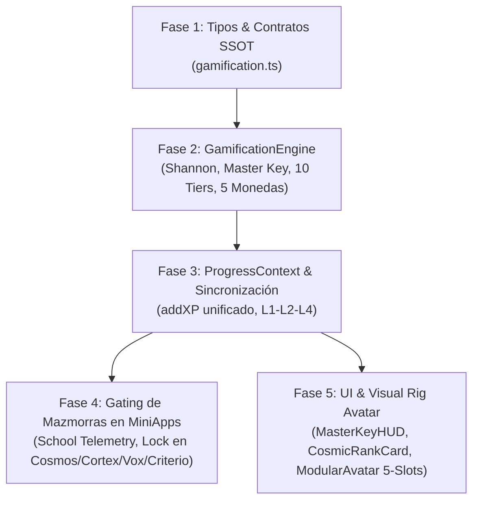

# 📊 GAP ANALYSIS: ESTADO ACTUAL DEL CÓDIGO VS. ARQUITECTURA CANÓNICA DE GAMIFICACIÓN Y REGISTRO
**Proyecto:** GOALS Platform (`/home/ubuntu/workspace/pro/webs/13goals`)  
**Fecha:** Agosto 2026 • **Estado:** Informe Técnico de Auditoría y Plan de Implementación  
**Foco:** Registro/Onboarding, Progresión/XP, Gating de MiniApps, Servicios de IA/Voz y Gaps de Gamificación Unificada.

---

## 1. 📝 REGISTRO Y ONBOARDING: FUNCIONAMIENTO ACTUAL, EDAD/CURSO Y PERSISTENCIA

### 1.1. Flujo de Autenticación y Registro (`src/core/views/AuthView.tsx` y `src/core/context/AuthContext.tsx`)
- **Modos de Entrada:**
  - **Email / Password:** Formulario con Nombre (`displayName`), Edad (`selectedAge`, slider interactivo de 6 a 15 años calibrado con tramos: `6-7`, `8-9`, `10-11`, `12-13`, `14-15`), Correo y Contraseña ([AuthView.tsx:L18-58, L117-179](file:///home/ubuntu/workspace/pro/webs/13goals/src/core/views/AuthView.tsx#L18-L58)).
  - **Google Auth:** Soporte web con popup (`signInWithPopup`) y nativo Android/Capacitor con Credential Manager moderno y fallback clásico de Google Play ([AuthContext.tsx:L226-288](file:///home/ubuntu/workspace/pro/webs/13goals/src/core/context/AuthContext.tsx#L226-L288)).
  - **Modo Invitado / Dev Super Admin:** Acceso anónimo directo (`signInGuest`) o usuario local Super Admin de desarrollo (`signInAsLocalDevAdmin`, [AuthContext.tsx:L346-399](file:///home/ubuntu/workspace/pro/webs/13goals/src/core/context/AuthContext.tsx#L346-L399)).
- **¿Pide edad y curso en el registro?**
  - **En `AuthView.tsx` (Signup):** Pide nombre y edad (slider 6-15) y calcula automáticamente el badge de nivel (ej. "3º-4º Primaria"). Al registrarse, llama a `saveChildProfileData()` ([AuthView.tsx:L38-51](file:///home/ubuntu/workspace/pro/webs/13goals/src/core/views/AuthView.tsx#L38-L51)).
  - **En `InitialOnboardingGate.tsx` (Onboarding Forzoso):** Pide Nombre, Edad (slider 6-15), Curso escolar exacto LOMLOE (`AVAILABLE_GRADES`), Intereses (`AVAILABLE_INTERESTS`), Asignaturas favoritas y estilo de aprendizaje ([InitialOnboardingGate.tsx:L20-45, L117-239](file:///home/ubuntu/workspace/pro/webs/13goals/src/core/components/onboarding/InitialOnboardingGate.tsx#L20-L45)).

### 1.2. Compuerta de Aprobación Administrativa (`PendingApprovalGate.tsx` y `App.tsx`)
- Al crear una cuenta en Firestore, el usuario se inicializa con `status: 'pending'`, `isApproved: false` y `role: 'student'` (excepto el Super Admin `josferestudio@gmail.com`, [AuthContext.tsx:L133-144](file:///home/ubuntu/workspace/pro/webs/13goals/src/core/context/AuthContext.tsx#L133-L144)).
- `App.tsx` evalúa `const isApproved = isAdmin || userData?.isApproved === true || user?.isApproved === true;` ([App.tsx:L112](file:///home/ubuntu/workspace/pro/webs/13goals/src/App.tsx#L112)). Si no está aprobado, bloquea con `PendingApprovalGate` ([App.tsx:L231-233](file:///home/ubuntu/workspace/pro/webs/13goals/src/App.tsx#L231-L233)).
- `AuthContext.tsx` y `PendingApprovalView.tsx` tienen un listener `onSnapshot` en tiempo real sobre `doc(db, 'users', uid)` que detecta la aprobación inmediata sin recargar ([AuthContext.tsx:L159-178](file:///home/ubuntu/workspace/pro/webs/13goals/src/core/context/AuthContext.tsx#L159-L178), [PendingApprovalView.tsx:L16-34](file:///home/ubuntu/workspace/pro/webs/13goals/src/core/views/PendingApprovalView.tsx#L16-L34)).

### 1.3. ¿Dónde se guarda el perfil? (Arquitectura de Persistencia Multinivel)
1. **L1 Memoria RAM:** `LearnerProfileService` (`memoryCache: Map<string, LearnerProfile>`, [LearnerProfileService.ts:L16, L31-34](file:///home/ubuntu/workspace/pro/webs/13goals/src/core/services/LearnerProfileService.ts#L16)).
2. **L2 LocalStorage:** Claves `goals_learner_profile_{userId}`, `goals_local_user`, `goals_data_{userId}`, `goals_child_profile` ([LearnerProfileService.ts:L37-46, L151-158](file:///home/ubuntu/workspace/pro/webs/13goals/src/core/services/LearnerProfileService.ts#L37-L46), [ProgressContext.tsx:L106-120](file:///home/ubuntu/workspace/pro/webs/13goals/src/core/context/ProgressContext.tsx#L106-L120)).
3. **L4 Firestore:** Colección `users/{userId}` con los campos `learnerProfile` (modelo adaptativo canónico), `childProfile` (retrocompatibilidad mediante `LegacyProfileAdapter`), `isApproved`, `email`, `displayName`, `xp`, `streak`, `experiences`, `evolutions` ([LearnerProfileService.ts:L89-103](file:///home/ubuntu/workspace/pro/webs/13goals/src/core/services/LearnerProfileService.ts#L89-L103), [ProgressContext.tsx:L121-128, L144-189](file:///home/ubuntu/workspace/pro/webs/13goals/src/core/context/ProgressContext.tsx#L121-L128)).
4. **Subcolección de Expedientes:** `users/{userId}/learningStates/{disciplineId}` gestionada por `StudentStateService.ts` ([StudentStateService.ts:L51-64, L83-90](file:///home/ubuntu/workspace/pro/webs/13goals/src/core/services/StudentStateService.ts#L51-L64)).

---

## 2. 🎮 SISTEMA DE PROGRESO / XP / PUNTOS ACTUAL VS. ARQUITECTURA CANÓNICA (`docs/gamificacion/03`)

### 2.1. Lo que SÍ está implementado hoy en el código
- **Estructura de Datos `UserData`:** Contiene `xp` global, `streak` (racha diaria), `lastDay`, `weeklyActivity` (array booleano de 7 días), `claimedRetos`, `experiences` (desglose de XP por app: `astro`, `school`, `languages`, `verify`, `ai-lab`), `evolutions` (timeline de eventos/actividades) ([src/core/types/index.ts:L43-75](file:///home/ubuntu/workspace/pro/webs/13goals/src/core/types/index.ts#L43-L75)).
- **Atribución de XP Multi-Experiencia:** Función `addXP(amount, expId, reason)` que suma XP global, incrementa el XP específico de la mini-app y genera una entrada en `evolutions` ([ProgressContext.tsx:L446-498](file:///home/ubuntu/workspace/pro/webs/13goals/src/core/context/ProgressContext.tsx#L446-L498)).
- **Sistema de Rangos Básico (5 Niveles Lineales):** Función `getRankInfo(xp)` con 5 niveles estáticos: Novato (0 XP), Cadete (100 XP), Piloto (300 XP), Comandante (600 XP), Astrofísico (1000 XP) ([ProgressContext.tsx:L73-79](file:///home/ubuntu/workspace/pro/webs/13goals/src/core/context/ProgressContext.tsx#L73-L79)).
- **Retos y Lecciones:** 5 retos estáticos (`r1`-`r5`) y sistema de 1 a 3 estrellas por test en Cosmos ([ProgressContext.tsx:L323-378, L426-443](file:///home/ubuntu/workspace/pro/webs/13goals/src/core/context/ProgressContext.tsx#L323-L378)).
- **Mascota Básica:** Configuración de skin 2D estática (`mascotSkins.ts`: astrobot, buho, dragon, gatito) y prompts de voz ([aiService.ts:L81-102](file:///home/ubuntu/workspace/pro/webs/13goals/src/core/services/aiService.ts#L81-L102)).

### 2.2. GAPS: Lo que FALTA vs. `docs/gamificacion/03_ARQUITECTURA_META_NIVEL_AVATAR_SINERGIAS.md`
| Elemento Canónico | Estado en Código Actual | Brecha / Gap Específico |
| :--- | :--- | :--- |
| **1. The Master Key** (*La Llave Maestra Estelar*) | ❌ **0% Implementado** | No existe la lógica de activación tras 15-20 min obligatorios de **School** con honestidad pedagógica ({score} \ge 0.80$, tasa de adivinanza {guess} \le 0.30$). No existe el multiplicador global {school} = 2.0	imes / 2.5	imes$ ni el desbloqueo de "Mazmorras de Conocimiento". |
| **2. Las 5 Monedas Temáticas** | ❌ **0% Implementado** | Solo existe un número escalar de XP. Faltan las 5 economías: **Stardust** (Cosmos), **Bytes** (Cortex/IA-Lab), **Flow** (Vox/Idiomas), **Synapse** (Criterio) y **Cristales Estelares de Forja** (School/Master Key). |
| **3. Factor de Armonía de Shannon** ($\Phi_{	ext{harmony}}$) | ❌ **0% Implementado** | El XP es una suma lineal simple. Falta la fórmula $\mathbf{p} = (p_{\mathcal{S}}, p_{\mathcal{B}}, p_{\mathcal{F}}, p_{\mathcal{Y}}, p_{\mathcal{C}})$, la entropía (\mathbf{p}) = -\sum p_i \log_5(p_i)$ y el multiplicador $\Phi_{harmony} \in [1.0, 1.5]$ para premiar el aprendizaje polimático equilibrado. |
| **4. Los 10 Rangos Cósmicos** (10 Tiers $	imes$ 10 Niveles = 100 Niveles) | ⚠️ **Parcial (5 niveles viejos)** | Actualmente solo hay 5 rangos fijos hasta 1000 XP. Faltan los **10 Rangos Cósmicos** (Cadete Planetario hasta Almirante Supremo Universal, 2.26M XP) con la ecuación $	ext{XP\_Required}(L) = \lfloor 120 \cdot L^{1.85} + 250 \cdot L 
floor$ y halos de color canónicos. |
| **5. Avatar Modular Evolutivo** (Visual Rig de 5 Ranuras) | ⚠️ **Solo skins 2D** | Solo existen 4 skins fijas en `mascotSkins.ts`. Falta el **Visual Rig de 5 slots** vinculados a cada materia: Slot 1 (Casco/Cortex), Slot 2 (Propulsor/Cosmos), Slot 3 (Comunicador/Vox), Slot 4 (Escudo/Criterio) y Slot 5 (Dron Acompañante/School). |
| **6. Logros Cruzados Multi-App** (*Cross-App Synergy Badges*) | ❌ **0% Implementado** | No existen los badges interdisciplinares (`Astro-Coder`, `Cónsul de la Verdad`, `Topógrafo Estelar`, `Arquitecto Ético`, `Polimatía Cósmica`). |

---

## 3. 🚪 GATING Y NAVEGACIÓN DE MINIAPPS: LISTADO, PRUEBA DE NIVEL Y MODELO PREMIUM/FREE

### 3.1. Listado y Acceso a MiniApps
- **Catálogo Central:** `src/core/config/experiencesConfig.ts` define `GOALS_EXPERIENCES` con las 5 mini-apps: `school` (Escuela IA), `languages` (Idiomas Voz), `astro` (Cosmos 3D), `verify` / `criterio` (Criterio), `ai-lab` (IA Lab) más `admin` y `profile` ([experiencesConfig.ts:L27-202](file:///home/ubuntu/workspace/pro/webs/13goals/src/core/config/experiencesConfig.ts#L27-L202)).
- **Puntos de Entrada:**
  1. `GoalsHome.tsx`: Fila de chips interactivos "Mundos de Aprendizaje" y tarjeta adaptativa "Mi Camino" ([GoalsHome.tsx:L270-382](file:///home/ubuntu/workspace/pro/webs/13goals/src/core/views/GoalsHome.tsx#L270-L382)).
  2. `MiniAppsDrawer.tsx`: Drawer lateral slide-over con desglose de sub-variantes de cada app y XP ganado ([MiniAppsDrawer.tsx:L24-217](file:///home/ubuntu/workspace/pro/webs/13goals/src/core/components/navigation/MiniAppsDrawer.tsx#L24-L217)).
  3. `MiniAppSubmenuSheet.tsx`: Menú inferior discreto dentro de cada app con accesos a herramientas y cambio rápido de app ([MiniAppSubmenuSheet.tsx:L80-478](file:///home/ubuntu/workspace/pro/webs/13goals/src/core/components/navigation/MiniAppSubmenuSheet.tsx#L80-L478)).

### 3.2. Mecanismo de Gating de MiniApps (`MiniAppPortalGate.tsx`)
- Cada acceso a una mini-app está envuelto por `MiniAppPortalGate` ([App.tsx:L269-290](file:///home/ubuntu/workspace/pro/webs/13goals/src/App.tsx#L269-L290)).
- **Bypass de Super Admin:** `isUserAdmin || user?.email === 'josferestudio@gmail.com'` omite todo bloqueo ([MiniAppPortalGate.tsx:L35-45](file:///home/ubuntu/workspace/pro/webs/13goals/src/core/components/miniapps/MiniAppPortalGate.tsx#L35-L45)).
- **Para Alumnos:** Consulta `studentStateService.getStudentState(uid, experienceId)`:
  - Si `diagnosticStatus === 'completed'`, da paso directo al contenido ([MiniAppPortalGate.tsx:L98-100](file:///home/ubuntu/workspace/pro/webs/13goals/src/core/components/miniapps/MiniAppPortalGate.tsx#L98-L100)).
  - Si `diagnosticStatus !== 'completed'`, activa el flujo de 3 pasos: (1) **Mini-Portada y Ficha** de la materia, (2) **Prueba de Nivel Interactiva** (4 preguntas generadas por `DiagnosticEngine` según la edad del alumno), (3) **Resultado y Calibración** (+50 XP, asignación de `recommendedStartUnitId`, guardado en Firestore y entrada) ([MiniAppPortalGate.tsx:L111-235, L340-496](file:///home/ubuntu/workspace/pro/webs/13goals/src/core/components/miniapps/MiniAppPortalGate.tsx#L111-L235)).

### 3.3. ¿Hay ya algún concepto de Premium / Pago / Free?
- **NO existe pasarela de pago, Stripe, suscripciones ni gating por plan comercial.**
- En `experiencesConfig.ts` hay clases CSS visuales llamadas `freeBannerClass` ([experiencesConfig.ts:L19, L43, L65](file:///home/ubuntu/workspace/pro/webs/13goals/src/core/config/experiencesConfig.ts#L19)), pero son puramente cosméticas.
- En `App.tsx` existe el **"Modo Visita / Invitado"** ([App.tsx:L184-230](file:///home/ubuntu/workspace/pro/webs/13goals/src/App.tsx#L184-L230)) que permite a usuarios no registrados visualizar la interfaz y los modelos 3D en modo solo lectura, requiriendo registro para interactuar con la IA o guardar progreso.
- **Conclusión:** El gating actual es 100% **pedagógico y administrativo** (Aprobación Admin $
ightarrow$ Onboarding de Edad $
ightarrow$ Prueba de Nivel por MiniApp).

---

## 4. 🤖 SERVICIOS DE IA Y VOZ INTEGRADOS EN EL REPOSITORIO

### 4.1. Servicio Central de IA (`src/core/services/aiService.ts`)
- **Endpoint Proxy:** Conecta con `https://143-47-35-167.sslip.io/v1` (o `/v1` en local) con `model: "auto"` ([aiService.ts:L7-10, L173](file:///home/ubuntu/workspace/pro/webs/13goals/src/core/services/aiService.ts#L7-L10)).
- **Funcionalidades:**
  - `askAI()`: Inferencia de texto / chat con timeout de 60s ([aiService.ts:L158-199](file:///home/ubuntu/workspace/pro/webs/13goals/src/core/services/aiService.ts#L158-L199)).
  - `askAIVision()`: Visión artificial multimodal (Gemini / Nemotron) para análisis de imágenes y fotos de cuadernos ([aiService.ts:L208-266](file:///home/ubuntu/workspace/pro/webs/13goals/src/core/services/aiService.ts#L208-L266)).
  - `normalizeChildVoiceIntent()`: Limpieza y normalización semántica de dictados infantiles con ruido fonético ([aiService.ts:L269-300](file:///home/ubuntu/workspace/pro/webs/13goals/src/core/services/aiService.ts#L269-L300)).
  - `buildChildSystemPrompt()`: Inyección de expediente (edad, curso, tramo LOMLOE, materias débiles, personalidad de mascota, directiva de infografías con Pollinations.ai, [aiService.ts:L104-141](file:///home/ubuntu/workspace/pro/webs/13goals/src/core/services/aiService.ts#L104-L141)).

### 4.2. Gestor de Proveedores de Voz BYOK (`src/core/services/VoiceProviderService.ts`)
- Catálogo de 7 proveedores con metadatos completos y test real de latencia HTTP/WebSocket en milisegundos ([VoiceProviderService.ts:L19-235, L384-682](file:///home/ubuntu/workspace/pro/webs/13goals/src/core/services/VoiceProviderService.ts#L19-L235)):
  1. `gemini_live` (Google AI Studio WebSocket, Puck/Charon/Aoede).
  2. `deepgram` (Nova-2 STT + Aura Neural TTS).
  3. `openai_realtime` (GPT-4o Realtime WebSocket + TTS-1).
  4. `cartesia` (Sonic 3.5 sub-90ms).
  5. `groq_edge` (Whisper Large v3-Turbo ~70ms + LLaMA 3.3 70B).
  6. `elevenlabs` (Turbo v2.5 / Multilingual v2).
  7. `webspeech` (Nativo navegador, offline y gratuito).
- **Cadena de Fallback Inteligente:** Resuelve automáticamente el proveedor activo degradando a WebSpeech si falla la red o se agota la cuota ([VoiceProviderService.ts:L687-707](file:///home/ubuntu/workspace/pro/webs/13goals/src/core/services/VoiceProviderService.ts#L687-L707)).

### 4.3. Motor Universal de Voz a Voz (`src/core/services/v2v/UniversalVoiceEngine.ts`)
- Pipeline de baja latencia (<250ms) con Web Audio API y AudioWorklets (`/pcm-recorder-processor.js` y `/pcm-player-processor.js`, [UniversalVoiceEngine.ts:L51-67](file:///home/ubuntu/workspace/pro/webs/13goals/src/core/services/v2v/UniversalVoiceEngine.ts#L51-L67)).
- **Hot-Swap de Proveedor:** Cambio en caliente entre Deepgram, Gemini Live y OpenAI Realtime ([UniversalVoiceEngine.ts:L100-170](file:///home/ubuntu/workspace/pro/webs/13goals/src/core/services/v2v/UniversalVoiceEngine.ts#L100-L170)).
- **Barge-In (Interrupción Inmediata):** Purga de buffer en 0ms enviando mensaje `FLUSH` al AudioWorklet al detectar habla del usuario ([UniversalVoiceEngine.ts:L175-182](file:///home/ubuntu/workspace/pro/webs/13goals/src/core/services/v2v/UniversalVoiceEngine.ts#L175-L182)).

---

## 5. 📋 LISTA CONCRETA DE GAPS A IMPLEMENTAR (ORDENADA POR DEPENDENCIAS)

### 🔹 Fase 1: Tipos y Contratos TypeScript (SSOT)
- [ ] **Gap 1.1 — `src/core/types/gamification.ts`:** Crear el archivo canónico de tipos según la especificación de `docs/gamificacion/03`:
  - `DomainCurrencies`: `{ stardust: number; bytes: number; flow: number; synapse: number; forgeCrystals: number; }`
  - `CosmicTierInfo`: Definición de los 10 Tiers (I al X, Lvl 1-100), halos cromáticos y fórmula de XP.
  - `MasterKeyStatus`: `{ isActive: boolean; unlockedAt?: number; expiresAt?: number; multiplier: number; schoolHonestyScore: number; dailyMinutes: number; }`
  - `ModularAvatarState`: 5 slots (`helmet`, `propulsion`, `communicator`, `shield`, `drone`) con niveles y piezas desbloqueadas.
  - `CrossAppBadge`: Contratos para logros cruzados interdisciplinares.
- [ ] **Gap 1.2 — Ampliación de `UserData` (`src/core/types/index.ts`):** Añadir `currencies`, `masterKey`, `cosmicLevel`, `modularAvatar`, `synergyBadges`.

### 🔹 Fase 2: Motor Central de Gamificación y Economía Virtual
- [ ] **Gap 2.1 — `src/core/services/GamificationEngine.ts`:**
  - **Ecuación de Fusión Universal de XP:** Implementar $\mathbf{p} = (p_{\mathcal{S}}, p_{\mathcal{B}}, p_{\mathcal{F}}, p_{\mathcal{Y}}, p_{\mathcal{C}})$, Entropía de Shannon (\mathbf{p}) = -\sum p_i \log_5(p_i)$ y Factor de Armonía $\Phi_{	ext{harmony}} = 1.0 + 0.5 \cdot H(\mathbf{p}) \in [1.0, 1.5]$.
  - **Fórmula de 100 Niveles Cósmicos:** $	ext{XP\_Required}(L) = \lfloor 120 \cdot L^{1.85} + 250 \cdot L 
floor$. Funciones deterministas `getLevelFromXP(xp)`, `getTierFromLevel(lvl)`, `getXPProgressToNextLevel(xp)`.
  - **Gestor de la Master Key:** Evaluación de sesión de School (15-20 min, {score} \ge 0.80$, {guess} \le 0.30$), cálculo del multiplicador (.0	imes$ base / .5	imes$ racha $\ge 7$ días) y asignación de Cristales Estelares de Forja.
  - **Gestor de 5 Monedas:** Métodos para acreditar/debitar Stardust, Bytes, Flow, Synapse y Cristales de Forja según la mini-app de origen.
  - **Evaluador de Logros Cruzados:** Verificación de condiciones multi-app (`Astro-Coder`, `Cónsul de la Verdad`, etc.).

### 🔹 Fase 3: Integración en el Contexto de Progreso y Persistencia
- [ ] **Gap 3.1 — Refactorización de `ProgressContext.tsx`:**
  - Integrar `GamificationEngine` en `addXP(amount, expId, reason)`: calcular automáticamente moneda de dominio, aplicar multiplicador Master Key y factor de armonía de Shannon.
  - Exponer en el contexto: `currencies`, `masterKey`, `cosmicRank`, `harmonyFactor`, `modularAvatar`, `claimDailySchoolMasterKey()`.
  - Persistencia Cache-First (L1 RAM $
ightarrow$ L2 LocalStorage $
ightarrow$ L4 Firestore en `users/{uid}`).
- [ ] **Gap 3.2 — Telemetría en `StudentStateService.ts`:**
  - Registrar tiempo de estudio efectivo y tasa de honestidad en `school` para activar la Master Key.

### 🔹 Fase 4: Gating de Mazmorras de Conocimiento y Lógica de MiniApps
- [ ] **Gap 4.1 — Gating de Mazmorras Avanzadas en MiniApps:**
  - **Cosmos 3D:** Bloqueo de simulaciones avanzadas Three.js salvo que la Master Key esté activa o se pague con Stardust.
  - **IA Lab (Cortex):** Bloqueo de retos avanzados de código Python Wasm / redes neuronales sin Master Key / Bytes.
  - **Idiomas (Vox):** Bloqueo de escenarios de debate inmersivo sin Master Key / Flow.
  - **Criterio:** Bloqueo de casos forenses y auditoría de medios complejos sin Master Key / Synapse.

### 🔹 Fase 5: Componentes UI de Gamificación y Visual Rig del Avatar
- [ ] **Gap 5.1 — `src/core/components/gamification/MasterKeyHUD.tsx`:**
  - Widget en Header / Dashboard con el estado de la Llave Maestra (tiempo restante, multiplicador .0	imes/2.5	imes$, barra de minutos de School).
- [ ] **Gap 5.2 — `src/core/components/gamification/CosmicRankCard.tsx` y Radar de Shannon:**
  - Visualización del Tier Cósmico actual (I al X), halo dinámico, nivel 1-100, radar pentagonal de equilibrio de materias y balances de las 5 monedas.
- [ ] **Gap 5.3 — `src/core/components/gamification/ModularAvatarVisualizer.tsx`:**
  - Visualizador del Avatar Modular con sus 5 ranuras funcionales y tienda de forja de accesorios estéticos usando Cristales Estelares y monedas temáticas.
- [ ] **Gap 5.4 — Actualización de Vistas (`GoalsHome.tsx`, `Header.tsx`, `ProfileModal.tsx`, `GoalsLanding.tsx`):**
  - Reemplazar el widget viejo de 5 niveles por el nuevo sistema de 10 Tiers Cósmicos, Master Key y balances de monedas.
