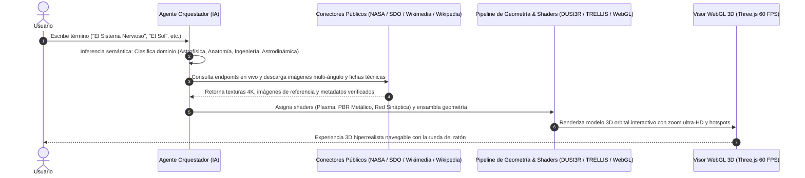

# Arquitectura del Sistema 3D Semiautomático y Asistido por IA (Omni-3D Genesis Engine)

> **Misión:** Transformar cualquier indicación verbal o textual del usuario (ej: *"El Sol"*, *"El Sistema Solar"*, *"El Sistema Nervioso"*, *"La Estación Espacial Internacional"*, *"El Corazón Humano"*) en un **modelo 3D interactivo hiperrealista, navegable y con definición milimétrica al hacer zoom**, de forma 100% automatizada e impulsada por IA.

---

## 1. El Flujo de Trabajo Semiautomático (Paso a Paso)



---

## 2. Los 4 Pilares de Adaptación por Dominio

El orquestador no trata todos los objetos por igual, sino que aplica la física y el modelo matemático adecuado según el término introducido:

### A. Dominio Astrofísico / Plasma (ej: *"El Sol"*, *"Nebulosas"*, *"Estrellas"*)
* **Fuentes de datos:** API de Helioviewer (NASA SDO), ESA STEREO-A/B, Solar Orbiter.
* **Técnica 3D:** Proyección esférica de texturas 4K multiespectrales (AIA 304 Å, 171 Å, 193 Å) + Shaders GLSL de convección de plasma, efecto Fresnel para la atmósfera coronal y tubos magnéticos para las protuberancias.
* **Zoom Ultra-HD:** El shader subdivide matemáticamente las células de granulación conforme la cámara se acerca a la superficie.

### B. Dominio Astrodinámico / Planetario (ej: *"El Sistema Solar"*, *"Saturno"*, *"Júpiter"*)
* **Fuentes de datos:** NASA JPL Horizons, USGS Astrogeology, misiones Cassini y Juno.
* **Técnica 3D:** Sistema orbital kepleriano con escalas paramétricas, texturas reales de planetas terrestres y gaseosos, anillos volumétricos de partículas (Saturno) y selector de enfoque orbital.
* **Zoom Ultra-HD:** Permite hacer zoom desde la vista general del sistema solar hasta la atmósfera de la Tierra o los anillos de Saturno.

### C. Dominio Anatómico y Biológico (ej: *"El Sistema Nervioso"*, *"El Cerebro"*, *"El Corazón"*)
* **Fuentes de datos:** Wikimedia Commons Medical Archives, Wikipedia REST API, NIH 3D Print Exchange.
* **Técnica 3D:** Geometría volumétrica translúcida con mapeo de surcos corticales, médula espinal, ramificaciones de plexos nerviosos periféricos (ciático, braquial) y partículas de impulsos electroquímicos sinápticos activos en tiempo real.
* **Zoom Ultra-HD:** Permite inspeccionar desde el cuerpo completo hasta las vías neuronales y el axón.

### D. Dominio de Ingeniería Espacial / Cuerpos Rígidos (ej: *"La ISS"*, *"James Webb"*, *"Rover Perseverance"*)
* **Fuentes de datos:** NASA Image and Video Library API (`images.nasa.gov`), NASA 3D Resources.
* **Técnica 3D:** Mallas PBR metálicas generadas con **DUSt3R / MASt3R** (a partir de 2-3 fotos de transbordador) o **TRELLIS.2**, con texturas de albedo, rugosidad y paneles solares reflectantes.
* **Zoom Ultra-HD:** Mallas de alta densidad poligonal y elipsoides de **3D Gaussian Splatting** que evitan la pixelación al acercarse.

---

## 3. Ejecución desde Terminal (Scripts Listos)

Se ha implementado el orquestador en Node.js (ESM) para ejecución directa y autónoma:

```bash
# Reconstruir el Sistema Nervioso
node c:\Obsidian\proyectos\webs\10_goals\scripts\omni3d_autonomous_orchestrator.js "El Sistema Nervioso"

# Reconstruir el Sistema Solar
node c:\Obsidian\proyectos\webs\10_goals\scripts\omni3d_autonomous_orchestrator.js "El Sistema Solar"

# Reconstruir el Sol en 4K
node c:\Obsidian\proyectos\webs\10_goals\scripts\omni3d_autonomous_orchestrator.js "El Sol"

# Reconstruir la Estación Espacial Internacional
node c:\Obsidian\proyectos\webs\10_goals\scripts\omni3d_autonomous_orchestrator.js "Estacion Espacial Internacional"
```

---

## 4. Visualización Inmediata en Navegador

Abre el archivo interactivo creado en el proyecto:
👉 [`solar_3d_reconstruction_research.html`](file:///c:/Obsidian/proyectos/webs/10_goals/solar_3d_reconstruction_research.html)

Escribe cualquier concepto en la barra superior o haz clic en los chips rápidos (☀️ *El Sol*, 🪐 *El Sistema Solar*, 🧠 *Sistema Nervioso*, 🛰️ *ISS*, 🫀 *Corazón Humano*) para ver al sistema clasificar, recuperar datos y sintetizar el modelo 3D en tiempo real.
