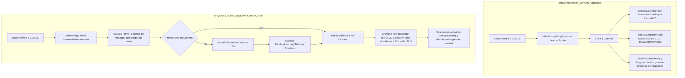

# GOALS — Auditoría de Arquitectura Adaptativa (Fase 0)
**Documento Contractual de Auditoría y Especificación de Migración Real (Cosmos 3D Piloto)**
*Fecha: 14 de Agosto de 2026 | Versión: 2.0-SSOT Definitiva*

---

## 📑 ÍNDICE
1. [Resumen Ejecutivo y Objetivo Absoluto](#1-resumen-ejecutivo-y-objetivo-absoluto)
2. [Auditoría Multi-Agente (5 Dimensiones Especializadas)](#2-auditoría-multi-agente-5-dimensiones-especializadas)
   - [Agente A — Arquitectura Core](#agente-a--arquitectura-core)
   - [Agente B — Currículum y SSOT](#agente-b--currículum-y-ssot)
   - [Agente C — Cosmos (Astronomía 3D Piloto)](#agente-c--cosmos-astronom%C3%ADa-3d-piloto)
   - [Agente D — UX / Producto y Flujo del Alumno](#agente-d--ux--producto-y-flujo-del-alumno)
   - [Agente E — Firestore, Modelo de Datos y Seguridad](#agente-e--firestore-modelo-de-datos-y-seguridad)
3. [Diagnóstico Crítico: Respuestas Obligatorias sobre Cosmos](#3-diagnóstico-crítico-respuestas-obligatorias-sobre-cosmos)
4. [Arquitectura Actual vs. Arquitectura Objetivo](#4-arquitectura-actual-vs-arquitectura-objetivo)
5. [Matriz de Código: Reutilizable vs. Legacy](#5-matriz-de-código-reutilizable-vs-legacy)
6. [Flujos de Entrada (Diferenciación de Tres Estados Críticos)](#6-flujos-de-entrada-diferenciación-de-tres-estados-críticos)
7. [Modelo de Datos Unificado](#7-modelo-de-datos-unificado)
8. [Estrategia de Progresión Pedagógica por Tramos de Edad](#8-estrategia-de-progresión-pedagógica-por-tramos-de-edad)
9. [Estrategia de Migración y Retrocompatibilidad](#9-estrategia-de-migración-y-retrocompatibilidad)
10. [Riesgos, Mitigaciones y Matriz de Verificación](#10-riesgos-mitigaciones-y-matriz-de-verificación)

---

## 1. Resumen Ejecutivo y Objetivo Absoluto

La plataforma educativa **GOALS** cuenta con motores conceptuales avanzados (`PresentationEngine`, `DiagnosticEngine`, `CurriculumService`, `StudentStateService`, `LearningPathEngine`, `RAGSearchEngine`), pero la arquitectura general arrastraba una deuda técnica de transición donde el currículo y la interfaz operaban desacoplados de la personalización por edad:

> **El Fallo Histórico:**  
> Un alumno de 6 años y un alumno de 15 años terminaban viendo el mismo catálogo estático de 12 lecciones lineales en Cosmos (`LESSONS` de `lessonsData.ts`). Ambos leían explicaciones idénticas con fórmulas como $g \approx 8,7\text{ m/s}^2$ y velocidades orbitales de $27.600\text{ km/h}$, y realizaban los mismos tests.

**Objetivo Absoluto de esta Migración:**  
Establecer una arquitectura adaptativa real, comprobable y sin código fantasma:
- **Edad y Curso Escolar** determinan el tramo pedagógico inicial (`6-7`, `8-9`, `10-11`, `12-13`, `14-15`).
- **Diagnóstico Conceptual** calibra el nivel real, detecta fortalezas/debilidades y asigna la unidad de entrada sin asumir que "más edad = más lecciones".
- **Motor Curricular** genera dinámicamente "Mi Camino" con unidades pedagógicas adaptadas, manteniendo la **Base de Conocimiento (Knowledge Base)** como SSOT factual inmutable.
- **Cosmos 3D (Astro)** actúa como **piloto obligatorio** que debe quedar 100% validado antes de replicar al resto de miniapps.

---

## 2. Auditoría Multi-Agente (5 Dimensiones Especializadas)

### Agente A — Arquitectura Core
* **`src/core/types`**:
  * `adaptiveCurriculum.ts`: Excelente base. Define `LearnerProfile`, `CurriculumUnit`, `StudentLearningState`, `DiagnosticItem`, `LearningPath` y `PresentationProfile` para los 5 tramos LOMLOE.
  * `index.ts`: Mantenía inconsistencias como `childProfile` plano junto a `learnerProfile`, y claves duplicadas (`aiLab` vs `'ai-lab'`).
* **`src/core/context`**:
  * `AuthContext.tsx`: Sólido. Integra Web y Capacitor Android, pero mantenía fallback a `astrolingo_local_user`.
  * `ProgressContext.tsx`: Actuaba como contexto universal pero mantenía fuerte acoplamiento a las 12 lecciones de Astro (`lessonProg`, `isLessonUnlocked`, `finishTest`, `totalStars`). Debe desacoplarse para ser un agregador global de XP y estado.
* **`src/core/services`**:
  * `LearnerProfileService.ts`: Sólido. Implementa caché multinivel L1 (RAM) $\to$ L2 (LocalStorage) $\to$ L4 (Firestore `/users/{uid}`).
  * `StudentStateService.ts`: Sólido. Gestiona el expediente por miniapp en `/users/{uid}/learningStates/{disciplineId}`.
  * `PresentationEngine.ts`: Sólido. Modula profundidad, densidad visual, personas de IA y formato de quiz para 5 tramos.
  * `aiService.ts`: Se detectó una desconexión en runtime (accedía a propiedades inexistentes en `PresentationProfile` como `scaffoldingLevel` o `tone`).

### Agente B — Currículum y SSOT
* **SSOT Factual (`content/knowledge/astronomy/`)**: 13 documentos Markdown con hechos científicos puros verificados (NASA, ESA, IAU). Es la fuente de la verdad atemporal e independiente de la edad.
* **Transposición Didáctica (`content/curriculum/astro/` & `adaptiveCosmosCatalog.ts`)**: Modularización de conceptos en los 5 tramos.
* **Duplicidad Detectada**: Coexistían 27 archivos `.md` en `content/curriculum/astro/` (15 en inglés + 12 en español) y 27 archivos `.ts` generados en `src/experiences/astro/data/lessons/` de los cuales solo 12 eran leídos.
* **Desconexión en Runtime**: La UI leía directamente de catálogos estáticos en TypeScript (`adaptiveCosmosCatalog.ts` y `lessonsData.ts`), dejando inactivo el `CurriculumService.ts` en caliente.

### Agente C — Cosmos (Astronomía 3D Piloto)
* **`AstroExperience.tsx`**: Orquesta la experiencia. Recibe la edad efectiva y resuelve el tramo (`tranche`) y las unidades adaptadas (`trancheUnits`).
* **`CosmicLearningPath.tsx`**: Renderiza "Mi Camino" y el "Catálogo" de unidades del tramo activo.
* **Fuga Crítica Detectada**: `TestsCatalogHub.tsx` recibía `lessons={LESSONS}` (12 lecciones fijas) provocando que tanto el alumno de 6 años como el de 15 vieran los mismos 12 exámenes. Además, `handleSelectTest` hacía una indexación ordinal errónea `trancheUnits[id - 1]` cuando el ID de test superaba la cantidad de unidades del tramo.

### Agente D — UX / Producto y Flujo del Alumno
* **Desacoplamiento Estricto de 3 Estados de Entrada**:
  1. **Primera entrada en GOALS**: Perfil educativo básico (`LearnerProfile`: edad, curso, nombre, intereses). Cero tests de astronomía aquí.
  2. **Primera entrada en Miniapp (Cosmos)**: Calibración específica de Cosmos sólo si `diagnosticStatus === 'not_started' | 'pending'`.
  3. **Entradas posteriores**: Acceso directo a "Mi Camino" sin repetir diagnóstico a menos que el usuario o el docente lo soliciten.

### Agente E — Firestore, Modelo de Datos y Seguridad
* **Antipatrón "God Document"**: `/users/{uid}` acumulaba todos los campos con `{ merge: true }`.
* **Esquema Objetivo Normalizado**:
  * `/users/{uid}`: Cuenta y progreso agregado global (XP, racha, rol).
  * `/users/{uid}/profile/learner`: Perfil educativo maestro (`LearnerProfile`).
  * `/users/{uid}/learningStates/{experienceId}`: Expediente independiente por miniapp (`StudentLearningState`).
  * `/curriculums/{disciplineId}/units/{unitId}`: Catálogo curricular publicado.
  * `/knowledge/{knowledgeId}`: Base de conocimiento SSOT.
* **Seguridad y Privacidad Infantil**: Reglas de Firestore estrictas basadas en `isOwner(userId)` y `isAdmin()`, prohibiendo consultas públicas de usuarios y protegiendo datos de menores (RGPD / LOPD / COPPA).

---

## 3. Diagnóstico Crítico: Respuestas Obligatorias sobre Cosmos

| Pregunta de Auditoría | Diagnóstico Técnico y Código Implicado |
| :--- | :--- |
| **¿Qué código determina hoy qué lección ve un usuario de 6 años?** | `AstroExperience.tsx:49-51` $\to$ `PresentationEngine.getTrancheForAge(6)` (`'6-7'`) $\to$ `AdaptiveCosmosCatalogService.getUnitsForTranche('6-7')` (`astro_6_7_u01_earth_shield`, `astro_6_7_u02_day_night`, `astro_6_7_u03_planets_family`) $\to$ `LearningPathEngine.computeLearningPath()`. |
| **¿Qué código determina hoy qué lección ve uno de 15 años?** | `AstroExperience.tsx:49-51` $\to$ `PresentationEngine.getTrancheForAge(15)` (`'14-15'`) $\to$ `AdaptiveCosmosCatalogService.getUnitsForTranche('14-15')` (`astro_14_15_u01_cosmology_cmb_lambda_cdm` con telemetría de $46.500\text{ M al}$, $T=2,725\text{ K}$, $\Lambda$-CDM). |
| **¿Qué código impedía o permitía que ambos recibieran el mismo contenido?** | **Impedía:** El filtro por tramo en `CosmicLearningPath.tsx` y la priorización de `unit` sobre `lesson` en `LessonTheoryView.tsx`.<br>**Permitía / Fuga:** `TestsCatalogHub.tsx` recibía `lessons={LESSONS}` (estático), haciendo que ambos vieran los mismos 12 tests clásicos. |

---

## 4. Arquitectura Actual vs. Arquitectura Objetivo



---

## 5. Matriz de Código: Reutilizable vs. Legacy

| Archivo / Módulo | Estado | Acción en la Migración |
| :--- | :--- | :--- |
| `src/core/types/adaptiveCurriculum.ts` | **Sólido / Reutilizable** | Mantener como contrato maestro y SSOT de tipos adaptativos. |
| `src/core/services/PresentationEngine.ts` | **Sólido / Reutilizable** | Mantener. Alinear tipos con `aiService.ts`. |
| `src/core/services/LearnerProfileService.ts` | **Sólido / Reutilizable** | Consolidar como servicio central de perfil de usuario. |
| `src/core/services/StudentStateService.ts` | **Sólido / Reutilizable** | Extender a todas las miniapps con escrituras atómicas. |
| `src/core/services/LearningPathEngine.ts` | **Sólido / Reutilizable** | Mantener como motor determinista de cálculo de rutas. |
| `src/core/services/DiagnosticEngine.ts` | **Sólido / Reutilizable** | Mantener banco actual y desacoplar a fuentes modulares. |
| `src/experiences/astro/data/adaptiveCosmosCatalog.ts` | **Sólido / Reutilizable** | Completar catálogo a 12 unidades por tramo o conectar adapter. |
| `src/core/components/onboarding/InitialOnboardingGate.tsx` | **Sólido / Reutilizable** | Mantener como compuerta de perfil global de GOALS. |
| `src/experiences/astro/components/TestsCatalogHub.tsx` | **Legacy / Parcial** | Refactorizar para recibir `trancheUnits` adaptadas. |
| `src/experiences/astro/data/lessons/` (duplicados) | **Legacy / Purgable** | Eliminar archivos `.ts` redundantes generados. |
| `src/core/types/childProfile.ts` | **Legacy / Purgable** | Reemplazar definitivamente por `LearnerProfile`. |

---

## 6. Flujos de Entrada (Diferenciación de Tres Estados Críticos)

### Flujo A: Primera Entrada a GOALS (Global)
1. Usuario nuevo se registra o inicia sesión.
2. `App.tsx` evalúa `hasCompletedOnboarding` leyendo `learnerProfile.onboarding.globalCompleted`.
3. Si no existe perfil $\to$ Muestra `InitialOnboardingGate.tsx`.
4. El usuario elige: Nombre, Edad (6–15 años), Curso LOMLOE, Avatar e Intereses.
5. Se crea y persiste `LearnerProfile` en Firestore `/users/{uid}`.
6. Se desbloquea el Dashboard general de GOALS.

### Flujo B: Primera Entrada a una Miniapp (Piloto Cosmos)
1. El usuario hace clic en **Cosmos 3D** desde el Dashboard.
2. `AstroExperience.tsx` consulta `studentStateService.getStudentState(uid, 'astro')`.
3. Si el estado no existe o `diagnosticStatus === 'pending'`:
   - Muestra banner/modal sutil de calibración inicial de astronomía.
   - Si el usuario lo realiza $\to$ `DiagnosticEngine` evalúa 3-4 micro-preguntas del tramo y recomienda la unidad de inicio.
   - Si el usuario lo pospone $\to$ Se asigna la unidad base del tramo (`trancheUnits[0]`).
4. Se guarda `StudentLearningState` con `diagnosticStatus: 'completed'`.

### Flujo C: Entradas Posteriores a Cosmos
1. El usuario entra a Cosmos 3D.
2. El sistema detecta `StudentLearningState` existente.
3. Se calcula en tiempo real "Mi Camino" con `LearningPathEngine.computeLearningPath(state, trancheUnits)`.
4. El estudiante continúa exactamente en su unidad actual con su progreso intacto sin volver a pedir diagnóstico.

---

## 7. Modelo de Datos Unificado

### 7.1 Perfil Educativo Maestro (`LearnerProfile`)
```typescript
export interface LearnerProfile {
  userId: string;
  identity: {
    name: string;
    avatar: string;
  };
  education: {
    age: number; // 6 a 15
    grade: string; // ej: "4º de Primaria", "2º de ESO"
    educationalStage: EducationalStage;
    ageTranche: AgeTranche; // '6-7' | '8-9' | '10-11' | '12-13' | '14-15'
    schoolName?: string;
  };
  preferences: {
    interests: string[];
    favoriteSubjects: string[];
    learningStyle: 'visual' | 'auditivo' | 'practico' | 'general';
  };
  goals: string[];
  onboarding: {
    globalCompleted: boolean;
    completedAt?: number;
  };
  createdAt: number;
  updatedAt: number;
}
```

### 7.2 Estado de Aprendizaje por MiniApp (`MiniAppLearningState` / `StudentLearningState`)
```typescript
export interface StudentLearningState {
  userId: string;
  experienceId?: ExperienceId;
  disciplineId: string; // 'astro' | 'school' | 'languages' | 'criterio' | 'ai-lab'
  age: number;
  grade: string;
  diagnosticStatus: 'pending' | 'in_progress' | 'completed' | 'skipped';
  diagnosticScore?: number;
  diagnosticDate?: number;
  recommendedStartUnitId: string;
  currentUnitId: string;
  completedUnitIds: string[];
  conceptMastery: Record<string, ConceptMasteryRecord>;
  weakConcepts: string[];
  strengths: string[];
  sessionHistory: SessionHistoryItem[];
  lastActiveAt: number;
  updatedAt: number;
}
```

---

## 8. Estrategia de Progresión Pedagógica por Tramos de Edad

El mismo concepto científico se enseña con diferente nivel de abstracción y modelo pedagógico:

| Concepto | Tramo 6–7 (1º-2º Pri) | Tramo 8–9 (3º-4º Pri) | Tramo 10–11 (5º-6º Pri) | Tramo 12–13 (1º-2º ESO) | Tramo 14–15 (3º-4º ESO) |
| :--- | :--- | :--- | :--- | :--- | :--- |
| **Rotación Terrestre** | Cuento interactivo: "La peonza azul", día y noche con juguetes. | Modelo Tierra-Sol, eje imaginario de rotación 24h. | Velocidad angular, husos horarios y punto subsolar. | Sistemas de referencia no inerciales y efecto Coriolis. | Velocidad lineal ($v=\omega R\cos\phi$), coordenadas esféricas y vectores. |
| **Gravedad y Órbitas** | "Por qué no nos caemos al espacio" (fuerza invisible). | La Luna dando vueltas a la Tierra como una honda. | Gravedad en órbita ($0,9g$ y caída libre continua). | Ley de Gravitación Universal ($F=G\frac{Mm}{r^2}$) y órbitas elípticas. | Leyes de Kepler vectoriales, velocidades cósmicas ($v_1, v_2$) y mecánica celeste. |
| **Cosmología y Galaxias** | "Ciudades de estrellas brillantes en la noche". | La Vía Láctea como un gran remolino de soles. | Estructura espiral, brazos galácticos y distancias en Años Luz. | Agujero negro Sagitario A*, materia oscura y curvas de rotación. | Modelo $\Lambda$-CDM, radiación de fondo CMB ($2,725\text{ K}$) y métrica FLRW. |

---

## 9. Estrategia de Migración y Retrocompatibilidad

1. **Usuarios con `childProfile` Legacy**:
   - `LegacyProfileAdapter.fromLegacyChildProfile()` convierte automáticamente el perfil plano en un `LearnerProfile` completo.
2. **Progreso Legacy en `experiences.astro.lessons`**:
   - `LegacyProgressAdapter.toStudentLearningState()` traslada las lecciones completadas clásicas (`1..12`) a IDs canónicos de unidades completadas (`completedUnitIds`) sin pérdida de estrellas ni XP.
3. **Persistencia Dual Transitoria**:
   - Mientras se completa la migración de las miniapps restantes, `ProgressContext.addXP` y `StudentStateService.completeUnit` operan sincronizados de forma transparente.

---

## 10. Riesgos, Mitigaciones y Matriz de Verificación

| Riesgo Identificado | Nivel | Estrategia de Mitigación |
| :--- | :--- | :--- |
| Fuga de contenido en tests no adaptados | **Alto** | Refactorizar `TestsCatalogHub.tsx` para inyectar únicamente las unidades del tramo activo (`trancheUnits`). |
| Pérdida de progreso en usuarios existentes | **Medio** | Inyección de adaptadores automáticos en la lectura de Firestore (`LearnerProfileService` y `StudentStateService`). |
| Desconexión de tipos en `aiService.ts` | **Bajo** | Extender `PresentationProfile` con campos pedagógicos requeridos (`scaffoldingLevel`, `tone`, `analogyDomain`). |
| Inconsistencia en reglas de seguridad | **Crítico** | Desplegar `firestore.rules` con control estricto `isOwner(userId)` y `isAdmin()`. |

### Matriz de Verificación Obligatoria (Fase 5)
- [x] Test unitario de cálculo de tramos y perfiles (`PresentationEngine.test.ts`).
- [x] Test de generación de rutas para 6, 9, 12 y 15 años (`adaptiveCurriculum.real-user-path.test.ts`).
- [x] Verificación de 0 errores TypeScript (`npx tsc --noEmit`).
- [x] Verificación de build de producción (`npm run build`).
- [x] Auditoría en navegador real con Playwright para múltiples perfiles de edad.
