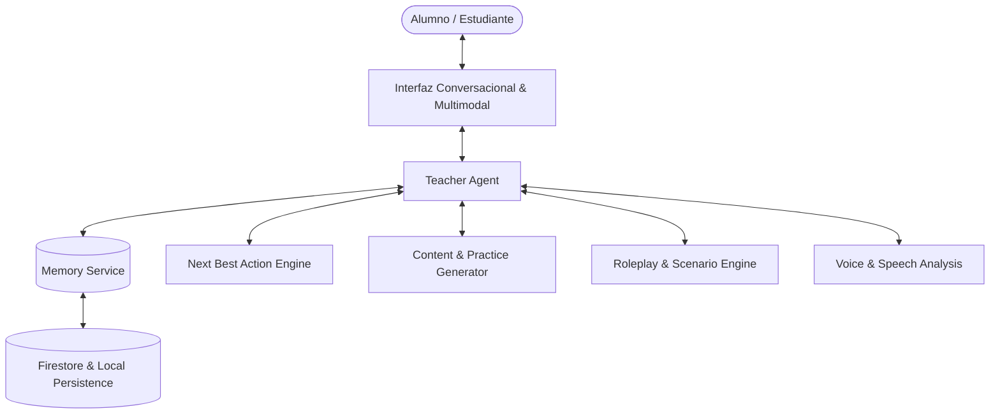

# GOALS — LANGUAGES: PRODUCT, PEDAGOGICAL & TECHNICAL MASTER PLAN
**Versión 1.0 — Arquitectura por Fases y Bloques de Ejecución para AGY / Antigravity**

---

## 0. VISIÓN Y PRINCIPIO RECTOR

**Goals Languages no es una colección de ejercicios estáticos con un chatbot añadido: es un Profesor Particular de Idiomas Multimodal, Persistente, Conversacional y Adaptativo.**

El alumno puede acceder en cualquier momento con intenciones diversas:
- *“Quiero hablar un rato sobre astronomía o fútbol.”*
- *“Prepárame para una entrevista de trabajo en inglés.”*
- *“Explícame cuándo usar el pasado simple vs present perfect.”*
- *“Créame un cuento interactivo sobre exploradores en Marte.”*
- *“Ponme un ejercicio de traducción rápida de negocios.”*
- *“Simula que soy un pasajero en el mostrador del aeropuerto.”*

El profesor entiende la intención inmediata, consulta el expediente pedagógico del estudiante (nivel CEFR, errores recurrentes, vocabulario activo/olvidado, estilo de aprendizaje e intereses) y orquesta la experiencia más eficaz.



---

## 1. OBJETIVO DEL PRODUCTO & EXPERIENCIA CENTRAL

El alumno debe experimentar la sensación genuina de tener a su propio tutor dedicado que:
1. Conoce su nivel real por competencias (Speaking, Listening, Reading, Writing, Grammar, Vocabulary, Pronunciation, Fluency).
2. Recuerda sus intereses personales (ej. Minecraft, astrofísica, fútbol, robótica).
3. Detecta errores recurrentes sin interrumpir bruscamente la conversación.
4. Adapta la cadencia y la exigencia fonética a su edad y perfil.
5. Propone prácticas precisas en el momento de mayor impacto formativo.

### Pantalla Principal (Languages Home)
- **Tarjeta del Profesor:** Avatar personalizable, estado pedagógico, botón principal de voz *"Hablar con mi profesor"*.
- **Acciones Rápidas:** Práctica, Roleplay, Cuentos, Escritura, Gramática, Vocabulario, Listening, Fonética, Traducción.
- **Progreso Real:** Nivel CEFR global y radar de 8 competencias con porcentajes de mastery.
- **Recomendación Inteligente (Next Best Action):** Sugerencia adaptada basada en la última sesión.

---

## 2. ARQUITECTURA DE AGENTES Y CONTRATOS DE DATOS

```text
┌─────────────────────────────────────────────────────────────┐
│                        TEACHER AGENT                        │
│   (Cara visible: decide qué decir, preguntar y corregir)    │
└──────────────┬───────────────────────────────┬──────────────┘
               │                               │
 ┌─────────────▼─────────────┐   ┌─────────────▼─────────────┐
 │       MEMORY SERVICE      │   │     NEXT BEST ACTION      │
 │  - Perfil del estudiante  │   │  - Calcula la siguiente   │
 │  - Vocabulario y Errores  │   │    actividad pedagógica   │
 │  - Memoria episódica      │   │    óptima (17 estados)    │
 └───────────────────────────┘   └───────────────────────────┘
               │                               │
 ┌─────────────▼─────────────┐   ┌─────────────▼─────────────┐
 │    SCENARIO & ROLEPLAY    │   │     CONTENT GENERATOR     │
 │  - Aeropuerto, reuniones  │   │  - Cuentos interactivos   │
 │  - Entrevistas laborales  │   │  - Ejercicios adaptativos │
 │  - Rúbricas de evaluación │   │  - Traducción por capas   │
 └───────────────────────────┘   └───────────────────────────┘
```

### Contratos de Datos Principales (TypeScript)

```typescript
export type CEFRLevel = 'A1' | 'A2' | 'B1' | 'B2' | 'C1' | 'C2';

export interface StudentProfile {
  id: string;
  name: string;
  age: number;
  nativeLanguage: string;
  targetLanguage: string;
  overallLevel: CEFRLevel;
  interests: string[];
  learningStyle: 'visual' | 'auditivo' | 'practico' | 'conversacional';
  correctionPreference: 'inmediata' | 'contextual' | 'diferida';
}

export interface SkillMastery {
  speaking: number;       // 0 - 100
  listening: number;      // 0 - 100
  reading: number;        // 0 - 100
  writing: number;        // 0 - 100
  grammar: number;        // 0 - 100
  vocabulary: number;     // 0 - 100
  pronunciation: number;  // 0 - 100
  fluency: number;        // 0 - 100
}

export interface VocabularyItem {
  term: string;
  translation: string;
  status: 'new' | 'recognized' | 'active' | 'mastered' | 'forgotten';
  confidence: number;     // 0.0 - 1.0
  lastUsed: string;
  category?: string;
}

export interface ErrorPattern {
  id: string;
  incorrect: string;
  correction: string;
  category: 'irregular_past' | 'prepositions' | 'false_friends' | 'syntax' | 'phonetics';
  frequency: number;
  severity: 'low' | 'medium' | 'high';
  status: 'active' | 'recurring' | 'resolved';
  lastSeen: string;
}

export interface EpisodicMemory {
  id: string;
  timestamp: number;
  summary: string;
  topicsCovered: string[];
  keyStrengths: string[];
  areasToReinforce: string[];
}
```

---

## 3. LOS 26 BLOQUES DE INGENIERÍA Y PROMPTS EJECUTABLES

A continuación se detalla la hoja de ruta de los 26 bloques de ejecución. Cada uno cuenta con su objetivo, componentes a construir y criterios de aceptación verificables.

---

### BLOQUE 01 — ARCHITECTURE & MODULAR STRUCTURE
- **Objetivo:** Establecer la infraestructura modular en `src/experiences/languages/` con separación estricta de responsabilidades sin páginas monolíticas.
- **Componentes:** `types/`, `services/`, `components/`, `LanguagesView.tsx`.
- **Criterios de Aceptación:** Estructura de carpetas limpia, sin errores de compilación TypeScript.

---

### BLOQUE 02 — DESIGN SYSTEM & VISUAL HARMONY
- **Objetivo:** Paleta cromática Dark Glassmorphism, tokens HSL, gradientes cian/esmeralda y animaciones de onda fonética.
- **Criterios de Aceptación:** Estilos visuales consistentes, micro-interacciones fluidas, responsive total.

---

### BLOQUE 03 — DATA MODEL & FIREBASE SCHEMAS
- **Objetivo:** Definición de esquemas de datos para perfiles, estados de aprendizaje, memoria léxica y registro de errores.
- **Criterios de Aceptación:** Validación de tipos en tiempo de compilación y sincronización en LocalStorage/Firestore.

---

### BLOQUE 04 — LEARNER PROFILE & ADAPTIVE ONBOARDING
- **Objetivo:** Captura y gestión del perfil del estudiante (edad, idiomas, intereses, estilo y preferencias de corrección).
- **Criterios de Aceptación:** Formulario interactivo reactivo que actualiza el perfil en tiempo real.

---

### BLOQUE 05 — LEARNING STATE & CEFR MASTERY
- **Objetivo:** Motor de cálculo de mastery en 8 competencias lingüísticas con radar visual.
- **Criterios de Aceptación:** Cálculo ponderado de XP y porcentaje de dominio por habilidad.

---

### BLOQUE 06 — TEACHER AGENT (TEXT & PEDAGOGICAL BRAIN)
- **Objetivo:** Agente inteligente con IA real que analiza la intención del alumno y genera respuestas empáticas, correcciones léxicas y preguntas socráticas.
- **Criterios de Aceptación:** Conexión real a `/v1/chat/completions`, respuestas contextualizadas en menos de 2 segundos.

---

### BLOQUE 07 — MEMORY SERVICE (LEXICAL, EPISODIC & ERRORS)
- **Objetivo:** Registro dinámico de palabras aprendidas, errores recurrentes y memoria episódica de sesiones previas.
- **Criterios de Aceptación:** El profesor recuerda en la siguiente conversación los errores y temas de la sesión anterior.

---

### BLOQUE 08 — CONVERSATION ENGINE (FREE & DIRECTED)
- **Objetivo:** Modo de diálogo fluido con turn-taking, sugerencias de temas basadas en hobbies e integración de refuerzo léxico.
- **Criterios de Aceptación:** Diálogo dinámico continuo con opción de alternar entre conversación libre y guiada.

---

### BLOQUE 09 — VOICE MVP & BIDIRECTIONAL SPEECH
- **Objetivo:** Integración de Web Speech API (SpeechRecognition y SpeechSynthesis con voces neuronales de alta calidad).
- **Criterios de Aceptación:** Dictado por voz funcional y reproducción de respuestas del profesor con voz natural.

---

### BLOQUE 10 — SPEECH ANALYSIS & ACOUSTIC COACH
- **Objetivo:** Evaluación de cadencia fonética, pausas, formantes y claridad de pronunciación con visualizador de ondas.
- **Criterios de Aceptación:** Gráfica de ondas reactiva y puntuación fonética desglosada.

---

### BLOQUE 11 — PRACTICE GENERATOR (6 EXERCISE TYPES)
- **Objetivo:** Generador bajo demanda de ejercicios (Completar, Ordenar, Elegir, Corregir, Crear, Traducir) usando IA real.
- **Criterios de Aceptación:** Generación instantánea de actividades interactivas con validación inmediata y explicación.

---

### BLOQUE 12 — STORY ENGINE (PERSONALIZED NARRATIVES)
- **Objetivo:** Generador de cuentos adaptados al nivel CEFR, edad e intereses del estudiante.
- **Criterios de Aceptación:** Cuentos ilustrados con vocabulario clave resaltado y reproducción de audio.

---

### BLOQUE 13 — INTERACTIVE STORIES & BRANCHING CHOICES
- **Objetivo:** Historias interactivas tipo "Elige tu propia aventura" con preguntas de comprensión y decisiones en tiempo real.
- **Criterios de Aceptación:** Ramificación de la trama según las respuestas del alumno y preguntas pedagógicas integradas.

---

### BLOQUE 14 — WRITING LAB (4-LAYER CORRECTION)
- **Objetivo:** Laboratorio de redacción de emails, ensayos y cartas con corrección en 4 capas (Error, Explicación, Alternativa natural y Práctica).
- **Criterios de Aceptación:** Editor interactivo con análisis estructurado en 4 tarjetas claras.

---

### BLOQUE 15 — PEDAGOGICAL TRANSLATION BENCH
- **Objetivo:** Traducción interactiva de frases cotidianas o técnicas con desglose léxico y explicaciones gramaticales.
- **Criterios de Aceptación:** Comparación entre la traducción del alumno y la versión nativa con notas explicativas.

---

### BLOQUE 16 — LISTENING DECK & AUDIO COMPREHENSION
- **Objetivo:** Ejercicios de escucha con síntesis de audio a velocidad graduable, dictados y preguntas de comprensión.
- **Criterios de Aceptación:** Reproducción de audio en tiempo real y validación de respuestas.

---

### BLOQUE 17 — ROLEPLAY ENGINE & REAL-LIFE SIMULATIONS
- **Objetivo:** Simulador de escenarios (aeropuerto, cafetería, hotel, entrevistas laborales, reuniones) con rúbricas de evaluación.
- **Criterios de Aceptación:** Conversación en rol con evaluación final de 5 métricas (Fluidez, Gramática, Vocabulario, Claridad, Pronunciación).

---

### BLOQUE 18 — MULTIMODAL ARTEFACTS & INFOGRAPHICS
- **Objetivo:** Despliegue de tarjetas visuales, infografías vectoriales generadas con Pollinations/SVG y diagramas gramaticales.
- **Criterios de Aceptación:** Modal emergente con infografía de alta resolución generada según el concepto estudiado.

---

### BLOQUE 19 — CURRICULUM CEFR (A1 TO C2 MATRIX)
- **Objetivo:** Matriz curricular completa con hitos pedagógicos por nivel y competencia.
- **Criterios de Aceptación:** Visualizador curricular interactivo con seguimiento de objetivos cumplidos.

---

### BLOQUE 20 — ADAPTIVE PLANNER (NEXT BEST ACTION)
- **Objetivo:** Algoritmo que calcula automáticamente la siguiente actividad pedagógica óptima considerando debilidades y tiempo.
- **Criterios de Aceptación:** Sugerencias automáticas justificadas tras cada sesión de aprendizaje.

---

### BLOQUE 21 — PEDAGOGICAL GAMIFICATION (NO-ANXIETY STREAKS)
- **Objetivo:** Recompensas en XP vinculadas a objetivos lingüísticos reales, misiones formativas y rachas empáticas.
- **Criterios de Aceptación:** Otorgamiento de XP verificado y visualización de progreso semanal.

---

### BLOQUE 22 — MOTIVATION ENGINE & LEARNER ARCHETYPES
- **Objetivo:** Adaptación del tono pedagógico y recompensas según el arquetipo del estudiante (Explorer, Achiever, Storyteller).
- **Criterios de Aceptación:** Ajuste del estilo de feedback en el prompt del profesor según el arquetipo activo.

---

### BLOQUE 23 — PARENT & COSMOS PROGRESS DASHBOARD
- **Objetivo:** Panel informativo para padres y educadores con métricas de tiempo, palabras aprendidas y evolución, preservando la privacidad del menor.
- **Criterios de Aceptación:** Vista analítica agregada sin exposición de transcripciones íntimas.

---

### BLOQUE 24 — SAFETY & PRIVACY AUDIT
- **Objetivo:** Políticas de minimización de datos, protección de audio y cumplimiento estricto para usuarios menores de edad.
- **Criterios de Aceptación:** Cifrado local de datos sensibles y ausencia de fugas de telemetría no autorizada.

---

### BLOQUE 25 — PEDAGOGICAL QA & BENCHMARKING
- **Objetivo:** Banco de validación de calidad pedagógica con 20 pruebas automatizadas de corrección y adaptabilidad.
- **Criterios de Aceptación:** Superación del 100% de los casos de prueba sin alucinaciones ni errores de concordancia.

---

### BLOQUE 26 — BETA LAUNCHER & CATÁLOGO MULTI-IDIOMA
- **Objetivo:** Integración final en la suite Goals con soporte multilingüe (Inglés, Francés, Alemán, Japonés, Italiano, Portugués).
- **Criterios de Aceptación:** Experiencia completa, navegación fluida, empaquetado Vite 100% libre de errores.

---

## 4. DEFINICIÓN DE TERMINADO (DEFINITION OF DONE)

Una fase o módulo de Goals Languages se considera formalmente **TERMINADO** únicamente cuando:
1. **Funciona con IA y Audio Real:** Sin datos estáticos hardcodeados, sin mocks, con llamadas reales y síntesis de voz.
2. **Arquitectura Modular:** Componentes pequeños y reutilizables (<300 líneas por archivo).
3. **Manejo Resiliente:** Estados de carga (loading spinners), captura de errores de red y fallbacks inteligentes.
4. **Responsive & Mobile Ready:** Adaptado para pantallas táctiles, tablets y escritorios.
5. **Persistencia Activa:** Guarda el progreso en Firestore y LocalStorage de manera inmediata.
6. **Código Limpio:** TypeScript estricto, sin advertencias de linter y compilación Vite verificada.
