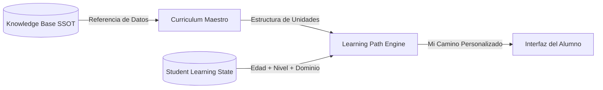

# GOALS — Especificación de Contenido, Currículo, Edad, Nivel e Interfaz
**Versión 1.0 — Auditoría de Fase 0 y Marco de Migración Controlada 6–15 Años**

---

## 🏛️ PARTE 1: AUDITORÍA TÉCNICA DE LA ARQUITECTURA EXISTENTE

### 1.1. Matriz de Auditoría de Componentes Actuales

| Componente / Capa | Estado Actual | Qué Sirve (Reutilizable) | Qué Debe Modificarse | Qué NO Tocar | Nivel de Riesgo |
| :--- | :--- | :--- | :--- | :--- | :--- |
| **`GoalsHome` & Shell** (`src/App.tsx`, `GoalsHome.tsx`) | Funcional con selector de miniapps y barra de progreso global. | Layout responsive, Auth, badges de nivel y selector de experiencias. | Incorporar tarjeta *"Mi Camino"* (`LearningPathCard`) en lugar de mostrar catálogos globales abrumadores. | Header, Footer, StarField, sistema de Auth y CookieBanner. | **Bajo** |
| **Autenticación** (`AuthContext.tsx`) | 100% Funcional (Google, Email, Invitado). | Sesión de usuario, sincronización cloud/local y roles. | Ninguna modificación requerida en esta fase. | Código de Auth, login popup y gestión de tokens. | **Nulo** |
| **Perfil del Niño** (`childProfile.ts`, `ProfileModal.tsx`) | Captura nombre, edad (6-15), curso (Primaria/ESO) e intereses. | Interfaz `ChildLearningProfile` y modal de edición con persistencia. | Añadir campos de `diagnosticStatus`, `curriculumLevel` y `startingPoint`. | Opciones de intereses, asignaturas y estilos de aprendizaje. | **Bajo** |
| **Sistema de Progreso** (`ProgressContext.tsx`) | Persiste XP, rachas, evoluciones y lecciones leídas por ID numérico (1-12). | Algoritmo de racha (`streak.ts`), multiplicadores de XP y sincronización Firestore. | Desacoplar IDs numéricos fijos (1-12) a identificadores de unidad y niveles de mastery por concepto. | Claves globales de usuario, sistema de guardado en Firestore y fallback. | **Medio** |
| **`CurriculumService`** (`CurriculumService.ts`) | Cache-first L1->L2->L3->L4 con Firestore y fallback local. | Arquitectura de caché en 4 capas y suscripciones `onSnapshot`. | Soportar unidades por tramos de edad/etapa y filtrar lecciones según el Learning Path del alumno. | Motor de caché L1/L2 y listeners reactivos. | **Bajo** |
| **`KnowledgeService`** (`KnowledgeService.ts`) | Gestión de `KnowledgeItem` y `KnowledgeChunk` con sincronización Firestore. | Modelo de datos (SSOT), fuentes verificadas y parseo de chunks. | Mantener intacto. Las lecciones enlazarán `knowledgeSlugs`. | Esquemas de `KnowledgeItem` y estructura de colecciones. | **Nulo** |
| **`RAGSearchEngine`** (`RAGSearchEngine.ts`) | Keyword tokenization + scoring léxico + Grounding context. | Fallback determinista y generador de prompts con cero alucinación. | Encapsular tras la interfaz `KnowledgeSearchEngine` para permitir búsqueda vectorial futura. | Prompt de grounding pedagógico actual. | **Bajo** |
| **Parsers y Validadores** (`MarkdownCurriculumParser.ts`, `CurriculumValidator.ts`) | Parser AST de Markdown con soporte Frontmatter, 3D, fotos y tests. | Extracción de lecciones, fotos NASA, modelos 3D y quizzes estructurados. | Añadir metadatos de competencias LOMLOE, tramo de edad y conceptos requeridos en el frontmatter. | Lógica de parseo de alertas (`[!NOTE]`, `[!WOW]`, etc.). | **Bajo** |
| **Experiencia Astro Actual** (`AstroExperience.tsx`, `CosmicLearningPath.tsx`) | 12 Lecciones interactivas + Tests + Visor 3D Three.js. | Las 12 lecciones son un contenido de altísima calidad (Piloto validado). | Mostrar la ruta adaptada al nivel del estudiante en lugar de las 12 tarjetas fijas. | Motor 3D Three.js, shaders, texturas y escenas orbitales. | **Bajo** |
| **Base de Conocimiento Git** (`content/knowledge/astronomy/`) | 13 documentos Markdown con hechos verificados y fuentes NASA/ESA. | Contenido científico riguroso 100% verificado. | Mantener como Single Source of Truth (SSOT). | Archivos `.md` existentes de astronomía. | **Nulo** |
| **Currículo Git** (`content/curriculum/astro/`) | Lecciones en Markdown con fotos, modelos 3D y preguntas. | Formato y sintaxis probada. | Estructurar por tramos educativos (6-7, 8-9, 10-11, 12-13, 14-15). | Compatibilidad con lecciones 1 a 12 existentes. | **Bajo** |

---

## 🧭 PARTE 2: ESPECIFICACIÓN DE CONTENIDO, CURRÍCULO, EDAD, NIVEL E INTERFAZ (20 PUNTOS)

### 1. Qué existe en Knowledge Base (SSOT)
La **Knowledge Base** (`content/knowledge/`) es el repositorio enciclopédico factual, riguroso y atemporal de GOALS.
- **Contenido:** Hechos científicos inmutables, datos numéricos precisos (ej. masa de Marte $6,417 \times 10^{23}\text{ kg}$, distancia perigeo/apogeo, inclinación $23,44^\circ$, composición atmosférica), fuentes primarias (NASA, ESA, IAU, LOMLOE) y esquemas conceptuales.
- **Independencia:** Knowledge no tiene edad ni formato pedagógico; no sabe si le habla a un niño de 6 años o a un estudiante universitario. Es la **Single Source of Truth (SSOT)**.

### 2. Qué existe en Curriculum
El **Curriculum** (`content/curriculum/`) es la transposición pedagógica estructurada de la Knowledge Base.
- **Contenido:** Objetivos de aprendizaje, progresión curricular (LOMLOE / NGSS / IAU), secuencia de unidades didácticas, prerrequisitos conceptuales, competencias clave y criterios de evaluación.
- **Estructura:** Organizado por disciplinas (`astro`, `languages`, `school`, etc.) y segmentado en tramos pedagógicos calibrados evolutivamente.

### 3. Qué existe en cada Unidad / Lección (`CurriculumLesson`)
Cada unidad didáctica es un contenedor modular que articula la experiencia de aprendizaje:
```text
Unidad Didáctica
├── Metadatos (ID, Título, Subtítulo, Icono, Duración estimada, Recompensa XP)
├── Metadatos Curriculares (Tramo de edad recomendado, Curso LOMLOE, Competencias)
├── Referencias a Knowledge (knowledgeSlugs: ['astronomy.solar_system.mars'])
├── Prerrequisitos (IDs de unidades conceptualmente previas)
├── Pasos de Aprendizaje (Steps):
│   ├── Concepto nuclear (Texto adaptado, analogías, Wow facts)
│   ├── Recursos Visuales (Fotos oficiales NASA/ESA, Infografías SVG)
│   ├── Interactividad / 3D (Escenas Three.js, Simulaciones de órbitas)
│   ├── Actividad práctica / Experimento mental
│   └── Resumen y reflexión
└── Banco de Evaluación (Linked Test):
    ├── Preguntas de selección simple/múltiple
    ├── Retos de ordenación espacial/cronológica
    └── Explicaciones pedagógicas detalladas para cada acierto o fallo
```

### 4. Qué existe en el Student Learning State (`studentLearningState`)
El alumno **no almacena una copia del currículo**, sino su **estado y expediente individual**:
```typescript
export interface StudentLearningState {
  userId: string;
  disciplineId: string; // ej. 'astro'
  age: number;          // ej. 9
  grade: string;        // ej. '4º de Primaria'
  
  // Diagnóstico
  diagnosticStatus: 'pending' | 'completed' | 'skipped';
  diagnosticScore?: number;
  diagnosticDate?: number;
  
  // Posición Curricular
  recommendedStartingUnitId: string; // Unidad recomendada tras diagnóstico
  currentUnitId: string;            // Unidad que está cursando hoy
  
  // Progreso y Dominio
  completedUnitIds: string[];        // Unidades superadas con éxito
  masteredConcepts: Record<string, number>; // conceptKey -> % dominio (0-100)
  weakConcepts: string[];            // Conceptos que requieren refuerzo
  
  // Historial de Sesiones
  sessionHistory: Array<{
    unitId: string;
    completedAt: number;
    scorePercent: number;
    xpEarned: number;
    attempts: number;
  }>;
  
  updatedAt: number;
}
```

### 5. Cómo se relacionan entre sí


### 6. Cómo se almacena cada cosa
- **Git (Markdown + YAML):** Fuente maestra versionable del conocimiento (`content/knowledge/`) y del currículo (`content/curriculum/`).
- **Firestore:** Datos indexados para consumo en tiempo real por la app web y móvil:
  - `curriculums/{disciplineId}/units/{unitId}`
  - `knowledge/{knowledgeId}` y `knowledgeChunks/{chunkId}`
  - `users/{uid}/learningStates/{disciplineId}` (Estado del alumno)
- **Firebase Storage:** Recursos pesados (modelos 3D GLTF, texturas espaciales de 4K/8K, PDFs oficiales y audio fonético).
- **LocalStorage (L2 Cache):** Réplica offline-first del estado del alumno y de las unidades descargadas.

### 7. Cómo funciona el diagnóstico inicial
1. **No es un examen masivo:** Consta de 4 a 6 micro-retos adaptativos calibrados según la edad declarada.
2. **Algoritmo Adaptativo de Búsqueda Binaria Pedagógica:**
   - Se presenta un ítem del nivel esperado para su edad.
   - **Acierto:** Se evalúa un concepto del tramo superior para verificar si está adelantado.
   - **Fallo:** Se desciende hacia los prerrequisitos del concepto para localizar la frontera exacta de su conocimiento.
3. **Resultado Inmediato:** El diagnóstico no califica con notas punitivas; identifica fortalezas y determina el **Punto de Entrada Recomendado**.

### 8. Cómo se determina el punto de entrada
- Alumno de 9 años cuyo diagnóstico confirma dominio de los fundamentos del sistema Tierra-Sol-Luna: su punto de entrada se sitúa en las unidades de dinámica planetaria u órbitas, marcando los bloques previos como `Completados / Validados`.
- Alumno de 9 años con lagunas en la rotación terrestre: su punto de partida se posiciona en las unidades de rotación con ejemplos visuales, garantizando que no sufra frustración posterior.

### 9. Cómo cambia la ruta personal
La ruta personal no es una lista estática de 200 elementos: es una secuencia viva. Si un alumno supera una lección con 100% de maestría al primer intento, la siguiente unidad se desbloquea directamente; si presenta dudas en un concepto crítico (ej. inclinación del eje terrestre), el motor inserta automáticamente una micro-actividad de refuerzo antes de proseguir.

### 10. Cómo cambia la interfaz del alumno
La interfaz se despoja de la vista enciclopédica abrumadora. El alumno visualiza únicamente:
1. **Su bloque actual en curso** con una tarjeta grande y motivadora *"Continuar mi camino"*.
2. **Su progreso relativo** (conceptos dominados, estrellas y racha).
3. **Los 2 próximos hitos inmediatos** (visibles como próximos pasos).
4. **Los bloques completados** accesibles para repaso voluntario.

### 11. Cómo cambia la profundidad del contenido
El mismo concepto astronómico (ej. *La atmósfera de Marte*) se modula en profundidad según el tramo:
- **6–7 años:** "Marte tiene un aire muy fino donde no podemos respirar, y tiene polvo rojo como el óxido."
- **10–11 años:** "La atmósfera marciana tiene una presión de solo el 1% de la Tierra y está compuesta por 95% de dióxido de carbono ($CO_2$)."
- **14–15 años:** "La ausencia de una magnetosfera global permitió que el viento solar erosionara la atmósfera mediante escape hidrodinámico, reduciendo la presión superficial a 6.1 mbar (punto triple del agua)."

### 12. Cómo cambia la IA
La IA opera bajo **Grounding Estricto**:
- **Qué enseña:** Definido estrictamente por el currículo y los chunks de conocimiento vinculados.
- **Cómo lo explica:** La IA modula su vocabulario, longitud de frases, metáforas cotidianas y tono según la edad y estilo del alumno.
- **Prohibición de desvío:** La IA no puede inventar objetivos curriculares ni saltarse prerrequisitos conceptuales.

### 13. Comportamiento ante el cambio de edad
Cuando el alumno cumple años (ej. pasa de 9 a 10 años en su perfil):
- **No se reinicia su progreso.**
- El sistema compara su mapa de dominio actual contra el nivel esperado para 10 años.
- Si ya domina los conceptos del nuevo tramo, continúa su ruta con normalidad; si existen nuevos conceptos curriculares correspondientes a su nuevo curso escolar, se integran armónicamente en su ruta.

### 14. Alumno adelantado vs Alumno que necesita refuerzo
- **Adelantado:** La interfaz ofrece retos opcionales de nivel superior (*"Desafío de Astrofísica"*), otorga multiplicadores de XP e incrementa la profundidad conceptual sin obligarle a repetir contenidos básicos.
- **Con lagunas:** La interfaz no muestra mensajes de error punitivos; ofrece explicaciones alternativas con analogías visuales, modelos 3D interactivos y ejercicios guiados paso a paso.

### 15. Reutilización entre miniapps (Astro, Languages, School, etc.)
Todas las miniapps de GOALS compartirán el mismo motor:
- Mismo `CurriculumService` y `KnowledgeService`.
- Mismo `StudentLearningState` y `ProgressContext`.
- Misma presentación adaptativa en `LessonView` (`<LessonView age={studentAge} studentState={state} unit={unit} />`).

### 16. Estrategia de escalado: De Astro a toda la suite GOALS
Astro sirve como el banco de pruebas y estándar de oro pedagógico. Una vez validada la progresión, el diagnóstico y el Learning Path en Astronomía, se replicará exactamente el mismo contrato de carpetas y esquemas en Idiomas, Ciencias Escolares y Competencia Digital/Desinformación.

---

## 📊 PARTE 3: MATRICES OBLIGATORIAS DE ADAPTACIÓN

### 3.1. Matriz de Elementos UI/UX por Tramo de Edad

| Elemento | 6–7 años (1.º-2.º Primaria) | 8–9 años (3.º-4.º Primaria) | 10–11 años (5.º-6.º Primaria) | 12–13 años (1.º-2.º ESO) | 14–15 años (3.º-4.º ESO) |
| :--- | :--- | :--- | :--- | :--- | :--- |
| **Texto** | Mínimo (1-2 frases por paso, tipografía grande 18px+). | Párrafos cortos (3-4 líneas, vocabulario accesible). | Texto estructurado con destacados y subtítulos claros. | Texto académico con terminología científica rigurosa. | Denso, con definiciones formales y formulación matemática. |
| **Imágenes** | Ilustraciones coloridas, fotos reales de alto impacto. | Fotos NASA/ESA con rótulos explicativos sencillos. | Diagramas de rayos, cortes transversales y comparativas. | Esquemas orbitales, mapas espectrales y telemetría. | Gráficos multieje, curvas de luz y espectros electromagnéticos. |
| **Vídeo / 3D** | Animaciones guiadas, rotación 3D automática simple. | Modelos 3D interactivos con etiquetas tocables. | Vistas orbitales 3D con control de cámara libre y escalas. | Simulador con parámetros físicos (velocidad, distancia, masa). | Telemetría en tiempo real, vectores de fuerza y simulación Kepleriana. |
| **Interactividad** | Botones táctiles gigantes, arrastrar y soltar visual. | Fichas ordenables, selector de opciones con iconos. | Sliders de tiempo/escala y alternancia de capas de datos. | Herramientas de medición interactiva (regla, escala, cronómetro). | Análisis de datasets, cálculo de variables y pruebas de hipótesis. |
| **Actividades** | Asociación visual directa y discriminación perceptiva. | Pequeñas clasificaciones y emparejamientos conceptuales. | Experimentos mentales guiados y deducción de causas. | Resolución de problemas con datos y cálculo guiado. | Investigación basada en evidencias y análisis de casos reales. |
| **Quiz** | 2 opciones con emojis e imágenes (sin penalización). | 3 opciones o reordenar 3 elementos secuenciales. | Selección múltiple (4 opciones) y justificación de respuesta. | Preguntas con distractores conceptuales plausibles. | Preguntas de desarrollo estructurado, cálculo y contraejemplos. |
| **Fuentes** | Ocultas (mención verbal: *"La NASA nos enseña..."*). | Badge sutil de fuente oficial verificada (NASA/ESA). | Enlace a la misión espacial o agencia fuente. | Citas bibliográficas completas con autoridad explícita. | Referencias a papers peer-reviewed, DOI y datasets abiertos. |
| **Retos** | Misiones de exploración con medallas y estrellas. | Retos diarios de curiosidad con recompensas en gemas/XP. | Desafíos de lógica astronómica y predicción de fenómenos. | Misiones de cálculo orbital y simulaciones de ingeniería. | Retos de astrofísica teórica y debates científicos. |
| **IA** | Mascota animada, habla con frases cortas y cálidas. | Tutor amigable que propone preguntas socráticas breves. | Mentor que razona el "por qué" y aclara dudas técnicas. | Asistente científico que formula contra-preguntas críticas. | Co-investigador riguroso que evalúa la solidez argumental. |
| **Navegación** | Un solo botón de acción principal ("¡Siguiente!"). | Navegación lineal guiada con mapa de hitos desbloqueados. | Ruta personal con selector de vista (Camino vs Exploración). | Dashboard con árbol de competencias y métricas de avance. | Panel analítico completo con control total sobre su ruta. |
| **Densidad UI** | Muy limpia, 1 elemento por pantalla, cero distracciones. | Espaciosa, tarjetas con bordes redondeados y colores vivos. | Equilibrada, tarjetas de contenido con pestañas organizadas. | Compacta, paneles laterales con datos y especificaciones. | Profesional (Dark Glassmorphism técnico), alta densidad de datos. |

---

### 3.2. Matriz de Comportamiento según el Estado del Alumno

| Estado del Alumno | Qué Ve el Alumno en la Interfaz | Acción del Sistema / Motor |
| :--- | :--- | :--- |
| **Nuevo Usuario** | Pantalla de bienvenida cálida + Invitación al micro-diagnóstico inicial (*"Descubramos tu nivel espacial en 3 minutos"*). | Inicializa el `StudentLearningState` con la edad declarada y asigna el test diagnóstico adaptativo. |
| **Diagnóstico Pendiente** | Banner destacado en la Home: *"Completa tu diagnóstico para desbloquear tu ruta personalizada"*. | Permite navegar en modo exploración libre pero mantiene el acceso al diagnóstico en 1 clic. |
| **En Progreso Normal** | Tarjeta principal *"Continuar mi camino"* con la lección actual + Los 2 próximos pasos inmediatos. | Carga la unidad actual en la posición exacta donde la dejó el estudiante. |
| **Unidad Completada** | Celebración visual con estrellas y XP ganado + Animación de desbloqueo del siguiente paso en la ruta. | Actualiza el estado en Firestore, marca los conceptos dominados y actualiza el radar de mastery. |
| **Concepto Débil Detectado** | Tarjeta de refuerzo positivo: *"¡Vamos a consolidar [Concepto] con una actividad rápida!"*. | Inserta un micro-paso de repaso o analogía visual alternativa antes de avanzar al siguiente tema complejo. |
| **Alumno Adelantado** | Badge de Maestría Avanzada + Acceso a *"Desafíos Cósmicos"* opcionales con mayor profundidad científica. | Otorga bonificaciones de XP y abre ramas optativas de investigación avanzada. |
| **Cumple Años / Cambio de Curso** | Mensaje de felicitación: *"¡Felicidades por tus [X] años! Hemos actualizado tus retos cósmicos"*. | Recalcula el nivel esperado, compara el mapa de dominio y ajusta la densidad de la interfaz sin reiniciar el progreso. |

---

## 🗺️ PARTE 4: PLAN DE MIGRACIÓN EN FASES PEQUEÑAS Y CONTROLADAS

```text
┌─────────────────────────────────────────────────────────────────────────────┐
│                    PLAN DE MIGRACIÓN CONTROLADA (10 FASES)                  │
├─────────┬───────────────────────────────────┬───────────────────────────────┤
│ FASE 0  │ Auditoría y Especificación        │ [x] COMPLETADA (Documentada)  │
├─────────┼───────────────────────────────────┼───────────────────────────────┤
│ FASE 1  │ Modelo de Datos Curricular 6–15   │ Definir tipos TS sin romper   │
│ FASE 2  │ Matriz Pedagógica de Tramos       │ Documentar LOMLOE en research │
│ FASE 3  │ Piloto de Astronomía (12 uds)     │ Reestructurar 3 uds x tramo   │
│ FASE 4  │ Punto de Entrada y Learning State │ Persistir estado del alumno   │
│ FASE 5  │ Diagnóstico Adaptativo            │ Micro-test adaptativo (4-6 q) │
│ FASE 6  │ Interfaz "Mi Camino"              │ UI enfocada en el camino real │
│ FASE 7  │ Lección Adaptativa por Edad       │ <LessonView> multinivel       │
│ FASE 8  │ Motor de Refuerzo y Dominio       │ Detección de brechas          │
│ FASE 9  │ Escalado de Contenido Completo    │ Expansión gradual validada    │
│ FASE 10 │ Replicación a Toda la Suite       │ Idiomas, School, Verify       │
└─────────┴───────────────────────────────────┴───────────────────────────────┘
```

---

## 🛑 CONCLUSIÓN Y CRITERIO DE PARADA

Esta especificación establece con exactitud matemática y pedagógica el modelo que regirá la evolución de GOALS.
- **Cero código destructivo ejecutado.**
- **El proyecto actual compila y funciona al 100%.**
- **Quedo a la espera de tu revisión y aprobación para iniciar formalmente la FASE 1 (Definición de Tipos del Modelo Curricular).**
