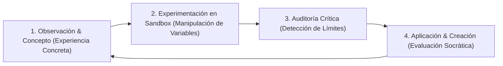

# 01 · MARCO PEDAGÓGICO (PEDAGOGICAL FRAMEWORK)

**Producto:** GOALS · IA LAB  
**Enfoque:** Aprendizaje Experiencial (Kolb), Taxonomía de Bloom Revisada y Andamiaje Cognitivo Adaptativo.

---

## 1. El Ciclo de Aprendizaje en IA Lab

Cada concepto en IA Lab se imparte mediante una estructura de 4 fases progresivas:

1. **Experiencia Concreta:** Presentación del fenómeno (ej. cómo una cámara ve números y no colores).
2. **Manipulación de Variables (Hands-On):** El alumno interactúa con los diales matemáticos (cambia la tasa de aprendizaje, el kernel 3x3 o la temperatura).
3. **Auditoría Crítica:** El alumno se enfrenta a un fallo del sistema (un sobreajuste, una alucinación o un sesgo de datos) para descubrir el límite del modelo.
4. **Co-Creación & Evaluación:** El alumno aplica lo aprendido para resolver un dilema o co-crear una solución con retroalimentación inmediata.

---

## 2. Taxonomía de Bloom Adaptada a la Inteligencia Artificial

| Nivel Bloom | Acción del Alumno en IA Lab | Componente en la App |
| :--- | :--- | :--- |
| **1. Recordar** | Identificar qué es un token, un peso o un píxel RGB. | Lecciones interactivas y Quizzes rápidos. |
| **2. Comprender** | Explicar por qué la IA alucina o cómo aprende el descenso de gradiente. | Metáforas guiadas y desgloses paso a paso. |
| **3. Aplicar** | Modificar la temperatura y el Top-K para obtener respuestas concretas. | `TokenFlowLab` y `NeuralNetworkVisualizer`. |
| **4. Analizar** | Inspeccionar matrices de convolución y mapas de características locales. | `ComputerVisionLab`. |
| **5. Evaluar** | Juzgar la veracidad de una respuesta y contrastarla con fuentes primarias. | `HallucinationHunterLab` y `BiasAndEthicsLab`. |
| **6. Crear** | Estructurar prompts con la metodología RCRF y co-crear con el mentor IA. | `CreativeAIStudio`. |

---

## 3. Adaptación Dinámica por Edad

### A. Exploradores (7 a 9 años)
- **Lenguaje:** Claro, estimulante, basado en preguntas cotidianas y comparaciones con el mundo real (juegos de mesa, pinturas, Legos, deportes).
- **Carga cognitiva:** Textos de máximo 2 párrafos concisos con apoyos visuales y síntesis de voz automática.
- **Enfoque ético:** Reglas de seguridad básica: no compartir datos privados con chatbots y entender que los robots no son amigos humanos reales.

### B. Constructores (10 a 12 años)
- **Lenguaje:** Preciso, técnico pero accesible, introduciendo la terminología estándar del sector (Machine Learning, Dataset, Token, Overfitting, Convolución).
- **Carga cognitiva:** Explicaciones de causas y consecuencias lógicas con desgloses cuantitativos (porcentajes de acierto, pérdida, dimensiones de vectores).
- **Enfoque ético:** Comprensión de cómo se entrenan los modelos, derechos de autor en el arte digital y el impacto de los algoritmos de recomendación en redes sociales.

### C. Innovadores (13 a 15+ años)
- **Lenguaje:** Riguroso, preuniversitario, con rigor matemático formal (fórmulas de activación, backpropagation, auto-atención multi-head, arquitecturas RAG).
- **Carga cognitiva:** Análisis de casos reales judiciales y científicos (Mata v. Avianca, Gender Shades, EU AI Act).
- **Enfoque ético:** Legislación europea, auditorías de sesgo algorítmico, huella hídrica y energética de los centros de datos y derechos fundamentales.
