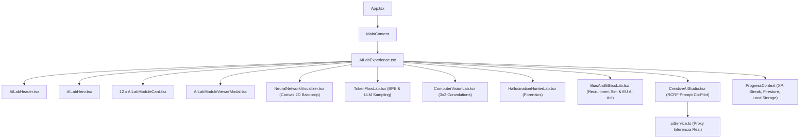

# 03 · ARQUITECTURA TÉCNICA (TECHNICAL ARCHITECTURE)

**Módulo:** `ai-lab`  
**Ecosistema:** GOALS Platform (React 18 + Vite + TypeScript + Tailwind CSS)

---

## 1. Topología de Componentes y Flujo de Estado

---

## 2. Motores Matemáticos y Algorítmicos Nativos (Cero Mocks)

### A. Motor de Red Neuronal 2D (`NeuralNetworkVisualizer.tsx`)
- **Implementación:** Pure Canvas 2D + JavaScript Typed Arrays.
- **Topología:** Entrada 2D $\rightarrow$ Capa Oculta 1 (1–8 neuronas) $\rightarrow$ Capa Oculta 2 (1–8 neuronas) $\rightarrow$ Salida Sigmoide 1D.
- **Entrenamiento:**
  - Forward Pass con funciones de activación seleccionables ($\text{ReLU}(x) = \max(0, x)$, $\tanh(x)$, $\sigma(x)$).
  - Cálculo de Binary Cross-Entropy Loss: $\mathcal{L} = -(y \log(\hat{y}) + (1-y)\log(1-\hat{y}))$.
  - Backpropagation aplicando la regla de la cadena para obtener $\frac{\partial \mathcal{L}}{\partial W_i}$ y $\frac{\partial \mathcal{L}}{\partial b_i}$.
  - Descenso de Gradiente estocástico en bucle `requestAnimationFrame`.
  - Renderizado de la frontera de decisión evaluando una cuadrícula espacial de $45 \times 45$ celdas en tiempo real.

### B. Motor de Tokenización y Muestreo LLM (`TokenFlowLab.tsx`)
- **Tokenizador:** Segmentación léxica de subpalabras con expresión regular Unicode, hashing determinista de identificadores de token (IDs de 1000 a 99999) e inspección de bytes UTF-8 (`TextEncoder`).
- **Muestreador Probabilístico (Softmax con Temperatura):**
  $$P(w_i) = \frac{\exp(z_i / T)}{\sum_{j} \exp(z_j / T)}$$
- **Filtros Top-K y Top-P (Nucleus Sampling):** Poda del vector de probabilidades acumuladas y muestreo estocástico ponderado en tiempo real.

### C. Motor de Convolución Espacial (`ComputerVisionLab.tsx`)
- **Matriz de Entrada:** Matrices de $16 \times 16$ píxeles en escala de grises (0 a 255).
- **Operación de Convolución Discreta 2D:**
  $$(I * K)(r, c) = \sum_{i=-1}^{1} \sum_{j=-1}^{1} I(r+i, c+j) \cdot K(i+1, j+1)$$
- **Filtros Implementados:** Detección de Bordes Laplaciano, Enfoque (Sharpen), Sobel Horizontal/Vertical, Desenfoque Gaussiano y Relieve (Emboss).
- **Inspección Interactiva:** Desglose aritmético reactivo al pasar el cursor sobre cualquier píxel.

---

## 3. Persistencia de Datos y Gamificación

- **Almacenamiento Local y Cloud:**
  - `localStorage['goals_ai_lab_completed_modules']`: Array JSON de IDs de módulos completados.
  - Sincronización transparente con `UserData.experiences.aiLab` en Firestore mediante `ProgressContext`.
  - Emisión de Toasts de recompensa de XP y actualización del ranking del estudiante.
