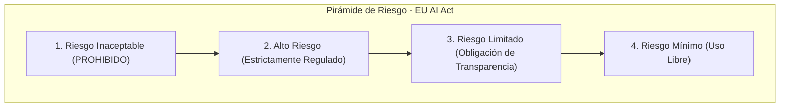

# 06 · SEGURIDAD, PRIVACIDAD Y ÉTICA (SAFETY & ETHICS)

**Módulo:** `ai-lab`  
**Cumplimiento:** Reglamento General de Protección de Datos (RGPD / GDPR), Ley de IA de la UE (EU AI Act) y directrices COPPA / UNICEF para menores.

---

## 1. Principios de Protección del Menor (Child Safety First)

1. **Privacidad por Defecto:** IA Lab no almacena ni transmite datos personales sensibles de los alumnos. El perfil de aprendizaje (`ChildLearningProfile`) se almacena localmente y con seudónimos en Firestore.
2. **Filtros de Contenido Seguros:** El servicio de IA (`aiService.ts`) opera con directivas de sistema (`system instructions`) que bloquean cualquier generación de contenido violento, sexual, discriminatorio o potencialmente peligroso.
3. **Sin Publicidad ni Rastreo Comercial:** La plataforma es 100% educativa, sin cookies de terceros ni subastas de datos para publicidad comportamental.

---

## 2. Alineación con la Ley de Inteligencia Artificial de la UE (EU AI Act)

IA Lab enseña a los estudiantes la clasificación en 4 niveles de riesgo establecida por la Unión Europea:

- **Riesgo Inaceptable:** Se prohíbe la manipulación conductual subliminal, la puntuación social ciudadana y el reconocimiento biométrico masivo indiscriminado en tiempo real en la vía pública.
- **Alto Riesgo:** Sistemas en educación (admisión y evaluación), salud, justicia y empleo requieren auditorías de sesgos, datos de calidad y supervisión humana obligatoria (*Human-in-the-loop*).
- **Riesgo Limitado:** Chatbots y generadores de medios sintéticos deben declarar explícitamente que son herramientas artificiales y certificar deepfakes.
- **Riesgo Mínimo:** Videojuegos, filtros de spam y asistentes de productividad.

---

## 3. Educación en Ciberseguridad e Inyecciones de Prompt

El currículo capacita al alumno para comprender:
- **Ataques de Inyección de Prompts (Prompt Injection):** Cómo instrucciones ocultas en textos externos pueden manipular asistentes automatizados.
- **Extracción de Datos de Entrenamiento (Data Extraction):** Por qué nunca se deben pegar credenciales, contraseñas o datos familiares en modelos comerciales abiertos.
- **Desinformación Sintética y Falsificación:** El peligro del "dividendo del mentiroso" y la necesidad de verificar la procedencia de imágenes mediante estándares abiertos como **C2PA (Content Credentials)**.
