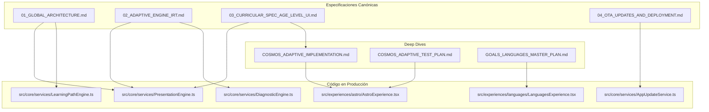

# 🏛️ GOALS — Brújula Técnica y Arquitectura del Sistema

**Repositorio Central de Especificaciones, Motores y Auditorías Arquitectónicas**  
*Plataforma Educativa Adaptativa Multidimensional (6 a 15 Años)*

---

## 🧭 1. Visión y Filosofía Arquitectónica

El sistema **GOALS** está construido sobre cuatro pilares fundamentales:

1. **Separación Estricta de Cuatro Capas**:
   - **Knowledge Base (SSOT)**: Repositorio atemporal de hechos científicos verificados (NASA, ESA, IAU, LOMLOE).
   - **Curriculum Maestro**: Transposición didáctica en unidades modulares (`CurriculumUnit`) graduadas por tramos.
   - **Student Learning State**: Expediente individual del alumno (`LearnerProfile` & `StudentLearningState`) que registra dominio conceptual real.
   - **Presentation & AI Engine**: Modulación en tiempo de ejecución de la densidad visual, profundidad cognitiva, formato de quizzes y personalidad del tutor IA.
2. **Cero Mocks y Datos 100% Reales**: Ningún componente de producción utiliza datos simulados o temporizadores cosméticos. Todos los cálculos, rutas y evaluaciones se ejecutan sobre datos reales persistidos en Firestore y validados con suites de tests automáticas.
3. **Jerarquía de Persistencia Offline-First (L1–L4)**:
   - **L1 (RAM)**: Cache en memoria reactiva de acceso inmediato (<1 ms).
   - **L2 (LocalStorage / IndexedDB)**: Persistencia local en cliente para uso sin conexión.
   - **L3 (Fallback In-Memory)**: Estado de degradación suave garantizado si falla la red.
   - **L4 (Firebase Firestore)**: Sincronización en la nube con reconciliación bidireccional.
4. **Anti-Fuga Curricular y No-Regresión**: Un estudiante de 6 años jamás comparte las mismas explicaciones, fórmulas o pruebas que un estudiante de 15 años. La plataforma adapta dinámicamente todo el flujo mediante el motor psicométrico y el enrutador de "Mi Camino".

---

## 🗺️ 2. Mapa y Flujo Unificado del Motor

```
                  ┌─────────────────────────────────────┐
                  │        KNOWLEDGE BASE (SSOT)        │
                  │       (content/knowledge/*.md)      │
                  └──────────────────┬──────────────────┘
                                     │ (Referencias de Hechos Factuales)
                                     ▼
                  ┌─────────────────────────────────────┐
                  │          CURRÍCULO MAESTRO          │
                  │      (content/curriculum/*.md)      │
                  └──────────┬──────────────────────┬───┘
                             │                      │
                  (Tramo inicial / Competencias)    │ (Banco de Ítems Diagnósticos)
                             ▼                      ▼
┌──────────────────┐   ┌───────────────┐      ┌─────────────────────────┐
│  CHILD PROFILE   │──>│  DIAGNOSTIC   │<────>│    DIAGNOSTIC ENGINE    │
│  (Edad / Curso)  │   │    SESSION    │      │ (Búsqueda Adaptativa)   │
└──────────────────┘   └───────┬───────┘      └─────────────────────────┘
                               │
                       (Mastery Inicial)
                               ▼
                  ┌───────────────────────────────┐
                  │    STUDENT LEARNING STATE     │
                  │   (Posición / Mastery / Gap)  │
                  └────────────┬──────────────────┘
                               │
                               ▼
                  ┌───────────────────────────────┐
                  │     LEARNING PATH ENGINE      │
                  │ (Mi Camino: Actual, Sig, Rep) │
                  └────────────┬──────────────────┘
                               │
                               ▼
                  ┌───────────────────────────────┐
                  │        DYNAMIC ROUTER         │
                  │ (Perfil -> Diag -> Camino)    │
                  └────────────┬──────────────────┘
                               │
                               ▼
                  ┌───────────────────────────────┐
                  │  ADAPTIVE PRESENTATION ENGINE │
                  │ (Profundidad, Densidad, 3D)   │
                  └────────────┬──────────────────┘
                               │
                               ▼
                  ┌───────────────────────────────┐
                  │     ADAPTIVE LESSON VIEW      │
                  │    (Teoría + 3D + Quiz + IA)  │
                  └────────────┬──────────────────┘
                               │
                       (Resultado / Mastery)
                               ▼
                  ┌───────────────────────────────┐
                  │   PROGRESS & MASTERY UPDATE   │
                  │     (Firestore / Offline)     │
                  └───────────────────────────────┘
```

---

## 🗂️ 3. Taxonomía de Documentos de Arquitectura

### 🏛️ A. Documentos Centrales Canónicos (Vigentes)

| Documento | Título y Propósito | Interfaces y Contratos Clave |
| :--- | :--- | :--- |
| **[`01_GLOBAL_ARCHITECTURE.md`](./01_GLOBAL_ARCHITECTURE.md)** | **Flujo Unificado y Arquitectura del Motor**: Manifiesto principal del ecosistema. Define la relación entre SSOT, currículo, estado y presentación. | `CurriculumUnit`, `StudentLearningState`, `LearningPath`, `PresentationProfile` |
| **[`02_ADAPTIVE_ENGINE_IRT.md`](./02_ADAPTIVE_ENGINE_IRT.md)** | **Motor Adaptativo Multidimensional**: Detalla los 5 tramos LOMLOE, arquetipos cognitivos, formatos de quiz y modulación de prompts de IA. | `LearnerProfile`, `AgeTranche`, `EducationalStage`, `StudentLearningState` |
| **[`03_CURRICULAR_SPEC_AGE_LEVEL_UI.md`](./03_CURRICULAR_SPEC_AGE_LEVEL_UI.md)** | **Especificación de Contenido, Tramos y UI (20 Puntos)**: Marco normativo completo de transposición didáctica, matrices UI/UX y plan de migración en 10 fases. | `CurriculumLesson`, `CurriculumStep`, `CurriculumTest`, `QuestionItem` |
| **[`04_OTA_UPDATES_AND_DEPLOYMENT.md`](./04_OTA_UPDATES_AND_DEPLOYMENT.md)** | **Auto-Actualizaciones In-App OTA y Despliegue**: Sistema de actualización silenciosa de APK Android y Web vía Hosting/Firestore. | `AppUpdateService`, `useAppUpdate`, `public/version.json` |
| **[`spec_curriculum_viewer.html`](./spec_curriculum_viewer.html)** | **Visor Web Interactivo**: Interfaz Dark Glassmorphism para inspección visual de la especificación curricular adaptativa. | Visor web standalone ejecutable en navegador |

---

### 🔬 B. Especificaciones Técnicas Profundas ([`deep_dives/`](./deep_dives/))

| Documento | Ámbito | Descripción Técnica |
| :--- | :--- | :--- |
| **[`deep_dives/COSMOS_ADAPTIVE_IMPLEMENTATION.md`](./deep_dives/COSMOS_ADAPTIVE_IMPLEMENTATION.md)** | Cosmos 3D | Implementación del piloto adaptativo en Astronomía (`AstroExperience`, `CosmicLearningPath`, `TestsCatalogHub`, `adaptiveCosmosCatalog`). |
| **[`deep_dives/COSMOS_ADAPTIVE_TEST_PLAN.md`](./deep_dives/COSMOS_ADAPTIVE_TEST_PLAN.md)** | Testing | Plan de pruebas automatizadas con Vitest (`npm test`) y matriz de validación manual UI para anti-fuga curricular. |
| **[`deep_dives/ASTRO_REFERENCE_ANALYSIS.md`](./deep_dives/ASTRO_REFERENCE_ANALYSIS.md)** | Benchmark | Auditoría comparativa entre el prototipo original Golden Master (HTML) y la versión modular React/Vite de GOALS. |
| **[`deep_dives/GOALS_LANGUAGES_MASTER_PLAN.md`](./deep_dives/GOALS_LANGUAGES_MASTER_PLAN.md)** | Languages | Master Plan del profesor particular conversacional multimodal en 6 capas pedagógicas y de IA. |

---

### 📋 C. Informes de Auditoría e Historial ([`audits/`](./audits/))

| Documento | Alcance | Hallazgos y Decisiones |
| :--- | :--- | :--- |
| **[`audits/ADAPTIVE_ARCHITECTURE_AUDIT.md`](./audits/ADAPTIVE_ARCHITECTURE_AUDIT.md)** | Auditoría 5D | Diagnóstico multi-agente de la Fase 0. Identificó el desacoplamiento de lecciones fijas y definió el roadmap adaptativo. |
| **[`audits/DEVELOPMENT_AUDIT.md`](./audits/DEVELOPMENT_AUDIT.md)** | Stack Inicial | Inspección técnica del stack original (React 18, Vite, Three.js, Tailwind, Capacitor y Firebase). |
| **[`audits/GOALS_GLOBAL_AUDIT.md`](./audits/GOALS_GLOBAL_AUDIT.md)** | Acoplamientos | Identificación de IDs numéricos hardcoded (1–12) y reglas de no regresión en Firestore y WebGL. |
| **[`audits/GOALS_MIGRATION_STATUS.md`](./audits/GOALS_MIGRATION_STATUS.md)** | Estado Fases | Registro de cumplimiento de las Fases 0 a 10 en la migración del piloto Cosmos. |

---

### 📦 D. Especificaciones Históricas ([`legacy_specs/`](./legacy_specs/))

- **[`legacy_specs/criterio/`](./legacy_specs/criterio/)**: 14 tratados originales de especificación técnica y pedagógica para Pensamiento Crítico y Verificación.
- **[`legacy_specs/languages/`](./legacy_specs/languages/)**: 28 bloques temáticos originales para la suite de aprendizaje de segundas lenguas.

---

## 🧩 4. Mapa de Dependencias entre Componentes y Documentos



---

## 🎯 5. Reglas de Mantenimiento y Modificación

1. **Inmutabilidad de la Base de Conocimiento (Knowledge Base SSOT)**: Toda modificación conceptual o científica debe realizarse primero en `content/knowledge/` con fuentes oficiales (NASA/ESA/LOMLOE).
2. **Extensión No Destructiva**: Cualquier nueva propiedad en `LearnerProfile` o `StudentLearningState` debe implementarse con tipado opcional o valores por defecto para garantizar retrocompatibilidad con usuarios existentes.
3. **Verificación Automatizada Obligatoria**: Tras modificar cualquier regla adaptativa o de presentación, debe ejecutarse la suite de validación `npm test` verificando que los tests de anti-fuga y calibración de tramos se ejecuten con éxito (Exit Code 0).
