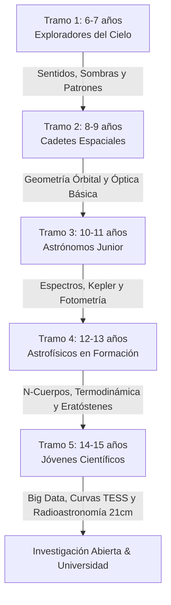

# 🌌 PLAN CURRICULAR INTEGRAL DE COSMOS (6 A 15 AÑOS)
## Tratado Maestro de Transposición Didáctica, Práctica Empírica y Carrera Espacial
**Estado:** `🟢 ESPECIFICACIÓN TÉCNICA Y CURRICULAR ACTIVA (SSOT 2026)`  
**Marco Normativo & Estándares:** LOMLOE (RD 157/2022 Primaria y RD 217/2022 ESO) & IAU OAE (*11 Big Ideas in Astronomy / Astronomy Literacy*)  
**Calibración Científica:** Actualizado a 2026 (JWST, Misiones Artemis II/III, Gran Eclipse Total España 2026, Parker Solar Probe, Europa Clipper, Vera Rubin LSST, Euclid, LISA / Ondas Gravitacionales)  
**Entorno de Aplicación:** GOALS Platform — Módulo Cosmos 3D

---

## 📑 ÍNDICE MAESTRO DE LA INVESTIGACIÓN

1. [🏛️ Fundamentos Psicopedagógicos y Progresión Cognitiva en Espiral](#1-fundamentos-psicopedagógicos-y-progresión-cognitiva-en-espiral)
2. [🗺️ Mapa Curricular Exhaustivo por los 5 Tramos de Edad](#2-mapa-curricular-exhaustivo-por-los-5-tramos-de-edad)
   - [Tramo 1: 6–7 Años (1.º y 2.º Primaria — Ciclo Inicial)](#tramo-1-67-años-1º-y-2º-primaria--ciclo-inicial)
   - [Tramo 2: 8–9 Años (3.º y 4.º Primaria — Ciclo Medio)](#tramo-2-89-años-3º-y-4º-primaria--ciclo-medio)
   - [Tramo 3: 10–11 Años (5.º y 6.º Primaria — Ciclo Superior)](#tramo-3-1011-años-5º-y-6º-primaria--ciclo-superior)
   - [Tramo 4: 12–13 Años (1.º y 2.º ESO — Secundaria Inicial)](#tramo-4-1213-años-1º-y-2º-eso--secundaria-inicial)
   - [Tramo 5: 14–15 Años (3.º y 4.º ESO — Secundaria Superior)](#tramo-5-1415-años-3º-y-4º-eso--secundaria-superior)
3. [🔬 Catálogo Maestro de Puesta en Práctica y Observación Real (Cero Mocks)](#3-catálogo-maestro-de-puesta-en-práctica-y-observación-real-cero-mocks)
   - [Observación Instrumental Real (Simple vista, Prismáticos, Telescopios Robóticos)](#observación-instrumental-real)
   - [Laboratorios Físicos y Simuladores 3D WebGL / Three.js](#laboratorios-físicos-y-simuladores-3d-webgl--threejs)
   - [Experimentos Caseros con Control de Variables](#experimentos-caseros-con-control-de-variables)
   - [Ciencia Ciudadana e Ingesta de Datos Abiertos en Vivo (NASA, NOAA, Zooniverse)](#ciencia-ciudadana-e-ingesta-de-datos-abiertos-en-vivo)
4. [🎯 Sistema de Evaluación Adaptativa y Diagnóstico Inicial](#4-sistema-de-evaluación-adaptativa-y-diagnóstico-inicial)
   - [Algoritmo de Búsqueda Binaria Pedagógica (BBP)](#algoritmo-de-búsqueda-binaria-pedagógica-bbp)
   - [Banco de Diagnóstico Calibrado (25 Ítems Reales)](#banco-de-diagnóstico-calibrado-25-ítems-reales)
   - [Evaluación Formativa 360º y Rúbricas Competenciales LOMLOE](#evaluación-formativa-360º-y-rúbricas-competenciales-lomloe)
   - [Detección de Conceptos Débiles y Motor de Repaso Espaciado (SM-2 / Ebbinghaus)](#detección-de-conceptos-débiles-y-motor-de-repaso-espaciado-sm-2--ebbinghaus)
5. [🎖️ Progresión y Carrera Espacial (25 Niveles & 5 Rangos Mayores)](#5-progresión-y-carrera-espacial-25-niveles--5-rangos-mayores)
   - [Estructura de Rangos y Fórmulas Matemáticas de XP](#estructura-de-rangos-y-fórmulas-matemáticas-de-xp)
   - [Catálogo Oficial de Insignias de Misión (NASA/ESA Inspired Badges)](#catálogo-oficial-de-insignias-de-misión)
   - [Diplomas y Certificaciones Digitales con Hash Criptográfico](#diplomas-y-certificaciones-digitales)
6. [💻 Arquitectura Técnica, Tipos TypeScript y Visor Web Interactivo](#6-arquitectura-técnica-tipos-typescript-y-visor-web-interactivo)

---

## 1. FUNDAMENTOS PSICOPEDAGÓGICOS Y PROGRESIÓN COGNITIVA EN ESPIRAL

El aprendizaje de la astronomía exige superar la percepción inmediata y geocéntrica para construir modelos mentales tridimensionales y relativistas. Siguiendo la **Teoría de la Instrucción en Espiral de Jerome Bruner** y los estadios de desarrollo cognitivo de **Jean Piaget**, los conceptos astronómicos se abordan en los 5 tramos mediante 3 modos de representación:

```
┌──────────────────────────────────────────────────────────────────────────────────────────────────┐
│                   PROGRESIÓN COGNITIVA EN ESPIRAL DE BRUNER EN ASTRONOMÍA (GOALS)                │
├──────────────────────┬───────────────────────────────┬───────────────────────────────────────────┤
│ TRAMO EDUCATIVO      │ MODO DE REPRESENTACIÓN        │ ENFOQUE COGNITIVO Y HERRAMIENTA CENTRAL   │
├──────────────────────┼───────────────────────────────┼───────────────────────────────────────────┤
│ Tramo 1 (6–7 años)   │ ENACTIVO / Sensorial          │ Kinestesia corporal, cuentos, luz directa │
│ Tramo 2 (8–9 años)   │ ICÓNICO TEMPRANO / Concreto   │ Maquetas físicas, vistas cenitales 3D     │
│ Tramo 3 (10–11 años) │ ICÓNICO FORMAL / Proporcional │ Escalas proporcionales, variables 3D      │
│ Tramo 4 (12–13 años) │ SIMBÓLICO INICIAL / Físico    │ Gráficas, espectros ópticos, cinemática   │
│ Tramo 5 (14–15 años) │ SIMBÓLICO FORMAL / Cuántico   │ Leyes Newton/Kepler, astrofísica, RAG     │
└──────────────────────┴───────────────────────────────┴───────────────────────────────────────────┘
```

---

## 2. MAPA CURRICULAR EXHAUSTIVO POR LOS 5 TRAMOS DE EDAD

### TRAMO 1: 6–7 AÑOS (1.º Y 2.º PRIMARIA — CICLO INICIAL)
* **Perfil Psicopedagógico:** Estadio preoperacional tardío / operaciones concretas tempranas. Pensamiento egocéntrico e intuitivo.
* **Alineación LOMLOE:** RD 157/2022 (Conocimiento del Medio Natural). Observación del cielo diurno/nocturno, alternancia día/noche, el Sol como fuente de vida.
* **Estándar IAU:** Big Idea 1 (La Tierra es un planeta en el espacio) & Big Idea 2 (Ciclos celestes diarios).
* **IA Persona:** *Cosmic Pet* (Mascota animada cálida con frases cortas).

#### Unidades Troncales:
1. **1.1. Nuestra Canica Azul: La Piel de Aire y los Océanos**
   - *Concepto:* La Tierra es una esfera gigante de roca y agua con una manta delgada de aire azul que nos protege.
   - *Vocabulario:* Tierra, atmósfera, esfera, oxígeno, planeta azul.
2. **1.2. El Sol: La Gran Linterna y Fogata del Cielo**
   - *Concepto:* El Sol es una estrella gigante cercana que da luz y calor a las plantas y animales.
   - *Vocabulario:* Sol, estrella, luz solar, calor, sombras.
3. **1.3. La Luna que Cambia de Traje y el Juego de Sombras**
   - *Concepto:* La Luna es de roca gris y brilla como un espejo porque el Sol la ilumina; según su posición la vemos cambiar de forma.
   - *Vocabulario:* Luna, fases lunares, Luna Llena, Luna Nueva, cráter.
4. **1.4. La Familia del Sol: Rocas Pequeñas y Gigantes con Anillos**
   - *Concepto:* 8 planetas viajan en orden alrededor del Sol (4 de roca pequeños y 4 gigantes con anillos de hielo).
   - *Vocabulario:* Sistema Solar, 8 planetas, Mercurio, Venus, Marte, Júpiter, Saturno.
5. **1.5. ¿Hay Otros Mundos con Agua y Plantas?**
   - *Concepto:* Millones de estrellas lejanas tienen planetas propios (exoplanetas) donde buscamos agua.
   - *Vocabulario:* Exoplaneta, telescopio espacial, agua líquida.
6. **1.6. Un Cielo de Puntos Brillantes: Constelaciones y Figuras**
   - *Concepto:* Las estrellas lejanas forman figuras imaginarias en la noche (como la Osa Mayor y la Estrella Polar).
   - *Vocabulario:* Constelación, Osa Mayor, Estrella Polar, cielo nocturno.
7. **1.7. Astronautas, Cohetes y Robots Exploradores**
   - *Concepto:* Los humanos viajan al espacio en cohetes y envían robots con ruedas (rovers) a explorar otros planetas.
   - *Vocabulario:* Cohete, astronauta, rover, Estación Espacial, flotar.

---

### TRAMO 2: 8–9 AÑOS (3.º Y 4.º PRIMARIA — CICLO MEDIO)
* **Perfil Psicopedagógico:** Operaciones concretas consolidadas. Inicio del razonamiento espacial inductivo.
* **Alineación LOMLOE:** RD 157/2022. Movimiento de rotación y traslación terrestre, puntos cardinales, fases lunares, atmósfera y satélites.
* **Estándar IAU:** Big Idea 3 (La gravedad rige las órbitas) & Big Idea 4 (Estructura del Sistema Solar).
* **IA Persona:** *Tutor Cercano* (Formulación de preguntas socráticas breves).

#### Unidades Troncales:
1. **2.1. El Gran Giro Terrestre: Rotación, Sombras y Brújulas**
   - *Concepto:* La Tierra gira sobre su eje de Oeste a Este cada 24 horas, creando la salida y puesta aparente del Sol.
   - *Vocabulario:* Eje de rotación, 24 horas, puntos cardinales, gnomon, brújula magnética.
2. **2.2. La Anatomía del Sol: Manchas Solares y el Fuego Cósmico**
   - *Concepto:* El Sol es una bola de gas (hidrógeno/helio) con manchas más frías y llamaradas magnéticas de viento solar.
   - *Vocabulario:* Fotosfera, manchas solares, llamarada solar, viento solar.
3. **2.3. La Órbita de la Luna: Cuatro Fases, Mareas y Eclipses**
   - *Concepto:* La Luna tarda 29,5 días en dar la vuelta a la Tierra mostrando siempre la misma cara; su gravedad genera las mareas.
   - *Vocabulario:* Mes sinódico (29,5 d), Cuarto Creciente, Cuarto Menguante, cara oculta, marea alta/baja, cono de umbra.
4. **2.4. Planetas Rocosos vs Gigantes Gaseosos y el Cinturón de Asteroides**
   - *Concepto:* División entre planetas terrestres interiores y gigantes gaseosos/helados exteriores separados por asteroides y cometas.
   - *Vocabulario:* Planetas terrestres, gigantes de gas, cinturón de asteroides, cometa, cola de gas/polvo.
5. **2.5. La Zona Habitable: El Planeta "Ricitos de Oro"**
   - *Concepto:* Franja orbital donde la temperatura permite la existencia de agua líquida en superficie.
   - *Vocabulario:* Zona de habitabilidad, agua líquida, atmósfera protectora, telescopios cazadores.
6. **2.6. Vidas de Estrellas: De Nebulosas de Gas a Gigantes Rojas**
   - *Concepto:* Ciclo estelar básico: nacimiento en nebulosas, brillo por miles de millones de años, fase de gigante roja y enana blanca.
   - *Vocabulario:* Nebulosa, gigante roja, enana blanca, año luz (distancia que recorre la luz en 1 año).
7. **2.7. La Estación Espacial Internacional (ISS) y la Exploración de Marte**
   - *Concepto:* Laboratorio internacional a 400 km de altura en microgravedad y rovers (Perseverance) buscando biofósiles en Marte.
   - *Vocabulario:* ISS, órbita baja (LEO), microgravedad, rover Perseverance.

---

### TRAMO 3: 10–11 AÑOS (5.º Y 6.º PRIMARIA — CICLO SUPERIOR)
* **Perfil Psicopedagógico:** Transición hacia el pensamiento abstracto y razonamiento proporcional.
* **Alineación LOMLOE:** RD 157/2022. Inclinación axial de 23,44°, solsticios y equinoccios, estructura de la atmósfera, balance radiativo, satélites espaciales.
* **Estándar IAU:** Big Idea 5 (Estrellas como reactores nucleares) & Big Idea 6 (Inmensidad espacio-temporal del Universo).
* **IA Persona:** *Mentor Socrático* (Razona causas y efectos físicos).

#### Unidades Troncales:
1. **3.1. La Inclinación Axial (23,44°), la Insolación y las 4 Estaciones**
   - *Concepto:* Las estaciones se deben a la inclinación fija del eje terrestre de 23,44° que modula la concentración de rayos solares ($\text{W/m}^2$), no a la distancia orbital.
   - *Vocabulario:* Inclinación axial (23,44°), solsticio, equinoccio, ángulo cenital, insolación, trópicos.
2. **3.2. El Reactor Solar: Núcleo de Fusión, Ciclo 25 y Clima Espacial**
   - *Concepto:* Fusión nuclear de hidrógeno a 15 millones de °C; ciclo magnético solar de 11 años que produce auroras boreales y tormentas geomagnéticas.
   - *Vocabulario:* Fusión nuclear, núcleo solar, ciclo solar 25, magnetosfera, aurora polar.
3. **3.3. Mecánica de Eclipses: Nodos Orbitales (5,14°), Saros y el Gran Eclipse 2026**
   - *Concepto:* La órbita lunar inclinada 5,14° solo permite eclipses al cruzar los nodos orbitales. El eclipse total en España del 12 de agosto de 2026.
   - *Vocabulario:* Inclinación orbital (5,14°), nodos orbitales, corona solar, perlas de Baily, anillo de diamantes, ciclo de Saros.
4. **3.4. La Arquitectura a Escala: Línea de Nieve, Cinturón de Kuiper y Nube de Oort**
   - *Concepto:* Proporcionalidad del Sistema Solar en Unidades Astronómicas (1 UA = 149,6 Mkm), planetas enanos y billones de cometas en Oort.
   - *Vocabulario:* Unidad Astronómica (UA), línea de congelación, planetas enanos (Plutón, Ceres, Eris), cinturón de Kuiper, Nube de Oort (100.000 UA).
5. **3.5. Cazadores de Exoplanetas: Método del Tránsito y Atmósferas con JWST**
   - *Concepto:* Detección por caída de flujo luminoso y análisis espectral de vapor de agua, metano y CO₂ en mundos como TRAPPIST-1 y K2-18b.
   - *Vocabulario:* Tránsito fotométrico, curva de luz, espectroscopía de transmisión, biofirmas moleculares.
6. **3.6. La Vía Láctea: Espirales, Cúmulos y el Agujero Negro Sagitario A\***
   - *Concepto:* Galaxia espiral barrada de 100.000 años luz de diámetro con 200.000 millones de estrellas girando en torno al agujero negro supermasivo Sagitario A*.
   - *Vocabulario:* Vía Láctea, brazo espiral de Orión, agujero negro supermasivo, Sagitario A*, horizonte de sucesos.
7. **3.7. La Odisea Interestelar: Voyager 1 a 1 Día-Luz y los Ojos de JWST**
   - *Concepto:* Sondas en el espacio interestelar (Voyager 1 superando 1 Día-Luz en 2026) y telescopios en el punto de equilibrio gravitatorio L2 de Lagrange.
   - *Vocabulario:* Medio interestelar, Día-Luz (~25.900 Mkm), Disco de Oro, punto Lagrange L2 (1,5 Mkm).

---

### TRAMO 4: 12–13 AÑOS (1.º Y 2.º ESO — SECUNDARIA INICIAL)
* **Perfil Psicopedagógico:** Razonamiento formal hipotético-deductivo. Comprensión de vectores, caída libre, energía y óptica espectral.
* **Alineación LOMLOE:** RD 217/2022 (Física y Química / Biología y Geología). Fuerzas gravitatorias, leyes de Newton, cinemática orbital, espectro electromagnético y termodinámica.
* **Estándar IAU:** Big Idea 7 (La gravedad moldea el cosmos) & Big Idea 8 (El espectro electromagnético como sonda).
* **IA Persona:** *Asistente Científico* (Formulación de contrapreguntas críticas y análisis de variables).

#### Unidades Troncales:
1. **4.1. Dinámica Orbital Terrestre: Velocidad Orbital ($v = \sqrt{GM/r}$), Van Allen y LEO/GEO**
   - *Concepto:* En órbita baja (ISS a 400 km), la gravedad es el 90% de la superficie ($g \approx 8,7\text{ m/s}^2$); la ingravidez es un estado inercial de caída libre continua a $7,8\text{ km/s}$.
   - *Vocabulario:* Velocidad orbital, caída libre inercial, órbita LEO, órbita geoestacionaria (GEO a 35.786 km), cinturones de Van Allen.
2. **4.2. Astrofísica Solar: Cadena Protón-Protón ($E=mc^2$), Magnetohidrodinámica y Corona Solar**
   - *Concepto:* Fusión $4^1\text{H} \rightarrow ^4\text{He} + 2e^+ + 2\nu_e + 26,7\text{ MeV}$. Calentamiento coronal a $1.500.000\text{ K}$ por reconexión magnética y ondas de Alfvén.
   - *Vocabulario:* Cadena $p-p$, defecto de masa ($E=mc^2$), ondas de Alfvén, reconexión magnética, CME.
3. **4.3. Mecánica Orbital Lunar Avanzada: Libración, Bloqueo de Marea y Fotometría de Eclipses**
   - *Concepto:* Fuerzas de marea que bloquearon la rotación lunar (resonancia 1:1), libración en longitud/latitud (59% visible) y dispersión de Rayleigh en eclipses lunares.
   - *Vocabulario:* Bloqueo de marea (1:1), libración lunar, perigeo/apogeo, dispersión de Rayleigh, Luna de Sangre.
4. **4.4. Mecánica Planetaria: 3 Leyes de Kepler, Resonancias de Kirkwood y Defensa Planetaria**
   - *Concepto:* Leyes elípticas ($T^2 = a^3$), conservación del momento angular ($\frac{dA}{dt} = \text{cte}$), huecos de Kirkwood por Júpiter y desviación de asteroides (misión DART).
   - *Vocabulario:* 1ª, 2ª y 3ª Ley de Kepler, excentricidad ($e$), huecos de Kirkwood, misión DART, NEOs.
5. **4.5. Espectroscopía de Tránsito con JWST y Detección por Velocidad Radial**
   - *Concepto:* Espectros de absorción de Fraunhofer e identificación de exoplanetas mediante el bamboleo Doppler inducido en la estrella anfitriona.
   - *Vocabulario:* Efecto Doppler estelar, velocidad radial ($v_r$), líneas de Fraunhofer, espectro infrarrojo (NIRSpec/MIRI).
6. **4.6. Astrofísica Estelar y el Diagrama Hertzsprung-Russell (H-R)**
   - *Concepto:* Clasificación OBAFGKM, Secuencia Principal, equilibrio hidrostático entre presión de radiación y gravedad, supernovas y estrellas de neutrones.
   - *Vocabulario:* Diagrama H-R, Secuencia Principal, tipos OBAFGKM, equilibrio hidrostático, supernova tipo II, púlsar.
7. **4.7. El Cosmos en Expansión: Ley de Hubble-Lemaître ($v = H_0 d$) y Corrimiento al Rojo ($z$)**
   - *Concepto:* Expansión métrica del espacio ($H_0 \approx 70\text{ km/s/Mpc}$) y estiramiento de longitudes de onda fotónicas ($z = \Delta\lambda/\lambda_0$).
   - *Vocabulario:* Ley de Hubble-Lemaître, constante $H_0$, corrimiento al rojo cosmológico ($z$), telescopio espacial Euclid.

---

### TRAMO 5: 14–15 AÑOS (3.º Y 4.º ESO — SECUNDARIA SUPERIOR)
* **Perfil Psicopedagógico:** Pensamiento formal avanzado. Manejo de cálculo algebraico, física de campos, termodinámica y cosmología cuantitativa.
* **Alineación LOMLOE:** RD 217/2022 (Física y Química 4º ESO / Cultura Científica). Ley de Gravitación Universal, radiación de Planck/Wien/Stefan-Boltzmann, relatividad y física nuclear.
* **Estándar IAU:** Big Ideas 9, 10 y 11 (Nucleosíntesis estelar, Materia/Energía Oscura y perspectiva cósmica).
* **IA Persona:** *Co-investigador Riguroso* (Evaluación de rigor epistemológico y modelos teóricos).

#### Unidades Troncales:
1. **5.1. Geofísica Espacial: Puntos de Lagrange (L1-L5), Velocidad de Escape y Balance Radiativo**
   - *Concepto:* Potencial gravitatorio efectivo en sistemas co-rotantes, velocidad de escape ($v_e = \sqrt{2GM/R} = 11,2\text{ km/s}$) y balance de Stefan-Boltzmann ($S_0(1-A)/4 = \epsilon \sigma T^4$).
   - *Vocabulario:* Puntos de Lagrange L1-L5, velocidad de escape, albedo ($A \approx 0,30$), balance radiativo neto ($+1,0\text{ W/m}^2$).
2. **5.2. Magnetohidrodinámica Solar: Ciclo de Hale (22 Años), Viento Solar y Clima Espacial**
   - *Concepto:* Rotación diferencial solar (efecto $\Omega$), dínamo $\alpha-\Omega$, ciclo magnético de 22 años de inversión de polaridad e impacto en magnetopausa.
   - *Vocabulario:* Rotación diferencial, dínamo $\alpha-\Omega$, ciclo de Hale, evento Carrington, presión dinámica solar.
3. **5.3. Astrofísica de Eclipses: Pruebas de Relatividad General y Geología Lunar Artemis**
   - *Concepto:* Deflexión de la luz estelar por masa solar ($1,75''$ en el eclipse de Eddington 1919) y criogeología de volátiles en cráteres en sombra permanente (PSRs) del Polo Sur lunar.
   - *Vocabulario:* Curvatura espaciotemporal, lente gravitacional, prueba de Eddington, Cráteres PSRs, regolito lunar, Gateway.
4. **5.4. Cosmoquímica y Dinámica de Poblaciones Menores: Modelo de Niza y Océanos en Europa/Encélado**
   - *Concepto:* Migración planetaria de gigantes gaseosos, calentamiento por fuerzas de marea en lunas heladas y quimiosíntesis en ventilas hidrotermales.
   - *Vocabulario:* Modelo de Niza, calentamiento de marea, plumas criovolcánicas, relación isotópica D/H, Europa Clipper/JUICE.
5. **5.5. Astrobiología Cuantitativa: Biofirmas Espectrales, Ecuación de Drake y Paradoja de Fermi**
   - *Concepto:* Detección de pares de gases fuera del equilibrio termodinámico ($\text{CH}_4 + \text{O}_2$, Dimetilsulfuro $\text{DMS}$) y formulación probabilística de civilizaciones.
   - *Vocabulario:* Desequilibrio termodinámico, biofirmas/tecnofirmas, DMS, Ecuación de Drake, Paradoja de Fermi, extremófilos.
6. **5.6. Evolución Estelar Avanzada, Nucleosíntesis y Curvas de Rotación con Materia Oscura**
   - *Concepto:* Límite de Chandrasekhar ($1,44 M_\odot$), nucleosíntesis $r/s$, radio de Schwarzschild ($r_s = 2GM/c^2$) y evidencia de Materia Oscura por curvas de rotación planas ($v(r) \approx \text{cte}$).
   - *Vocabulario:* Límite Chandrasekhar, nucleosíntesis estelar, radio de Schwarzschild, curvas de rotación de Vera Rubin, Materia Oscura $\Lambda\text{CDM}$.
7. **5.7. Cosmología Relativista, CMB, Galaxias Tempranas JWST y Ondas Gravitacionales**
   - *Concepto:* Modelo $\Lambda\text{CDM}$ (68% Energía Oscura, 27% Materia Oscura, 5% Bariónica), Fondo Cósmico de Microondas ($2,725\text{ K}$ a $z \approx 1100$), galaxias maduras a $z > 14$ y ondas gravitacionales (LIGO/Virgo/LISA).
   - *Vocabulario:* Métrica FLRW, Ecuaciones de Friedmann, CMB ($2,725\text{ K}$), galaxias de alto $z$ (JADES-GS-z14-0 a $z=14,32$), Ondas Gravitacionales LISA.

---

## 3. CATÁLOGO MAESTRO DE PUESTA EN PRÁCTICA Y OBSERVACIÓN REAL (CERO MOCKS)



### Observación Instrumental Real
1. **Tramo 6–7 Años:**
   - Caza visual nocturna del paso de la ISS (magnitud $-2$ a $-3$) cruzando el cielo en 3–5 min sin parpadeo.
   - Diario lunar visual de 28 días dibujando fases.
   - Observación con prismáticos 7x35 de los mares basálticos lunares (*Tranquillitatis*, *Imbrium*) y las Pléyades (M45).
   - Solicitudes asistidas de fotos reales en el **MicroObservatory Harvard-CfA** (`https://mo-www.cfa.harvard.edu/OWN/`).
2. **Tramo 8–9 Años:**
   - Protocolo y observación del **Gran Eclipse Solar de España 2026** con gafas certificadas **ISO 12312-2**.
   - Observación con prismáticos 10x50 sobre trípode de las 4 lunas galileanas de Júpiter (*Ío, Europa, Ganimedes, Calisto*) comprobando el cambio lineal diario.
   - Capturas en la red **Las Cumbres Observatory (LCOGT)** (`https://lco.global/education/`).
3. **Tramo 10–11 Años:**
   - Telescopio refractor 70-90 mm: Anillos de Saturno, división de Cassini y fases de Venus.
   - Observación solar con filtro homologado Baader: Conteo de manchas solares y cálculo del **Número de Wolf**:
     $$R = 10 \cdot g + s$$
   - Solicitud de imágenes FITS en el **Telescopio Liverpool de 2,0 metros** (National Schools' Observatory, La Palma).
4. **Tramo 12–13 Años:**
   - Astrometría de Ganimedes para calcular la masa real de Júpiter aplicando la 3ª ley de Kepler generalizada por Newton:
     $$M_{\text{Júpiter}} = \frac{4\pi^2 a^3}{G T^2} \approx 1,898 \times 10^{27}\text{ kg}$$
   - Fotometría de estrellas variables Cefeidas en LCOGT con la relación de Henrietta Leavitt ($M_V = -2,81 \log_{10} P - 1,43$).
5. **Tramo 14–15 Años:**
   - Fotometría diferencial CCD/CMOS de tránsitos de exoplanetas (ej. HD 189733b) para deducir el radio planetario ($\frac{R_p}{R_\star} = \sqrt{\delta}$).
   - Espectroscopía con red de difracción *Star Analyser 100/200* y clasificación espectral Morgan-Keenan (OBAFGKM) con la Ley de Wien ($\lambda_{\max} T = 2,898 \times 10^{-3}\text{ m}\cdot\text{K}$).
   - Radioastronomía amateur con receptor RTL-SDR sintonizado a la línea de **21 cm del Hidrógeno Neutro ($1.420,405\text{ MHz}$)** para medir el efecto Doppler y trazar la curva de rotación de la Vía Láctea que evidencia la Materia Oscura.

---

### Laboratorios Físicos y Simuladores 3D WebGL / Three.js
* **Motor 3D Paramétrico:** Integración en Three.js con navegación universal (Paneo con Barra Espaciadora en escritorio y 2 dedos en táctil).
* **Simuladores Implementados:**
  1. *El Faro del Día y la Noche (6-7 a):* Textura Blue Marble + luz direccional y banderas interactivas.
  2. *Geometría Nodal de Eclipses (8-9 a):* Conos de umbra y penumbra con inclinación orbital variable de $0^\circ$ a $5,14^\circ$.
  3. *Leyes de Kepler y Newton-Raphson (10-11 a):* Resolución de la ecuación de Kepler ($M = E - e \sin E$) y polígonos de áreas iguales en tiempos iguales.
  4. *Simulador N-Cuerpos con Velocity Verlet (12-13 a):* Estabilidad de Puntos de Lagrange L1 a L5 y órbitas de asteroides Troyanos.
  5. *Ajuste de Tránsitos Exoplanetarios con Oscurecimiento de Limbo de Mandel-Agol (14-15 a):* Fragment shaders con ajuste Chi-cuadrado sobre datos TESS.
  6. *Cosmología 3D 2MASS Redshift Survey (14-15 a):* Expansión de 50.000 galaxias con corrimiento al rojo $z$ y cálculo de la constante $H_0$.

---

### Experimentos Caseros con Control de Variables
1. **Bombardeo de Cráteres Lunares (6-7 a):** Harina blanca (capa profunda) + cacao en polvo (regolito). Medición del diámetro del cráter y rayos de eyección según la altura de caída ($E_p = mgh$).
2. **Cámara Oscura Estenopeica (8-9 a):** Caja de 1 metro con estenopo de aluminio de 0,5 mm. Proyección segura del disco solar de $9,31\text{ mm}$ ($d/L = D_\odot / D_{\text{ES}}$).
3. **Espectroscopio Casero con DVD (10-11 a):** Rendija de $0,2\text{ mm}$ y red de difracción de $\approx 1.350\text{ líneas/mm}$ para identificar las líneas de absorción de Fraunhofer ($D$ de Sodio a 589 nm y Balmer $H_\alpha$ a 656,3 nm).
4. **Recreación de Eratóstenes Santander–Madrid (12-13 a):** Medición simultánea del ángulo cenital solar con gnomon vertical a mediodía local para calcular el radio terrestre ($R_\oplus = \Delta d / \Delta\theta$).
5. **Laboratorio de Efecto Invernadero Radiativo (12-13 a):** Recipientes herméticos con aire vs $\text{CO}_2$ puro iluminados por lámpara térmica de 100 W, midiendo curvas de calentamiento y retención.
6. **Medición Experimental de la Constante Solar ($S_0$) y Temperatura del Sol (14-15 a):** Lata de aluminio ennegrecida con 200 ml de agua expuesta al Sol. Cálculo de irradiancia ($S_0 \approx 1.361\text{ W/m}^2$), Luminosidad Solar ($L_\odot = 3,828 \times 10^{26}\text{ W}$) y temperatura fotosférica ($T_{\text{eff}} \approx 5.778\text{ K}$) con la ley de Stefan-Boltzmann.

---

### Ciencia Ciudadana e Ingesta de Datos Abiertos en Vivo
* **Globe at Night (6-7 a):** Medición de brillo estelar contra fichas de contaminación lumínica.
* **Open Notify API (6-7 a):** Ingesta JSON en tiempo real de coordenadas de la ISS (`/iss-now.json`) con cálculo Haversine de distancia al usuario.
* **Sunspotter & NOAA SWPC (8-9 a):** Clasificación magnética de manchas SDO e ingesta JSON del índice planetario $Kp$ en vivo (`planetary_k_index_1m.json`).
* **Planet Hunters TESS & MAST Archive (10-11 a):** Inspección de curvas de luz fotométricas de la NASA y filtrado de series temporales CSV/JSON.
* **Galaxy Zoo (12-13 a):** Clasificación morfológica de galaxias SDSS y JWST.
* **NASA Exoplanet Archive TAP API (12-13 a):** Consultas SQL TAP en vivo para generar diagramas de Radio Planetario ($R_\oplus$) vs Período Orbital y visualizar el *Fulton Radius Gap*.
* **Daily Minor Planet & NOAA DSCOVR Solar Wind (14-15 a):** Búsqueda de NEOs en Catalina Sky Survey y cálculo en vivo del tensor de presión dinámica del viento solar ($P_{\text{dyn}} = \frac{1}{2}\rho v_{\text{sw}}^2$) y compresión de la Magnetopausa.

---

## 4. SISTEMA DE EVALUACIÓN ADAPTATIVA Y DIAGNÓSTICO INICIAL

### Algoritmo de Búsqueda Binaria Pedagógica (BBP)

```
                  ┌─────────────────────────────────────────────────┐
                  │ INICIO: Captura Edad Declarada ($A \in [6,15]$) │
                  └────────────────────────┬────────────────────────┘
                                           │
                                           ▼
                  ┌─────────────────────────────────────────────────┐
                  │ Seleccionar Tramo Base $T_0$ según Edad         │
                  │ $T_1 (6-7), T_2 (8-9), T_3 (10-11), T_4 (12-13), T_5 (14-15)$│
                  └────────────────────────┬────────────────────────┘
                                           │
                                           ▼
                     ┌───────────────────────────────────────────┐
                     │ Presentar Ítem Nuclear Calibrado ($D_1$)  │
                     └─────────────────────┬─────────────────────┘
                                           │
                    ┌──────────────────────┴──────────────────────┐
                    │                                             │
             [Respuesta Correcta]                          [Respuesta Errónea]
                    │                                             │
                    ▼                                             ▼
     ┌─────────────────────────────┐               ┌─────────────────────────────┐
     │ Salto Ascendente ($D_2 \in T_0$ Dificultad ↑)│   │ Retroceso a Prerrequisito   │
     │ ¿Evidencia de Nivel Avanzado?│              │ ($D_2 \in T_{-1}$ o Fundamento)   │
     └──────────────┬──────────────┘               └──────────────┬──────────────┘
                    │                                             │
            ┌───────┴───────┐                             ┌───────┴───────┐
       [Acierto]        [Fallo]                      [Acierto]        [Fallo]
            │               │                             │               │
            ▼               ▼                             ▼               ▼
   ┌─────────────────┐ ┌───────────────┐         ┌───────────────┐ ┌─────────────────┐
   │ Testear Tramo   │ │ Confirmar     │         │ Nivel Base en │ │ Retroceso       │
   │ Superior ($T+1$)│ │ Nivel Medio   │         │ Tramo Actual  │ │ Adicional       │
   │ (Adelantado)    │ │ de Tramo      │         │ con Refuerzo  │ │ (Tramo Previo)  │
   └────────┬────────┘ └───────┬───────┘         └───────┬───────┘ └────────┬────────┘
            └──────────────────┴───────────┬─────────────┴──────────────────┘
                                           │
                                           ▼
                  ┌─────────────────────────────────────────────────┐
                  │ CÁLCULO DE RESULTADO Y ASIGNACIÓN               │
                  │ • recommendedStartUnitId                        │
                  │ • initialMasteryVector (Conceptos dominados)    │
                  │ • weakConcepts (Lagunas identificadas)          │
                  │ • assignedRank (Rango inicial con XP de bienvenida)│
                  └─────────────────────────────────────────────────┘
```

---

### Banco de Diagnóstico Calibrado (25 Ítems Reales)

| Tramo | ID Ítem | Concepto Nuclear | Dificultad | Enunciado (Prompt) | Opciones [Correcta marcada con *] | Feedback Pedagógico Inmediato | Unidad Destino en Caso de Fallo |
|---|---|---|---|---|---|---|---|
| **6-7** | `diag_6_01` | `tierra_esfera` | Fácil | ¿Qué forma tiene nuestro planeta Tierra en el espacio? 🌍 | A) Redonda como una esfera azul *<br>B) Plana como una moneda<br>C) Cuadrada como una caja | La Tierra es una gran esfera que flota en el espacio. | `astro_6_7_u01_earth_shield` |
| **6-7** | `diag_6_02` | `dia_noche_rotacion` | Fácil | ¿Por qué se hace de noche en tu casa para ir a dormir? 🌙 | A) La Tierra gira y nos ponemos de espaldas al Sol *<br>B) El Sol se apaga<br>C) Una nube gigante lo tapa | La Tierra gira como una peonza sin parar nunca. | `astro_6_7_u02_day_night` |
| **6-7** | `diag_6_03` | `sol_estrella` | Fácil | ¿Qué es el Sol que brilla por la mañana? ☀️ | A) Una estrella gigante de fuego y luz *<br>B) Un planeta de roca<br>C) Una luna gigante | El Sol es la estrella más cercana a nosotros. | `astro_6_7_u03_planets_family` |
| **6-7** | `diag_6_04` | `gravedad_flotar` | Media | ¿Por qué flotan los astronautas dentro de la estación espacial? 👨‍🚀 | A) Vuelan en caída libre continua alrededor de la Tierra *<br>B) Llevan zapatos mágicos<br>C) No hay aire dentro | Flotan porque la nave cae en órbita continuamente. | `astro_6_7_u01_earth_shield` |
| **6-7** | `diag_6_05` | `luna_fases` | Media | ¿Por qué la Luna cambia de forma en el cielo? 🌔 | A) Por la luz del Sol que ilumina distintas partes *<br>B) Porque se rompe y crece<br>C) Porque los marcianos la apagan | La Luna es iluminada por el Sol según su posición. | `astro_6_7_u02_day_night` |
| **8-9** | `diag_8_01` | `linea_karman` | Media | ¿Dónde empieza oficialmente el espacio exterior? 🚀 | A) En la Línea de Kármán a 100 km de altura *<br>B) A 10 km con los aviones<br>C) A 10.000 km | A 100 km la atmósfera es tan tenue que se requiere velocidad orbital. | `astro_8_9_u01_atmosphere_satellites` |
| **8-9** | `diag_8_02` | `estaciones_inclinacion` | Media | ¿Cuál es la causa real de que existan el Verano y el Invierno? ❄️☀️ | A) La inclinación de 23,5° del eje terrestre *<br>B) La Tierra se acerca al Sol en verano<br>C) Las manchas solares | La inclinación hace que los rayos solares incidan más rectos. | `astro_8_9_u02_seasons_moon_phases` |
| **8-9** | `diag_8_03` | `acoplamiento_marea` | Media | ¿Por qué la Luna siempre nos muestra la misma cara? 🌕 | A) Tarda lo mismo en girar sobre sí misma que en dar la vuelta a la Tierra *<br>B) No rota sobre su eje<br>C) La Tierra la tiene atada magnéticamente | Rotación y traslación lunar duran exactamente 27,3 días. | `astro_8_9_u02_seasons_moon_phases` |
| **8-9** | `diag_8_04` | `velocidad_escape` | Difícil | ¿Qué necesitan los cohetes para salir al espacio y no caer? 🛸 | A) Alcanzar gran velocidad para entrar en órbita de caída libre *<br>B) Apagar los motores a gran altura<br>C) Usar imanes espaciales | La velocidad orbital (~28.000 km/h) equilibra la gravedad. | `astro_8_9_u01_atmosphere_satellites` |
| **8-9** | `diag_8_05` | `planetas_rocosos_gaseosos`| Fácil | ¿Cuáles son los cuatro planetas rocosos más cercanos al Sol? 🪐 | A) Mercurio, Venus, Tierra y Marte *<br>B) Júpiter, Saturno, Urano y Neptuno<br>C) Marte, Júpiter, Saturno y Plutón | Los interiores son densos y rocosos; los exteriores, gigantes de gas. | `astro_8_9_u03_inner_outer_planets` |
| **10-11**| `diag_10_01`| `velocidad_orbital_leo` | Media | ¿A qué velocidad media orbita la ISS a 418 km de altura? 🛰️ | A) 7,66 km/s (27.600 km/h) *<br>B) 1.000 km/h<br>C) 300.000 km/s | A 7,66 km/s compensa la aceleración centrípeta gravitatoria. | `astro_10_11_u01_orbital_mechanics` |
| **10-11**| `diag_10_02`| `fusin_nuclear_solar` | Media | ¿Qué proceso genera la inmensa energía en el núcleo del Sol? ☀️ | A) Fusión nuclear de núcleos de hidrógeno en helio *<br>B) Combustión química de carbón<br>C) Fisión de átomos de uranio | A 15 millones de °C, 4 protones se fusionan en 1 núcleo de helio. | `astro_10_11_u02_sun_solar_weather` |
| **10-11**| `diag_10_03`| `efecto_invernadero_venus`| Media | ¿Por qué Venus es más caliente que Mercurio si está más lejos? 🌋 | A) Por su atmósfera de CO₂ (96%) y denso efecto invernadero *<br>B) Tiene volcanes de fuego perpetuo<br>C) Absorbe más polvo del espacio | El CO₂ denso (92 bar) atrapa la radiación infrarroja térmica. | `astro_10_11_u03_geology_mars_venus` |
| **10-11**| `diag_10_04`| `lagrange_l2` | Difícil | ¿Por qué el telescopio James Webb orbita en el punto Lagrange L2? 🌌 | A) El equilibrio gravitatorio Sol-Tierra permite proteger sus espejos térmicamente *<br>B) Es el punto más cercano a Marte<br>C) No hay gravedad allí | En L2 (a 1,5 M km), el parasol bloquea permanentemente a Sol y Tierra. | `astro_10_11_u01_orbital_mechanics` |
| **10-11**| `diag_10_05`| `ciclo_solar_11` | Media | ¿Cada cuántos años se invierte el campo magnético del Sol? ⚡ | A) Aproximadamente cada 11 años *<br>B) Cada 100 años<br>C) Cada 365 días | El ciclo de actividad magnética solar oscila cada ~11 años (22 ciclo Hale). | `astro_10_11_u02_sun_solar_weather` |
| **12-13**| `diag_12_01`| `leyes_kepler` | Media | Según la 2ª Ley de Kepler (Ley de las Áreas), un planeta en su órbita: 🪐 | A) Se desplaza más rápido en el perihelio que en el afelio *<br>B) Mantiene velocidad constante siempre<br>C) Se detiene en los extremos | El radio vector barre áreas iguales en tiempos iguales ($dA/dt = L/2m$). | `astro_12_13_u01_kepler_newton` |
| **12-13**| `diag_12_02`| `diagrama_hr` | Difícil | En el Diagrama Hertzsprung-Russell, ¿dónde se ubican las estrellas de la Secuencia Principal? ⭐ | A) En una banda diagonal desde caliente/brillante a fría/tenue *<br>B) En la esquina superior derecha exclusiva<br>C) Dispersas aleatoriamente | Queman hidrógeno en su núcleo en equilibrio hidrostático. | `astro_12_13_u02_stellar_evolution` |
| **12-13**| `diag_12_03`| `espectroscopia_fraunhofer`| Media | ¿Cómo determinamos la composición química de una estrella lejana? 🌈 | A) Analizando las líneas oscuras de absorción en su espectro de luz *<br>B) Midiendo su masa con un radar<br>C) Por el color de su superficie únicamente | Cada elemento absorbe longitudes de onda específicas según su estructura cuántica. | `astro_12_13_u02_stellar_evolution` |
| **12-13**| `diag_12_04`| `cinturon_radiacion_van_allen`| Media | ¿Qué fenómeno desvía las partículas letales del viento solar? 🛡️ | A) La magnetosfera generada por el efecto dínamo del núcleo externo de hierro fundido *<br>B) La capa de ozono estratosférica<br>C) La gravedad lunar | El campo dipolar terrestre confina los protones y electrones en los cinturones Van Allen. | `astro_12_13_u03_space_exploration_tech` |
| **12-13**| `diag_12_05`| `traspaso_hohmann` | Difícil | Para enviar una sonda de la Tierra a Marte con el mínimo combustible, se utiliza: 🚀 | A) Una elipse de transferencia de Hohmann con dos impulsos tangenciales *<br>B) Una línea recta a máxima potencia<br>C) Una caída gravitatoria hacia el Sol | La órbita elíptica es tangente a la órbita de salida y a la de destino. | `astro_12_13_u01_kepler_newton` |
| **14-15**| `diag_14_01`| `radiacion_cuerpo_negro_planck`| Difícil | Según la Ley de Desplazamiento de Wien ($\lambda_{\max} T = b$), si una estrella duplica su temperatura superficial: 🌟 | A) El pico de emisión se desplaza hacia longitudes de onda la mitad de cortas *<br>B) La longitud de onda máxima se duplica<br>C) La luminosidad total disminuye | A mayor temperatura, $\lambda_{\max}$ disminuye inversamente y el brillo sube con $T^4$ (Stefan-Boltzmann). | `astro_14_15_u01_astrophysics_radiation` |
| **14-15**| `diag_14_02`| `limite_chandrasekhar`| Difícil | ¿Qué ocurre si el núcleo remanente de una enana blanca supera 1,44 masas solares ($M_\odot$)? 💥 | A) La presión de degeneración de electrones no puede frenar el colapso y deviene en supernova Ia o estrella de neutrones *<br>B) Se convierte en una gigante roja estable<br>C) Se disuelve en gas interestelar | El principio de exclusión de Pauli para electrones relativistas es superado a $1,44 M_\odot$. | `astro_14_15_u02_compact_objects_black_holes` |
| **14-15**| `diag_14_03`| `relatividad_dilatacion_tiempo`| Difícil | ¿Por qué los relojes atómicos de los satélites GPS avanzan más rápido que en la superficie terrestre? ⏰ | A) Por la menor curvatura espaciotemporal gravitatoria (Relatividad General) que supera el efecto de su velocidad orbital (Relatividad Especial) *<br>B) Porque no hay rozamiento atmosférico<br>C) Por el impacto de los rayos cósmicos | Ganancia gravitatoria (+45 $\mu$s/día) menos pérdida cinemática (-7 $\mu$s/día) = +38 $\mu$s/día netos. | `astro_14_15_u02_compact_objects_black_holes` |
| **14-15**| `diag_14_04`| `metodo_transito_exoplanetas`| Media | Al observar un tránsito de un exoplaneta frente a su estrella, la profundidad del eclipse fotométrico ($\Delta F / F$) es proporcional a: 🔭 | A) La razón de áreas $(R_p / R_*)^2$ *<br>B) La distancia entre el telescopio y la estrella<br>C) La masa del planeta dividida por la masa estelar | La fracción de flujo bloqueado equivale exactamente al cociente de las secciones transversales. | `astro_14_15_u03_exoplanets_cosmology` |
| **14-15**| `diag_14_05`| `ley_hubble_lemaitre` | Difícil | La relación lineal $v = H_0 \cdot d$ entre velocidad de recesión de galaxias y su distancia evidencia que: 🌌 | A) El tejido del espacio-tiempo está en expansión métrica uniforme a gran escala *<br>B) Las galaxias se mueven a través de un espacio estático por una explosión central<br>C) La luz de las estrellas pierde energía por cansancio | El corrimiento al rojo cosmológico ($z = \Delta\lambda/\lambda_0$) resulta del estiramiento del propio espacio. | `astro_14_15_u03_exoplanets_cosmology` |

---

### Detección de Conceptos Débiles y Motor de Repaso Espaciado

$$M(c, t) = \left( \frac{\sum_{i=1}^{k} w_i \cdot s_i}{\sum_{i=1}^{k} w_i} \right) \times e^{-\lambda \cdot (t - t_{\text{last}})}$$

- $s_i \in [0, 100]$: Puntuación en el intento $i$.
- $w_i = 1.0 + 0.3 \cdot (i - 1)$: Peso de recencia.
- $\lambda = 0.045\text{ días}^{-1}$: Coeficiente de decaimiento de Ebbinghaus calibrado para astronomía.
- Intervalos Leitner automáticos: **1 día $\to$ 3 días $\to$ 7 días $\to$ 14 días $\to$ 30 días**.

---

## 5. PROGRESIÓN Y CARRERA ESPACIAL (25 NIVELES & 5 RANGOS MAYORES)

### Fórmulas Matemáticas de Progresión
1. **XP de Unidad Didáctica:** $\text{XP}_{\text{lección}} = \text{BaseXP}(\text{Tramo}) + 10 \times \text{stepsCount}$.
2. **XP de Test y Multiplicador de Racha:** $\text{XP}_{\text{test}} = \left(\frac{\text{Aciertos}}{\text{Total}}\times 100\right)\times 0.5 \times \text{Multiplier}(\text{streak}) + \text{FlawlessBonus}$.
   $$\text{Multiplier}(\text{streak}) = 1.0 + \min(0.50, 0.05 \times \lfloor \text{streak} / 3 \rfloor)$$
3. **XP de Proyecto Final LOMLOE:** $\text{XP}_{\text{proyecto}} = 300 + (\text{RúbricaScore} \times 50)$ [Rango: 300 a 800 XP].

---

### Tabla Maestra de los 25 Niveles de Carrera Espacial

| Nivel | Rango Mayor | Título del Sub-Rango | XP Acumulado | % Mastery Mínimo | Proyectos Superados | Racha Mínima | Desbloqueo Especial en la App |
|:---:|:---|:---|:---:|:---:|:---:|:---:|:---|
| **1** | **Cadete Espacial** | *Aspirante a Cadete Terrestre* | 0 XP | 0% | 0 | 0 días | Acceso al Visor 3D Tierra y Luna |
| **2** | Cadete Espacial | *Cadete de Tercera Clase* | 150 XP | 60% en Tramo | 0 | 1 día | Skin de Traje Espacial Básico |
| **3** | Cadete Espacial | *Cadete de Segunda Clase* | 350 XP | 65% en Tramo | 0 | 2 días | Modo "Visión Nocturna / Terminador" |
| **4** | Cadete Espacial | *Cadete de Primera Clase* | 600 XP | 70% en Tramo | 0 | 3 días | Panel de Telemetría Orbital en Vivo |
| **5** | Cadete Espacial | *Cadete Mayor Graduado* | 950 XP | 75% en Tramo | **1 (P1)** | 5 días | **Diploma Oficial de Cadete Espacial** |
| **6** | **Explorador Planetario** | *Explorador Lunar* | 1.400 XP | 75% Global | 1 | 6 días | Control de Escala Real 1:1 en la Luna |
| **7** | Explorador Planetario | *Explorador de Marte Rojo* | 1.950 XP | 78% Global | 1 | 7 días | Capas de Elevación Topográfica MOLA |
| **8** | Explorador Planetario | *Explorador Joviano y de Gigantes*| 2.600 XP | 80% Global | 1 | 9 días | Visor de Atmósferas y Bandas de Gas |
| **9** | Explorador Planetario | *Geólogo de Asteroides y Cometas*| 3.350 XP | 82% Global | 1 | 11 días| Base de Datos de Cuerpos Menores |
| **10**| Explorador Planetario | *Explorador Planetario Senior* | 4.200 XP | 85% Global | **2 (P2)** | 14 días| **Diploma de Explorador Planetario** |
| **11**| **Navegante Orbital** | *Piloto LEO (Órbita Baja)* | 5.200 XP | 85% Global | 2 | 16 días| Simulador de Reentrada y Fricción |
| **12**| Navegante Orbital | *Navegante de Rutas Cislunares* | 6.350 XP | 87% Global | 2 | 18 días| Trazador de Órbitas de Transferencia |
| **13**| Navegante Orbital | *Calculista de Órbitas y Kepler*| 7.650 XP | 88% Global | 2 | 21 días| Calculadora de Velocidad de Escape |
| **14**| Navegante Orbital | *Oficial de Puntos de Lagrange* | 9.100 XP | 90% Global | 2 | 24 días| Simulación de Estabilidad L1 a L5 |
| **15**| Navegante Orbital | *Navegante Mayor de Espacio Profundo*| 10.750 XP | 92% Global | **3 (P3)**| 28 días| **Diploma de Navegante Orbital** |
| **16**| **Comandante de Misión** | *Comandante de Módulo Espacial* | 12.600 XP | 92% Global | 3 | 32 días| Control de Sistemas de Soporte Vital |
| **17**| Comandante de Misión | *Director de Vuelo Artemis* | 14.700 XP | 93% Global | 3 | 36 días| Consola de Telemetría Houston/ESA |
| **18**| Comandante de Misión | *Comandante de Flotilla Interplanetaria*| 17.100 XP | 94% Global | 3 | 40 días| Planificador de Ventanas de Lanzamiento |
| **19**| Comandante de Misión | *Gobernador de Base Lunar y Marciana*| 19.800 XP | 95% Global | 3 | 45 días| Simulador de Hábitat de Ciclo Cerrado |
| **20**| Comandante de Misión | *Director Supremo de Operaciones Cósmicas*| 22.800 XP | 96% Global | **4 (P4)**| 50 días| **Diploma de Comandante de Misión** |
| **21**| **Astrofísico de Vuelo**| *Analista de Espectroscopía Cuántica*| 26.200 XP | 96% Global | 4 | 55 días| Descompositor Espectral de Luz Estelar |
| **22**| Astrofísico de Vuelo | *Físico de Radiación y Clima Espacial*| 30.000 XP | 97% Global | 4 | 60 días| Monitor de Rayos Cósmicos y CME |
| **23**| Astrofísico de Vuelo | *Ingeniero de Relatividad y Gravitación*| 34.300 XP | 98% Global | 4 | 65 días| Simulador de Lentes Gravitacionales |
| **24**| Astrofísico de Vuelo | *Maestro de Cosmología y Agujeros Negros*| 39.200 XP | 99% Global | 4 | 70 días| Calculador de Métrica Schwarzschild |
| **25**| Astrofísico de Vuelo | *Gran Astrofísico Principal del Cosmos*| 45.000 XP | **100% Global** | **5 (P5)**| **75 días**| **Gran Medalla de Oro de la Federación Espacial** |

---

### Catálogo Oficial de Insignias de Misión (NASA/ESA Patches)

| Icono | Nombre de la Insignia | Categoría | Requisito de Desbloqueo | Competencia LOMLOE |
|---|---|---|---|---|
| 🌒☀️ | **Cazador de Eclipses 2026** | Efeméride | Completar la simulación del Eclipse Total del 12 de agosto de 2026 en España. | STEM / LOMLOE CN.3 |
| 🌕🗺️ | **Cartógrafo Lunar** | Exploración | Localizar e inspeccionar en 3D los 6 sitios Apolo y el Cráter Shackleton. | CD / STEM |
| 🛰️⚖️ | **Navegante de Lagrange** | Mecánica | Resolver el cálculo de equilibrio gravitatorio en el punto L2 del JWST. | STEM / Física 4º ESO |
| 🌈🔬 | **Espectroscopista Junior** | Física | Identificar firmas de agua, metano y CO₂ en 5 espectros de absorción. | STEM / Química 3º ESO |
| 🚀👩‍🚀 | **Vanguardia Artemis** | Ingeniería | Superar la simulación de acoplamiento de la nave Orión con la estación Gateway. | CD / CPSAA |
| ☀️🛡️ | **Centinela Solar** | Heliofísica | Analizar una eyección CME y predecir el índice geomagnético Kp. | STEM / Física 2º ESO |
| 🪐🔭 | **Cazador de Exoplanetas** | Cosmología | Detectar 3 exoplanetas mediante curvas de luz fotométricas con el método del tránsito. | STEM / CD |
| ⏳🌀 | **Pionero Relativista** | Avanzada | Calibrar la dilatación temporal gravitatoria (+38 $\mu$s/día) en los satélites GPS. | Física 4º ESO / Relatividad |
| 🔥☄️ | **Guardián Planetario DART** | Defensa | Calcular el momento lineal cinético para desviar un asteroide binario. | STEM / Newton |
| ❄️🌊 | **Explorador Europa Clipper** | Astrobiología | Mapear la corteza de hielo y calcular el espesor del océano de Europa (Júpiter). | Biología / Geoquímica |
| 💎⭐ | **Cero Fallos Absoluto** | Maestría | Superar 5 tests de unidad consecutivos con puntuación 100% al primer intento. | CPSAA / Excelencia |
| 🔥📅 | **Órbita Imparable (30 Días)** | Constancia | Mantener una racha activa ininterrumpida de 30 días de aprendizaje en Cosmos. | CPSAA / Hábitos |

---

## 6. ARQUITECTURA TÉCNICA, TIPOS TYPESCRIPT Y VISOR WEB INTERACTIVO

* **Contratos TypeScript Maestros:** Disponibles en `src/core/types/adaptiveCurriculum.ts` y documentados en esta especificación.
* **Visor Web Interactivo:** Implementado en `docs/cosmos_curriculum_master_plan.html` con Dark Glassmorphism, selector dinámico de tramos de edad, visualizador 360º de lección, simulador físico Three.js/Canvas y selector instantáneo para alternar con la vista Markdown (.md).

---
*Fin del Tratado Curricular y Técnico Cosmos 3D (GOALS)*
