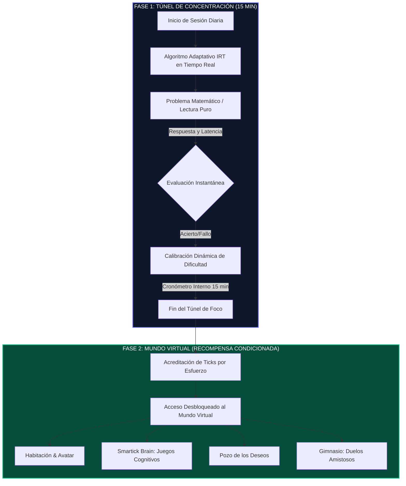
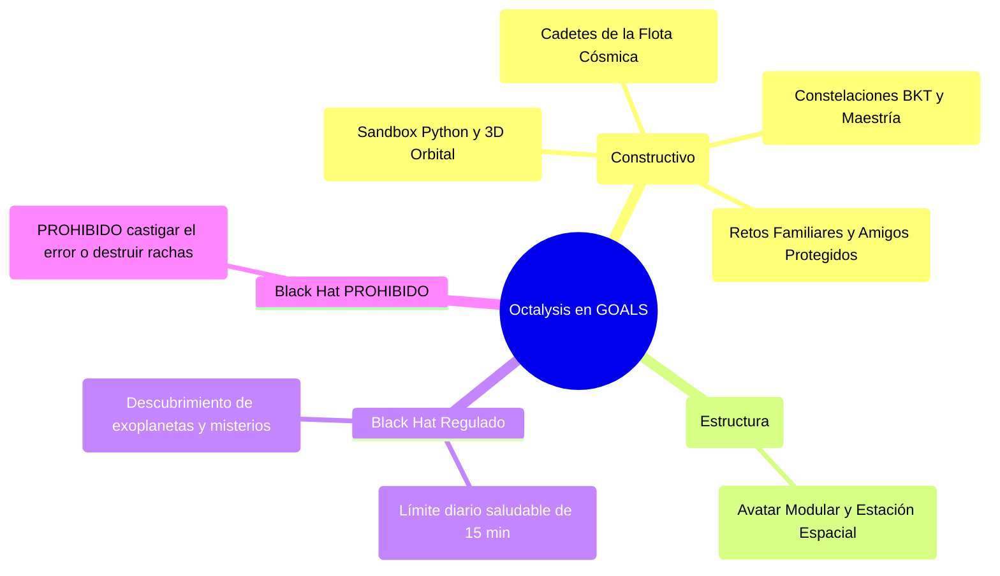

# 🎮 INFORME MAESTRO DE BENCHMARK: GAMIFICACIÓN EDTECH, MODELOS GLOBALES Y FRAMEWORK OCTALYSIS ÉTICO
## Auditoría de Campo de Smartick, Prodigy Math, Duolingo, Brilliant.org y Adaptación de los 8 Core Drives para Menores de 6 a 15 Años

**Ecosistema:** GOALS Platform  
**Marco Teórico:** Framework Octalysis de Yu-kai Chou, Carga Cognitiva de Sweller, Principio de Premack y Regulaciones COPPA / RGPD-Kids.  
**Fecha:** Agosto 2026 • Estado: Documento Canónico de Benchmark y Ética de Juego (SSOT).

---

### ÍNDICE GENERAL
1. **El Paradigma Dual EdTech: Gamificación Extractiva vs. Gamificación Estructural**.
2. **Smartick: La Anatomía del Túnel de Concentración de 15 Minutos y el Mundo Virtual**.
3. **Prodigy Math, Duolingo, Brilliant.org y Khan Academy: Auditoría Comparada**.
4. **Tabla Comparativa Multidimensional de la Industria (10 Ejes Críticos)**.
5. **Framework Octalysis de Yu-kai Chou Adaptado a la Infancia**.
6. **Matriz de Regulación Ética: 7 Mecánicas Prohibidas (Black Hat) vs 7 Mecánicas Adoptadas (White Hat)**.
7. **Diagramas de Core Loops de la Industria vs. Bucle Maestro de GOALS**.

---

## 1. EL PARADIGMA DUAL EDTECH

La industria EdTech global se divide en dos enfoques antagónicos:

```
┌────────────────────────────────────────────────────────────────────────────────────────┐
│                               PARADIGMAS DE GAMIFICACIÓN                               │
├─────────────────────────────────────┬──────────────────────────────────────────────────┤
│ ❌ GAMIFICACIÓN EXTRACTIVA (Black Hat) │ 🛡️ GAMIFICACIÓN ESTRUCTURAL ÉTICA (White Hat)     │
├─────────────────────────────────────┼──────────────────────────────────────────────────┤
│ • Diseñada para inflar métricas DAU │ • Diseñada para maximizar aprendizaje profundo.  │
│ • Explotación de sesgos y FOMO.     │ • Respeto a la neurobiología infantil.           │
│ • Vidas/Corazones que castigan error│ • El error como insumo de andamiaje socrático.   │
│ • Dopamina vacía y adicción pasiva. │ • Fomento de la motivación intrínseca (Flow).    │
└─────────────────────────────────────┴──────────────────────────────────────────────────┘
```

---

## 2. SMARTICK: EL MODELO DEL TÚNEL DE CONCENTRACIÓN Y EL CONDICIONAMIENTO OPERANTE PURO



### 2.1. Las 3 Claves del Éxito de Smartick:
1. **Cero Distracción durante el Estudio (Carga Extrínseca 0%):** Durante los 15 minutos de cálculo o lectura, no hay música de fondo, ni animaciones lúdicas, ni barras de vida de monstruos. El niño dedica el 100% de su memoria de trabajo a razonar.
2. **Desacoplamiento Espacio-Temporal (Principio de Premack):** El "Mundo Virtual" (avatar, habitación, tienda de Ticks y juegos de neuroentrenamiento de *Smartick Brain*) está **sellado por defecto** y solo se abre tras completar la sesión diaria.
3. **Economía de Mérito Intransferible:** Los *Ticks* solo se consiguen resolviendo problemas reales con esfuerzo y constancia; no se pueden comprar con dinero real.

---

## 3. AUDITORÍA COMPARADA DE LÍDERES GLOBALES

- **Prodigy Math (RPG por Turnos):** Muy atractivo para 7-11 años por coleccionismo de mascotas y batallas mágicas, pero con un grave desbalance de tiempo (*Play-to-Learn Ratio* de solo 30-40% estudio vs 60-70% cinemáticas/mapas) y paywalls discriminatorios.
- **Duolingo (Rachas y Ligas):** Líder en retención pero con abundantes *Dark Patterns*: el sistema de corazones castiga el error (lo que bloquea al alumno ante problemas difíciles), notificaciones culpabilizadoras y ligas que fomentan *XP-farming* de lecciones fáciles.
- **Brilliant.org (Puzzles Visuales y Primeros Principios):** El estándar de oro para preadolescentes (12-15 años). Enseña mediante manipuladores interactivos, momentos *Eureka (Aha!)* y rachas sobrias sin infantilización.
- **Khan Academy (Mastery Learning de Bloom):** Estructura de 4 niveles (*Attempted $\to$ Familiar $\to$ Proficient $\to$ Mastered*) y puntos de energía acumulativos 100% éticos.

---

## 4. TABLA COMPARATIVA MULTIDIMENSIONAL (10 EJES)

| Eje | Smartick | Prodigy Math | Duolingo | Brilliant.org | Khan Academy | **🚀 GOALS** |
| :--- | :--- | :--- | :--- | :--- | :--- | :--- |
| **1. Core Loop** | Túnel 15m $\to$ Mundo Virtual | Mapa $\to$ Batalla $\to$ Pregunta | Micro-lección $\to$ Racha $\to$ Liga | Puzzle visual $\to$ Eureka $\to$ Teoría | Explicación $\to$ Práctica $\to$ Bloom | **Túnel 15m $\to$ Constelación BKT $\to$ Sandbox 3D** |
| **2. Carga Cognitiva** | 0% Extrínseca | Alta (cinemáticas) | Media-alta | 0% Extrínseca | Muy baja | **Optimizada (Glassmorphism sobrio)** |
| **3. Play-to-Learn** | **100% estudio** | 35% estudio / 65% juego | 50% estudio / 50% juego | **95% estudio activo** | **100% estudio** | **100% estudio en foco / Sandbox post-sesión** |
| **4. Motivación** | Refuerzo diferido | Extrínseca (Loot) | Extrínseca (Miedo) | **Intrínseca pura** | Intrínseca formativa | **Intrínseca (Significado Épico + Maestría)** |
| **5. Dark Patterns** | **0 / 10** | 6 / 10 (Paywalls) | 9 / 10 (Vidas/Ligas) | 1 / 10 | **0 / 10** | **0 / 10 (Prohibidos por Estatuto)** |
| **6. Trato al Error** | Calibración IRT | Ataque fallido | **Bloqueo (Pierde vidas)**| Pista interactiva | Andamiaje paso a paso | **Andamiaje MAIEUTIC-4 sin bloqueo** |
| **7. Racha** | Diaria no acumulable | Secundaria | Agresiva / Ansiedad | Reto diario sobrio | Racha formativa | **Racha Compasiva con Escudo de Rescate** |
| **8. Economía** | Ticks (solo esfuerzo) | Oro + Suscripción | Gemas de pago | Sin moneda in-game | Puntos de energía | **Polvo Estelar & Effort Points (Mérito)** |
| **9. Edad Óptima** | 4 a 14 años | 7 a 11 años | 13+ años | 12 a 18+ años | K-12 | **3 Franjas Calibradas (6-8, 9-11, 12-15)** |
| **10. Tono UI** | Funcional limpio | Fantasía infantil | Infantil/Casual | Científico elegante | Académico clásico | **Inmersivo Cósmico 3D + Dark Glassmorphism** |

---

## 5. FRAMEWORK OCTALYSIS ADAPTADO A LA INFANCIA



---

## 6. MATRIZ DE REGULACIÓN ÉTICA PARA GOALS

```
┌────────────────────────────────────────────────────────────────────────────────────────┐
│                        MATRIZ DE REGULACIÓN ÉTICA DE JUEGO                             │
├────────────────────────────────────────────────────┬───────────────────────────────────┤
│ 🚫 MECÁNICAS BLACK HAT ESTRICTAMENTE PROHIBIDAS   │ 🛡️ MECÁNICAS WHITE HAT ADOPTADAS  │
├────────────────────────────────────────────────────┼───────────────────────────────────┤
│ 1. Cajas de botín aleatorias / Ruletas (Gacha).    │ 1. Túnel de Foco de 15 min diarios│
│ 2. Vidas o corazones que bloquean el estudio.      │ 2. Constelaciones de Maestría BKT │
│ 3. Ligas de descenso con estrés horario de cierre. │ 3. Andamiaje socrático progresivo │
│ 4. Streak-shaming o notificaciones de culpa.       │ 4. Racha compasiva con escudo     │
│ 5. Paywalls discriminatorios entre menores.        │ 5. Sandbox creativo (Python/3D)   │
│ 6. Temporizadores angustiantes en preguntas base.  │ 6. Tokenomics cerrado no fiat     │
│ 7. Chat abierto sin moderación entre menores.      │ 7. Avatar evolutivo por mérito    │
└────────────────────────────────────────────────────┴───────────────────────────────────┘
```
