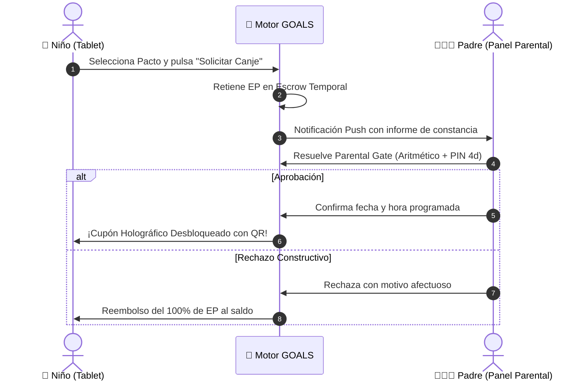

# 🌟 PACTOS FAMILIARES, RECOMPENSAS DEL MUNDO REAL Y SAFE-SOCIAL GAMIFICATION
## Economía Dual (Cosmetic XP vs Effort Points), Contratos Padre-Hijo, Misión Familiar Cósmica entre Hermanos y Ligas Anónimas COPPA

**Ecosistema:** GOALS Platform  
**Marco Teórico:** Teoría de la Autodeterminación (Deci & Ryan), Mitigación del Efecto de Sobrejustificación, Sibling Co-op y Normativas COPPA / RGPD-Kids / UK Age Appropriate Design Code.  
**Fecha:** Agosto 2026 • Estado: Documento Canónico de Pactos Familiares y Social Seguro (SSOT).

---

### ÍNDICE GENERAL
1. **El Concepto de 'Pacto Familiar' (*Parent-Child Real-World Reward Contract*)**.
2. **Dualidad Monetaria: *Cosmetic XP* vs. *Effort Points (EP)***.
3. **Catálogo de Recompensas Negociadas Co-diseñadas**.
4. **Protocolo de Canje Seguro en 4 Fases (Escrow $\to$ Push $\to$ Parental Gate $\to$ Cupón QR)**.
5. **Competición Social y Familiar Segura (*Safe-Social Play*) entre Hermanos**.
6. **Ligas Escolares Anónimas y Amigos Protegidos (Cero Grooming, Cero Ciberacoso)**.
7. **Reglas de Seguridad Firestore y Contratos TypeScript**.

---

## 1. EL PACTO FAMILIAR: CONECTANDO EL APRENDIZAJE CON EL MUNDO REAL

En lugar de sobornar al niño con dinero o crear peleas domésticas por las pantallas, GOALS formaliza un **acuerdo colaborativo familiar**:

```
                  ┌────────────────────────────────────────┐
                  │    TRIÁNGULO DE AUTODETERMINACIÓN      │
                  │              (Deci & Ryan)             │
                  └───────────────────┬────────────────────┘
                                      │
        ┌─────────────────────────────┼─────────────────────────────┐
        ▼                             ▼                             ▼
  ┌───────────┐                 ┌───────────┐                 ┌───────────┐
  │ AUTONOMÍA │                 │COMPETENCIA│                 │ CONEXIÓN  │
  └─────┬─────┘                 └─────┬─────┘                 └─────┬─────┘
        │                             │                             │
  • Co-diseño de pactos         • Feedback formativo de       • 80% de premios son
    (no imposición adulta).       maestría ("¡Mira lo que       experiencias compartidas
  • Árbol de rutas DAG libre.     ahora sabes razonar!").       con padres y hermanos.
  • Elección de recompensas.    • Mapa 3D de constelación.    • Tiempo de calidad.
```

---

## 2. DUALIDAD MONETARIA: COSMETIC XP VS EFFORT POINTS (EP)

| Parámetro | Cosmetic XP (Polvo Cósmico) | Effort Points / Puntos de Esfuerzo (EP) |
| :--- | :--- | :--- |
| **Propósito** | Progresión dentro de la app | **Recompensas reales en el hogar** |
| **Cómo se Obtiene** | Lecciones, trivias, exploración 3D, rachas | **Esfuerzo de alto valor:** superar fallos previos, sesiones de foco de 15 min y proyectos |
| **Dónde se Canjea** | Skins del avatar, fondos, títulos | **Pactos Familiares co-creados con los padres** |
| **Control Anti-Abuso**| Ilimitado para estudio | **Soft-Cap diario de 50 EP máx** (no acumulable con trampas) |

---

## 3. CATÁLOGO DE RECOMPENSAS FAMILIARES CO-DISEÑADAS

- **Categoría A (Ocio Digital Controlado):** $+30\text{ min}$ de consola el fin de semana ($80\text{ EP}$), $+60\text{ min}$ de juego cooperativo familiar ($140\text{ EP}$).
- **Categoría B (Experiencias Fuera de Pantalla):** Visita al Planetario / Museo de Ciencias ($300\text{ EP}$), Tarde de cine elegida por el niño ($250\text{ EP}$), Noche de observación astronómica con acampada ($350\text{ EP}$).
- **Categoría C (Objetos STEM & Pasiones):** Libro/cómic de divulgación ($180\text{ EP}$), Set de robótica / LEGO ($500\text{ EP}$), Mini telescopio / Microscopio ($800\text{ EP}$).
- **Categoría D (Autonomía Doméstica):** Elegir la cena del viernes ($60\text{ EP}$), Construir un súper fuerte de cojines en el salón ($100\text{ EP}$).

---

## 4. PROTOCOLO DE CANJE SEGURO EN 4 FASES



---

## 5. COMPETICIÓN COOPERATIVA ENTRE HERMANOS: MISIÓN FAMILIAR CÓSMICA

- **Reactor de Combustible Estelar Compartido:** Los hermanos no compiten entre sí; forman la tripulación de una nave espacial común. Cada hermano cumple su meta diaria adaptada a su edad (15 min en Primaria vs 25 min en Secundaria).
- **Racha Compartida de 5 Días:** Desbloquea un premio familiar conjunto (ej. *"Hacer pizza casera gigante juntos el sábado"*).
- **Escudo Fraternal (*Sibling Shield*):** Si un hermano está enfermo o no puede conectarse, el otro hermano puede resolver un reto especial para salvar la racha de la tripulación.

---

## 6. LIGAS ESCOLARES PROTEGIDAS (ZERO-GROOMING SAFE-SOCIAL)

- **Cero Texto Libre:** Prohibido el chat abierto; eliminación total de riesgos de acoso o grooming.
- **Identidades Cósmicas Anónimas:** Nombres automáticos de 3 términos (ej. `LinceEstelar #204`, `OrionCurioso #881`).
- **Cosmic Cheers Pre-Aprobados:** 6 felicitaciones espaciales (`🚀 ¡Imparable constancia!`, `💡 ¡Brillante deducción!`, `🛡️ ¡Gran persistencia!`).
- **Ranking por Crecimiento y Constancia (No por CI ni Velocidad):**
  $$\text{Puntos Semanales} = (\text{Días de Racha} \times 100) + (\text{Problemas Superados tras Fallo} \times 30) + (\text{Minutos de Foco} \times 5)$$
