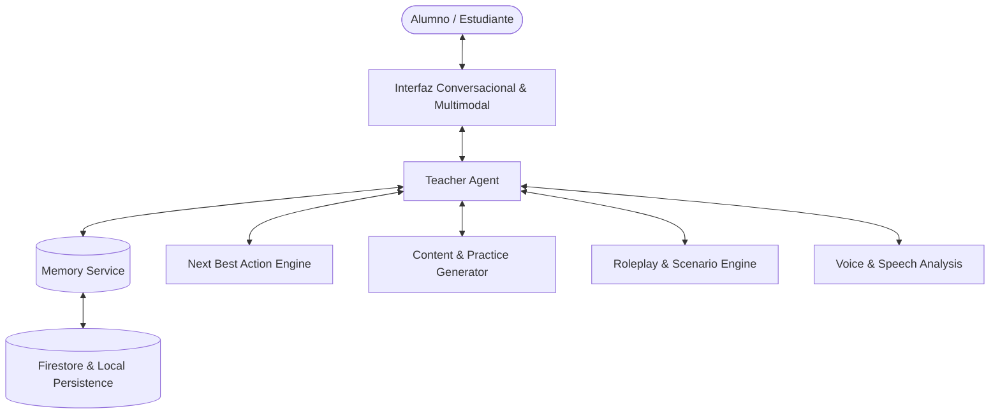

# GOALS — LANGUAGES: PRODUCT, PEDAGOGICAL & TECHNICAL MASTER PLAN
**Versión 1.0 — Arquitectura por Fases y 26 Bloques Ejecutables para AGY / Antigravity**

---

## 0. VISIÓN Y PRINCIPIO RECTOR

**Goals Languages no es una colección de ejercicios estáticos con un chatbot añadido: es un Profesor Particular de Idiomas Multimodal, Persistente, Conversacional y Adaptativo.**

El alumno puede acceder en cualquier momento con intenciones diversas:
- *“Quiero hablar un rato sobre astronomía o fútbol.”*
- *“Prepárame para una entrevista de trabajo en inglés.”*
- *“Explícame cuándo usar el pasado simple vs present perfect.”*
- *“Créame un cuento interactivo sobre exploradores en Marte.”*
- *“Ponme un ejercicio de traducción rápida de negocios.”*
- *“Simula que soy un pasajero en el mostrador del aeropuerto.”*
- *“No quiero hacer ejercicios; quiero hablar.”*

El profesor entiende la intención inmediata, consulta el expediente pedagógico del estudiante (nivel CEFR, errores recurrentes, vocabulario activo/olvidado, estilo de aprendizaje e intereses) y orquesta la experiencia más eficaz.



### Principio Rector
**La IA no sustituye al currículo: lo convierte en una experiencia personalizada.**
La arquitectura combina armónicamente:
- Profesor de voz en tiempo real con baja latencia e interrupciones naturales.
- Conversación libre y pedagógica con turn-taking fluido.
- Roleplay dinámico generativo para situaciones reales, académicas y laborales.
- Generación bajo demanda de prácticas, lecturas, escrituras y traducciones.
- Memoria episódica, léxica y de errores persistente.
- Evaluación multidimensional de 8 competencias CEFR.
- Planificación adaptativa (Next Best Action).
- Gamificación pedagógica sin ansiedad ni castigo de rachas.

---

## 1. OBJETIVO DEL PRODUCTO & EXPERIENCIA CENTRAL

El alumno debe experimentar la sensación genuina de tener a su propio tutor dedicado que:
1. Conoce su nivel real por competencias (Speaking, Listening, Reading, Writing, Grammar, Vocabulary, Pronunciation, Fluency).
2. Conoce sus objetivos inmediatos y de largo plazo.
3. Recuerda qué se ha trabajado en sesiones anteriores.
4. Recuerda errores recurrentes sin interrumpir bruscamente la conversación.
5. Recuerda vocabulario activo, olvidado y por consolidar.
6. Recuerda sus intereses personales (ej. Minecraft, astrofísica, fútbol, robótica).
7. Adapta la dificultad y la velocidad de locución en tiempo real.
8. Adapta el modo de corrección (inmediata, contextual o diferida).
9. Conversa por voz con naturalidad y latencia inferior a 2 segundos.
10. Crea prácticas bajo demanda adaptadas al error inmediato.
11. Genera escenarios interactivos ricos en matices.
12. Muestra material visual cuando aporta claridad pedagógica.
13. Evalúa el rendimiento de forma formativa y transparente.
14. Decide qué practicar después mediante el motor *Next Best Action*.
15. Motiva sin infantilizar adaptándose a la edad del estudiante.
16. Muestra progreso real y significativo.

---

## 2. ARQUITECTURA DE AGENTES Y SERVICIOS CORE

```text
┌─────────────────────────────────────────────────────────────────────────┐
│                              TEACHER AGENT                              │
│         (Cara visible principal: orquesta la experiencia pedagógica)     │
└──────────────┬───────────────────────────────┬──────────────────────────┘
               │                               │
 ┌─────────────▼─────────────┐   ┌─────────────▼─────────────┐
 │       MEMORY SERVICE      │   │     NEXT BEST ACTION      │
 │  - Perfil del estudiante  │   │  - Calcula la siguiente   │
 │  - Vocabulario y Errores  │   │    actividad pedagógica   │
 │  - Memoria episódica      │   │    óptima (17 estados)    │
 └───────────────────────────┘   └───────────────────────────┘
               │                               │
 ┌─────────────▼─────────────┐   ┌─────────────▼─────────────┐
 │    SCENARIO & ROLEPLAY    │   │     CONTENT GENERATOR     │
 │  - Aeropuerto, reuniones  │   │  - Cuentos interactivos   │
 │  - Entrevistas laborales  │   │  - 6 tipos de ejercicios  │
 │  - Rúbricas de evaluación │   │  - Traducción por capas   │
 └───────────────────────────┘   └───────────────────────────┘
               │                               │
 ┌─────────────▼─────────────┐   ┌─────────────▼─────────────┐
 │   VOICE & SPEECH COACH    │   │     PROGRESS & MASTERY    │
 │  - Web Speech STT / TTS   │   │  - Radar 8 habilidades    │
 │  - Análisis de formantes  │   │  - CEFR A1 a C2           │
 │  - Visualizador de ondas  │   │  - XP pedagógico & rachas │
 └───────────────────────────┘   └───────────────────────────┘
```

---

## 3. MAPA DE LOS 26 BLOQUES DE INGENIERÍA INCREMENTAL

```text
FASE 0: FUNDACIONES
├── 01 — Architecture & Modular Structure
├── 02 — Design System & Visual Harmony
└── 03 — Firebase & Data Model

FASE 1: PERFIL Y ESTADO DE APRENDIZAJE
├── 04 — Learner Profile & Adaptive Onboarding
└── 05 — Learning State & CEFR Mastery

FASE 2: EL PROFESOR Y SU MEMORIA
├── 06 — Teacher Text Brain (Socratic AI)
├── 07 — Memory Service (Lexical, Errors & Episodic)
└── 08 — Conversation Engine (Free & Directed)

FASE 3: VOZ Y ANÁLISIS ACÚSTICO
├── 09 — Voice MVP & Bidirectional Speech
└── 10 — Speech Analysis & Acoustic Waveforms

FASE 4: GENERADORES DE CONTENIDO Y MODALIDADES
├── 11 — Practice Generator (6 Exercise Types)
├── 12 — Story Engine (Personalized Narratives)
├── 13 — Reading Deck & Comprehension
├── 14 — Writing Lab (4-Layer Correction)
├── 15 — Pedagogical Translation Bench
├── 16 — Listening Deck & Audio Dictations
├── 17 — Roleplay Engine & Real-Life Simulations
└── 18 — Multimodal Artifacts & Infographics

FASE 5: CURRÍCULO Y ADAPTABILIDAD
├── 19 — Curriculum CEFR Matrix (A1 to C2)
└── 20 — Adaptive Planner (Next Best Action Engine)

FASE 6: MOTIVACIÓN Y ENTORNO
├── 21 — Pedagogical Gamification (No-Anxiety)
├── 22 — Motivation Engine & Learner Archetypes
└── 23 — Cosmos (Parent & Educator Portal)

FASE 7: SEGURIDAD, QA Y DESPLIEGUE
├── 24 — Safety & Privacy Audit (COPPA / GDPR-K)
├── 25 — Pedagogical QA & Benchmarking Suite
└── 26 — Beta Launcher & Multi-Language Suite
```

---

## 4. REGLAS ABSOLUTAS DE DESARROLLO PARA AGY

1. **No rehacer la aplicación al modificar una funcionalidad:** Los cambios deben ser incrementales y preservar las rutas existentes.
2. **No crear páginas monolíticas:** Ningún archivo debe superar las 300 líneas de código; dividir en subcomponentes (`TeacherCard`, `WaveformVisualizer`, `QuickPracticeDeck`, etc.).
3. **No duplicar lógica:** Centralizar llamadas y estados en `services/` y `types/`.
4. **No inventar datos sin contrato:** Todo dato en Firestore o LocalStorage debe tener su interfaz TypeScript estricta.
5. **Cero Mocks / Cero Simulaciones ficticias:** Usar llamadas reales a APIs de IA y servicios nativos de Web Speech / AudioContext.
6. **No acoplar a un único proveedor:** Modularizar adaptadores de voz y LLM para soportar Web Speech, DeepSeek, OpenAI, Gemini o modelos locales.
7. **No romper el diseño global:** Respetar la paleta Dark Glassmorphism, tokens HSL y tipografía corporativa de GOALS.
8. **Ciclo obligatorio por bloque:** `Inspect` → `Plan` → `Implement` → `Test` → `Verify`.
