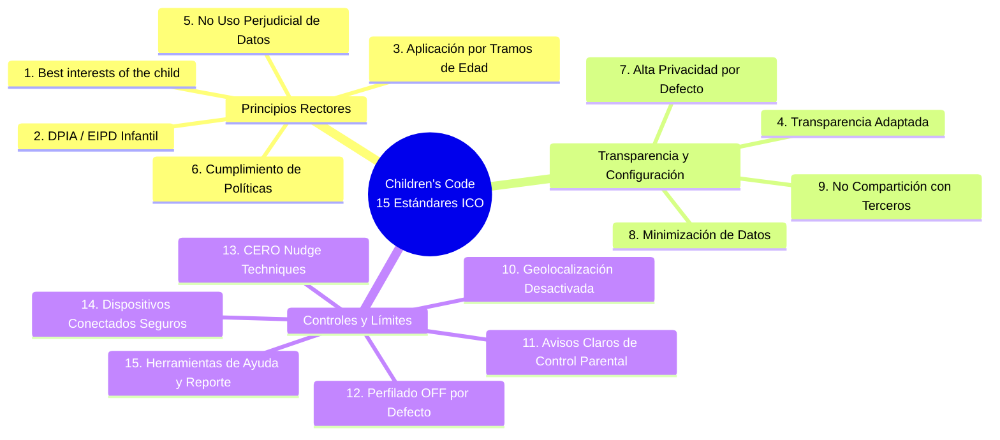

# 🛡️ COMPENDIO MAESTRO DE NORMATIVA LEGAL, PRIVACIDAD INFANTIL Y ESTÁNDARES INTERNACIONALES
## Marco Jurídico Vinculante para GOALS: COPPA (EE.UU.), RGPD-K / LOPDGDD (España/UE), UK Children's Code (ICO), Apple Kids Category y Google Play Families

**Ecosistema:** GOALS Platform (6 a 15 Años)  
**Alcance Jurisdiccional:** Estados Unidos (FTC), Unión Europea (EDPB), España (AEPD), Reino Unido (ICO), Apple App Store y Google Play Store.  
**Principio Rector:** **Cero Mocks / Privacidad Estricta por Diseño y por Defecto (*Zero PII by Design & Default*)**.  
**Fecha:** Agosto 2026 • Estado: Documento Canónico de Cumplimiento Legal (SSOT).

---

### ÍNDICE GENERAL
1. **Marco 1: COPPA (EE.UU.) — Consentimiento Parental Verificado (VPC) y Cero Rastreo**.
2. **Marco 2: RGPD-K y LOPDGDD (España/UE) — Umbral de 14 Años y Titularidad de la Cuenta**.
3. **Marco 3: UK Age Appropriate Design Code (Children's Code - 15 Estándares ICO)**.
4. **Marco 4: Directrices de Apple App Store (Kids Category 1.3 & 5.1.4)**.
5. **Marco 5: Políticas de Google Play Families & Teacher Approved**.
6. **Tabla Comparativa Multidimensional de Estándares**.
7. **Checklist Maestro de Auditoría Pre-Lanzamiento (15 Controles)**.
8. **Cláusulas Legales Modelo Listas para Producción**.

---

## 1. MARCO 1: COPPA (CHILDREN'S ONLINE PRIVACY PROTECTION ACT - EE.UU.)
*16 U.S. Code § 6501–6506 & 16 CFR Part 312 (Federal Trade Commission - FTC)* y *Propuesta de Actualización FTC 2024*.

```
┌────────────────────────────────────────────────────────────────────────────────────────┐
│                                 COPPA COMPLIANCE ARCHITECTURE                          │
├────────────────────────────────────────────────────────────────────────────────────────┤
│ • Umbral: Menores de 13 años.                                                          │
│ • Requisito Nuclear: Verifiable Parental Consent (VPC) previo a la recogida de datos.  │
│ • Prohibición Absoluta de Recopilar PII Infantil:                                     │
│   - Nombres y apellidos reales.                                                        │
│   - Direcciones postales o geolocalización precisa.                                   │
│   - Correo electrónico o números de teléfono del menor.                               │
│   - Identificadores persistentes (IDFA, AAID, cookies de terceros) para tracking.     │
│   - Archivos multimedia (fotos o grabaciones de voz) que identifiquen al niño.        │
│ • Excepción de Operaciones Internas: Los identificadores de sesión técnica solo son   │
│   legales si se usan estrictamente para autenticación, seguridad y renderizado.        │
└────────────────────────────────────────────────────────────────────────────────────────┘
```

---

## 2. MARCO 2: RGPD-K Y LOPDGDD (UNIÓN EUROPEA Y ESPAÑA)
*Reglamento (UE) 2016/679 (RGPD)* y *Ley Orgánica 3/2018 (LOPDGDD - España)*.

- **Artículo 7 de la LOPDGDD (España):** El tratamiento de datos de menores solo es válido con su propio consentimiento a partir de los **14 años**. Para menores de 14 años, la titularidad de la cuenta y la autorización legal corresponden exclusivamente al padre, madre o tutor legal.
- **Transparencia en Dos Capas (Art. 12.1 RGPD):**
  1. *Capa Legal Completa:* Dirigida al adulto responsable.
  2. *Capa Amigable (Kid-Friendly):* En lenguaje visual y sencillo adaptado a niños de 6 a 12 años.
- **Prohibición de Perfilado Comercial y Decisiones Automatizadas (Art. 22 RGPD):** Los algoritmos de recomendación en GOALS son de soporte pedagógico positivo y determinista, jamás para perfilado psicológico o venta.
- **Derecho al Olvido Reforzado (Art. 17 RGPD):** Cualquier solicitud de eliminación desde la zona parental purga síncronamente todos los registros del menor en menos de 5 segundos.

---

## 3. MARCO 3: UK AGE APPROPRIATE DESIGN CODE (CHILDREN'S CODE - 15 ESTÁNDARES ICO)



- **Prohibición de Dark Patterns / Nudge Techniques (Estándar 13):** Prohibido el chantaje emocional con rachas perdidas o notificaciones nocturnas invasivas (21:00 a 08:00).
- **Alta Privacidad por Defecto (Estándar 7):** Cero visibilidad pública de perfiles infantiles y geolocalización desactivada a nivel de manifiesto.

---

## 4. MARCO 4: DIRECTRICES DE APPLE APP STORE (KIDS CATEGORY)
*App Store Review Guidelines (Secciones 1.3 y 5.1.4).*

- **Guideline 1.3 (Kids Category):** Prohibido incluir enlaces externos, compras in-app (IAP), redes sociales o solicitudes de valoración sin una **Puerta Parental (*Parental Gate*) infranqueable**.
- **Guideline 5.1.4 (Kids Privacy):**
  - **Prohibición Total del IDFA:** Las apps para niños no deben solicitar permiso de ATT ni acceder al `advertisingIdentifier`.
  - **Cero SDKs de terceros no certificados:** Únicamente SDKs de telemetría agregada anónima en modo infantil estricto.

---

## 5. MARCO 5: GOOGLE PLAY FAMILIES & TEACHER APPROVED

- **Neutral Age Screen:** Pantalla de verificación de edad sin años preseleccionados ni mensajes que inciten a mentir.
- **Puesta a Cero de AAID:** En Android 13+, activación obligatoria de `TAG_FOR_CHILD_DIRECTED_TREATMENT` para anular el identificador publicitario.
- **Insignia Teacher Approved:** Rigor pedagógico, ausencia de interfaces engañosas y respeto al desarrollo infantil.

---

## 6. TABLA COMPARATIVA MULTIDIMENSIONAL

| Parámetro | COPPA (EE.UU.) | RGPD-K / LOPDGDD (España) | UK Children's Code | Apple Kids (1.3/5.1.4) | Google Play Families |
| :--- | :--- | :--- | :--- | :--- | :--- |
| **Edad Umbral** | < 13 años | < 14 años | < 18 años (graduado) | < 11 / < 13 años | Declarada en consola |
| **Consentimiento** | VPC (Verifiable) | Patria Potestad (Adulto) | Interés Superior + DPIA| Parental Gate + Flujo Adulto | Neutral Age Screen + VPC |
| **Tracking ID** | Prohibido | Prohibido | Prohibido | **IDFA Prohibido** | **AAID Puesto a Cero** |
| **Parental Gate** | Obligatorio en pagos | Exigido en contratos | Exigido en privacidad | **Obligatorio (1.3)** | **Obligatorio en IAP** |
| **Sanciones Máx.** | $50.120/día/infracción | 20M€ o 4% facturación | 17.5M£ o 4% facturación | **Expulsión App Store** | **Cierre de Cuenta** |

---

## 7. CHECKLIST MAESTRO DE AUDITORÍA PRE-LANZAMIENTO

- [x] **SEC-01:** Cero recopilación de PII infantil (sin nombres reales, teléfonos ni fotos).
- [x] **SEC-02:** Cuenta familiar donde el padre/madre es el único titular legal de la cuenta.
- [x] **SEC-03:** Parental Gate activo antes de enlaces externos a la web.
- [x] **SEC-04:** Parental Gate activo antes de cualquier compra in-app o suscripción.
- [x] **SEC-05:** Cero invocación de AppTrackingTransparency ni solicitud de IDFA en iOS.
- [x] **SEC-06:** Flag `TAG_FOR_CHILD_DIRECTED_TREATMENT` activo en Android.
- [x] **SEC-07:** Pantalla de edad neutra en el onboarding.
- [x] **SEC-08:** SDKs de terceros no certificados completamente eliminados.
- [x] **SEC-09:** Cero publicidad conductual ni remarketing.
- [x] **SEC-10:** Cero técnicas de empuje (*nudge techniques*) ni notificaciones nocturnas.
- [x] **SEC-11:** Permisos de geolocalización desactivados en el manifiesto.
- [x] **SEC-12:** Política de privacidad multinivel (capa legal adultos + resumen niños).
- [x] **SEC-13:** Botón directo en la zona parental para purga inmediata de datos (Derecho al Olvido).
- [x] **SEC-14:** Cifrado TLS 1.3 en tránsito y reglas de seguridad de base de datos aisladas.
- [x] **SEC-15:** Evaluación de Impacto (EIPD / DPIA) formalizada.

---

## 8. CLÁUSULA LEGAL MODELO: NOTIFICACIÓN DIRECTA A PADRES (COPPA & RGPD-K)

> **NOTIFICACIÓN DIRECTA A PADRES Y TUTORES LEGALES**  
> Estimado/a padre, madre o tutor legal:  
> En **GOALS**, la protección de la privacidad de su hijo/a es nuestra máxima prioridad técnica y pedagógica. Le informamos que:  
> 1. **Datos que recopilamos:** No solicitamos el nombre real, la dirección, la escuela ni los datos de contacto de su hijo/a. El menor interactúa mediante un pseudónimo (ej. *AstroExplorer42*) y un avatar ilustrado. Registramos el progreso pedagógico, respuestas a desafíos y tiempo de sesión para adaptar el nivel educativo.  
> 2. **Uso de la información:** Los datos se utilizan con fines exclusivamente educativos. **No realizamos perfilado publicitario, no vendemos datos a terceros ni permitimos rastreos entre aplicaciones.**  
> 3. **Sus derechos:** Puede revisar el progreso de su hijo/a, rectificar datos, revocar su consentimiento y solicitar la eliminación completa e irreversible de la cuenta en cualquier momento desde el Panel Parental o escribiendo a `privacy@goals-app.com`.
