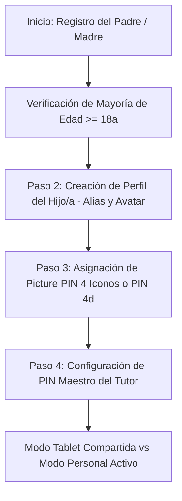

# 🎨 UX/UI ONBOARDING, TECLADOS TÁCTILES Y PUERTAS PARENTALES (PARENTAL GATES)
## Especificación de Interacción, Wireframes en 4 Pasos, Teclado de Picture PIN con Web Audio API, Retos Dinámicos y Conmutador de Hermanos

**Ecosistema:** GOALS Platform (6 a 15 Años)  
**Principios de Diseño:** Cero Fricción para Niños, Control Infranqueable para Adultos, Accesibilidad DUA 3.0.  
**Fecha:** Agosto 2026 • Estado: Documento Canónico de UX/UI (SSOT).

---

### ÍNDICE GENERAL
1. **Flujo de Onboarding Familiar en 4 Pasos (Wireframes y Lógica)**.
2. **Pantalla de Acceso Diario del Alumno (Tablet Familiar)**.
3. **Especificación de la Puerta Parental (*Parental Gate*) y Algoritmos Dinámicos**.
4. **Conmutador Rápido de Hermanos (*Multi-Child Switcher*)**.
5. **Directrices de Accesibilidad DUA (Diseño Universal para el Aprendizaje)**.

---

## 1. FLUJO DE ONBOARDING FAMILIAR EN 4 PASOS



### 1.1. Paso 1: Registro del Titular Adulto
- **Auth Providers:** Google SSO, Apple Sign-In o Email + Contraseña.
- **Verificación de Mayoría de Edad:** Selector de año de nacimiento (comprobación $\ge 18$ años conforme a COPPA/RGPD).

### 1.2. Paso 2: Creación de Perfiles Infantiles
- **Alias del Alumno:** Nombre amigable o alias cósmico (ej. *Leo Cósmico* o *Clara Galáctica*).
- **Edad y Curso Escolar:** Preconfigura el tramo pedagógico (LOMLOE / UK NC).
- **Avatar Ilustrado:** Selección de personaje cósmico (sin fotos reales).

### 1.3. Paso 3: Asignación de Método de Acceso Infantil
- **6 a 9 años:** **Picture PIN de 4 Iconos** (el niño o el padre eligen una secuencia de 4 iconos en orden: 🚀 + ⭐ + 🍕 + 🐱).
- **10 a 15 años:** **PIN Numérico de 4 Dígitos**.

### 1.4. Paso 4: PIN Maestro Parental + Canal de Respaldo
- Creación de un PIN de 4 dígitos para proteger la zona de adultos.
- Canal de recuperación de emergencia por correo electrónico verificado (*Magic Link*).

---

## 2. PANTALLA DE ACCESO DIARIO DEL ALUMNO (PICTURE PIN KEYBOARD)

```text
+---------------------------------------------------------------+
|  [Logo GOALS]                       🪐 ¿QUIÉN VA A APRENDER?  |
+---------------------------------------------------------------+
|                                                               |
|   ( 🤖 ) Leo Cósmico (3º Primaria)                            |
|                                                               |
|   INTRODUCE TU LLAVE SECRETA DE 4 ICONOS:                     |
|   Ranuras: [ 🚀 ] [ ⭐ ] [ 🍕 ] [ 🐱 ]   (4/4 completadas)    |
|                                                               |
|   +-------------------------------------------------------+   |
|   |  [🚀 Cohete]   [⭐ Estrella]  [🪐 Saturno]  [🍕 Pizza] |   |
|   |  [🐱 Gato]     [🤖 Robot]     [🦖 Dino]     [🐬 Delfín]|   |
|   |  [⚽ Balón]    [👑 Corona]    [⚡ Rayo]     [🍀 Trébol]|   |
|   +-------------------------------------------------------+   |
|   [ ⌫ Borrar último icono ]          [ 🔄 Reiniciar PIN ]     |
+---------------------------------------------------------------+
```

### 🔊 Síntesis de Sonido Real (Web Audio API):
- Ranura 1: Tono C5 ($523.25\text{ Hz}$).
- Ranura 2: Tono E5 ($659.25\text{ Hz}$).
- Ranura 3: Tono G5 ($783.99\text{ Hz}$).
- Ranura 4: Tono C6 ($1046.50\text{ Hz}$).
- **Éxito:** Arpegio ascendente en Do Mayor ($C_5 \to E_5 \to G_5 \to C_6$ en $200\text{ms}$).
- **Error:** Tono descendente con vibración háptica (`navigator.vibrate([60, 100, 60, 100])`).

---

## 3. ESPECIFICACIÓN DE LA PUERTA PARENTAL (*PARENTAL GATE*)

### 🎯 Disparadores Obligatorios:
- Acceso a suscripciones, pagos, facturación o cambio de plan.
- Salir del modo niño hacia la web general de administración.
- Enlaces externos (política de privacidad, web de soporte, redes).
- Modificación de límites de tiempo de pantalla o borrado de datos.

### 🧠 Algoritmos de Retos Dinámicos para Adultos:
1. **Nivel 1 (Aritmética de 2 dígitos):** Operaciones complejas para un niño (ej. $7 \times 8 = 56$, $48 + 37 = 85$, $93 - 47 = 46$).
2. **Nivel 2 (Lectura y Transcripción de Números en Español):** Genera números aleatorios de 4 cifras expresados en texto (ej. `"MIL NOVECIENTOS OCHENTA Y CUATRO"` $\to$ Respuesta requerida: `1984`).
3. **Nivel 3 (PIN Maestro del Padre):** Entrada de 4 dígitos protegida con límite de 3 intentos y bloqueo temporal de 60 segundos.

---

## 4. CONMUTADOR RÁPIDO DE HERMANOS (*MULTI-CHILD SWITCHER*)

- **Acceso en 1 Tap:** Botón superior derecho con el avatar del alumno activo.
- **Transición en Memoria (<150ms):** Al validar el Picture PIN del hermano, el contexto de la aplicación rehidrata su progreso, misiones, racha y expediente LOMLOE sin cerrar la sesión maestra del padre.
- **Aislamiento Total:** Cada hermano tiene su propio histórico y estrellas protegidas.

---

## 5. DIRECTRICES DE ACCESIBILIDAD DUA 3.0

- **Área Táctil Mínima:** Botones de Picture PIN de $72 \times 72\text{px}$ (superando el estándar WCAG AAA de $44 \times 44\text{px}$).
- **Tipografía Adaptada:** Soporte para *Atkinson Hyperlegible* y *OpenDyslexic*.
- **Feedback Multimodal:** Respuesta combinada visual, sonora y háptica con opción de silenciar para hipersensibilidad sensorial.
