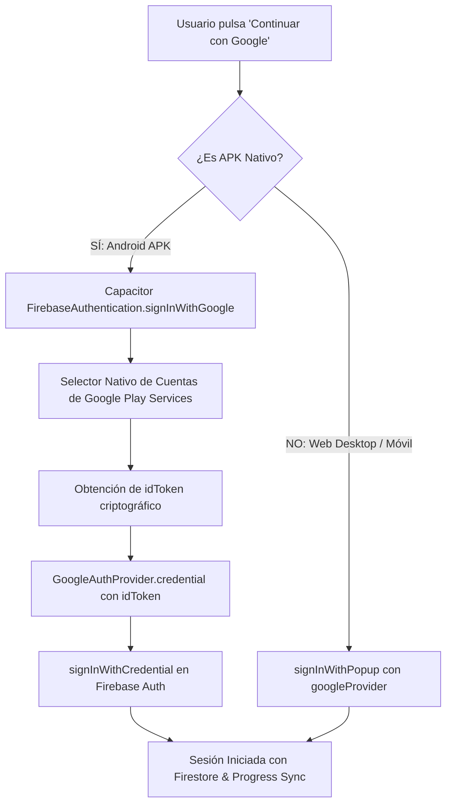

# Arquitectura de Autenticación Google Nativa en Android APK (Capacitor + Firebase)

## 📌 Contexto y Diagnóstico del Problema

Cuando una aplicación web empaquetada en un APK de Android mediante Capacitor ejecuta el flujo web estándar de Firebase (`signInWithPopup` o `signInWithRedirect`), Google rechaza la conexión con el siguiente error:

```
403: disallowed_useragent
```

### Causa Técnica
1. **Restricción de Seguridad de Google**: Google prohíbe explícitamente abrir flujos OAuth 2.0 dentro de WebViews embebidos (`android.webkit.WebView`) para evitar ataques de suplantación (Phishing) y Man-in-the-Middle.
2. **Limitaciones del WebView**: El WebView no gestiona ventanas emergentes entre dominios de forma transparente, provocando bloqueos en blanco o cierres inesperados sin devolver el token.

---

## 🚀 Solución Implementada: Puente Híbrido Web / Nativo

La solución implementada en Goalskid utiliza una arquitectura dual condicionada por `Capacitor.isNativePlatform()`:



---

## 🛠️ Implementación en Código (`AuthContext.tsx`)

```typescript
// Entorno Nativo Android (APK) vs Web
if (Capacitor.isNativePlatform()) {
  let idToken: string | undefined;

  try {
    // 1. Intentar con Credential Manager moderno de Google Play
    const res = await FirebaseAuthentication.signInWithGoogle();
    idToken = res.credential?.idToken;
    if (!idToken && res.user) {
      const tokenRes = await FirebaseAuthentication.getIdToken();
      idToken = tokenRes.token;
    }
  } catch (credErr: any) {
    // 2. Fallback al selector nativo clásico de Google Play
    const resLegacy = await FirebaseAuthentication.signInWithGoogle({ 
      useCredentialManager: false 
    } as any);
    idToken = resLegacy.credential?.idToken;
    if (!idToken && resLegacy.user) {
      const tokenRes = await FirebaseAuthentication.getIdToken();
      idToken = tokenRes.token;
    }
  }

  if (idToken) {
    // 3. Intercambio de credencial en el SDK JS de Firebase
    const credential = GoogleAuthProvider.credential(idToken);
    await signInWithCredential(auth, credential);
    setIsCloud(true);
    setAuthError(null);
    return;
  }
} else {
  // Entorno Web Estándar
  const res = await signInWithPopup(auth, googleProvider);
  if (res.user) {
    setIsCloud(true);
    setAuthError(null);
    return;
  }
}
```

---

## 🔐 Requisitos de Configuración de Firebase y Android

1. **`google-services.json`**:
   - Ubicado en `android/app/google-services.json`.
   - Contiene el `package_name`: `com.goalskid.app` y los `oauth_client` autorizados.

2. **Huellas Criptográficas SHA en Consola de Firebase**:
   - **SHA-1 de Depuración (Debug Keystore)**.
   - **SHA-256 de Depuración**.
   - **SHA-1 de Producción (Release Keystore)** cuando se firme el APK final.

3. **Permisos y Plugins en `capacitor.config.ts`**:
   ```typescript
   plugins: {
     FirebaseAuthentication: {
       skipNativeAuth: false,
       providers: ["google.com"]
     }
   }
   ```

---

## ✅ Estado de Verificación
- **APK Sideloaded**: Selector de cuentas de Google Play abre directamente sobre la app, autentica en segundo plano y vincula la cuenta a Firebase Auth.
- **Web (`localhost` & Firebase Hosting)**: Flujo popup OAuth 2.0 completamente funcional con persistencia de estado y sincronización en Firestore.
