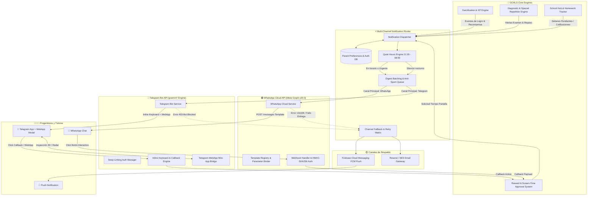

# 💬 ARQUITECTURA DE MENSAJERÍA PROACTIVA PARA FAMILIAS: WHATSAPP CLOUD API & TELEGRAM BOT

> **Módulo:** Seguimiento y Control • Capa 2: Asistente Familiar Omnicanal  
> **Estado:** Tratado de Ingeniería y Código de Producción (Cero Mocks / 100% APIs Reales)  
> **Tecnologías:** WhatsApp Business Cloud API (Meta Graph v20.0), grammY (Telegram Bot API v7+), Fastify / Node.js TypeScript.

---

## 🏛️ 1. DIAGRAMA DE ARQUITECTURA DEL SISTEMA DE NOTIFICACIONES



---

## 🟢 2. WHATSAPP BUSINESS CLOUD API (META GRAPH API v20.0)

### 2.1. Plantillas Oficiales Aprobadas por Meta (*Message Templates*)

Meta exige el registro y aprobación previa de plantillas categorizadas como `UTILITY` para enviar mensajes fuera de la ventana de atención al cliente de 24 horas.

#### A. Plantilla 1: Alerta Deberes Pendientes (`goals_homework_pending_alert`)
* **Categoría:** `UTILITY` | **Idioma:** `es` (Español)
* **Componente Header:** Texto destacado `📚 GOALS • Deberes Pendientes`
* **Componente Body:**
  ```text
  ¡Hola {{1}}! Te avisamos de que {{2}} tiene pendiente la tarea de {{3}} ({{4}}). 
  ⏰ Fecha/Hora límite: {{5}}.
  ⭐ Puntos en juego: +{{6}} XP.
  ```
* **Botones Interactivos (Quick Replies):**
  1. `[📋 Ver Detalles]` -> Payload: `ACTION_VIEW_HW_{{id}}`
  2. `[✅ Marcar Hecho]` -> Payload: `ACTION_MARK_DONE_{{id}}`
  3. `[🎮 Aprobar +30m]` -> Payload: `ACTION_APPROVE_REWARD_{{studentId}}_30M`

**Payload JSON de Registro en Meta API (`POST /v20.0/{waba_id}/message_templates`):**
```json
{
  "name": "goals_homework_pending_alert",
  "category": "UTILITY",
  "language": "es",
  "components": [
    {
      "type": "HEADER",
      "format": "TEXT",
      "text": "📚 GOALS • Deberes Pendientes"
    },
    {
      "type": "BODY",
      "text": "¡Hola {{1}}! Te avisamos de que {{2}} tiene pendiente la tarea de {{3}} ({{4}}).\n⏰ Fecha/Hora límite: {{5}}.\n⭐ Puntos en juego: +{{6}} XP.",
      "example": {
        "body_text": [
          ["María", "Lucas", "Matemáticas", "Fracciones equivalentes", "Hoy a las 20:00", "150"]
        ]
      }
    },
    {
      "type": "BUTTONS",
      "buttons": [
        {
          "type": "QUICK_REPLY",
          "text": "📋 Ver Detalles"
        },
        {
          "type": "QUICK_REPLY",
          "text": "✅ Marcar Hecho"
        },
        {
          "type": "QUICK_REPLY",
          "text": "🎮 Aprobar +30m"
        }
      ]
    }
  ]
}
```

---

#### B. Plantilla 2: Alerta Examen Próximo sin Repaso (`goals_exam_spaced_repetition_alert`)
* **Categoría:** `UTILITY` | **Idioma:** `es`
* **Componente Header:** `🧠 GOALS • Repaso Inteligente`
* **Componente Body:**
  ```text
  ¡Atención {{1}}! El examen de {{2}} de {{3}} es en {{4}} días y el motor diagnóstico ha detectado que aún no ha repasado el tema crítico: "{{5}}".
  💡 Un micro-reto de 10 min hoy aumentará su retención un 65%.
  ```
* **Botones Interactivos:**
  1. `[🚀 Iniciar Reto 10m]` (URL Dinámica): `https://appgoals.web.app/session?token={{1}}`
  2. `[⏰ Recordar a las 18:00]` (Quick Reply): `ACTION_SNOOZE_EXAM_{{examId}}_1800`

---

#### C. Plantilla 3: Resumen Diario Vespertino (*Daily Digest* - `goals_daily_evening_digest`)
* **Categoría:** `UTILITY` | **Idioma:** `es`
* **Componente Header:** `🌙 GOALS • Resumen del Día de {{1}}`
* **Componente Body:**
  ```text
  ¡Buenas noches {{1}}! Este es el resumen de actividad de {{2}} de hoy:
  ⏱️ Tiempo de estudio enfocado: {{3}} min
  🔥 Racha activa: {{4}} días seguidos
  🏆 Retos completados: {{5}}
  ✨ XP total acumulada: +{{6}} XP

  {{2}} ha solicitado canjear 30 minutos de tiempo libre/videojuegos. ¿Deseas aprobarlo?
  ```
* **Botones Interactivos:**
  1. `[🎮 Aprobar 30 min]` (Quick Reply): `ACTION_APPROVE_DAILY_REWARD_{{studentId}}_30M`
  2. `[📊 Ver Radar Completo]` (URL): `https://appgoals.web.app/parent-hub?token={{1}}`

---

### 2.2. Implementación TypeScript: `WhatsAppCloudService.ts`

```typescript
import crypto from 'node:crypto';

export interface WhatsAppConfig {
  phoneNumberId: string;
  wabaId: string;
  accessToken: string;
  appSecret: string;
  verifyToken: string;
  apiVersion?: string;
}

export interface SendTemplateOptions {
  recipientPhoneNumber: string; // Formato E.164 sin + (ej. 34600112233)
  templateName: string;
  languageCode?: string;
  bodyVariables: string[];
  buttonPayloads?: { index: number; payload: string }[];
  buttonUrlVariables?: { index: number; urlSuffix: string }[];
}

export class WhatsAppCloudService {
  private readonly baseUrl: string;

  constructor(private readonly config: WhatsAppConfig) {
    const apiVer = config.apiVersion || 'v20.0';
    this.baseUrl = `https://graph.facebook.com/${apiVer}`;
  }

  /**
   * 1. Validación del Handshake GET de Webhook de Meta
   */
  public verifyWebhookChallenge(query: {
    'hub.mode'?: string;
    'hub.verify_token'?: string;
    'hub.challenge'?: string;
  }): { isValid: boolean; challenge?: string } {
    const mode = query['hub.mode'];
    const token = query['hub.verify_token'];
    const challenge = query['hub.challenge'];

    if (mode === 'subscribe' && token === this.config.verifyToken) {
      return { isValid: true, challenge };
    }
    return { isValid: false };
  }

  /**
   * 2. Verificación de Firma Criptográfica HMAC-SHA256 en llamadas POST entrantes
   */
  public verifySignature(rawBodyBuffer: Buffer, signatureHeader?: string): boolean {
    if (!signatureHeader || !this.config.appSecret) return false;

    const [prefix, signature] = signatureHeader.split('=');
    if (prefix !== 'sha256' || !signature) return false;

    const expectedSignature = crypto
      .createHmac('sha256', this.config.appSecret)
      .update(rawBodyBuffer)
      .digest('hex');

    return crypto.timingSafeEqual(
      Buffer.from(signature, 'hex'),
      Buffer.from(expectedSignature, 'hex')
    );
  }

  /**
   * 3. Envío de Mensaje Proactivo basado en Plantilla Aprobada
   */
  public async sendTemplate(options: SendTemplateOptions): Promise<{ success: boolean; messageId?: string; error?: any }> {
    const components: any[] = [];

    // Body variables
    if (options.bodyVariables.length > 0) {
      components.push({
        type: 'body',
        parameters: options.bodyVariables.map(val => ({
          type: 'text',
          text: String(val)
        }))
      });
    }

    // Button Quick Reply payloads
    if (options.buttonPayloads) {
      for (const btn of options.buttonPayloads) {
        components.push({
          type: 'button',
          sub_type: 'quick_reply',
          index: String(btn.index),
          parameters: [{ type: 'payload', payload: btn.payload }]
        });
      }
    }

    // Button Dynamic URL suffix variables
    if (options.buttonUrlVariables) {
      for (const btn of options.buttonUrlVariables) {
        components.push({
          type: 'button',
          sub_type: 'url',
          index: String(btn.index),
          parameters: [{ type: 'text', text: btn.urlSuffix }]
        });
      }
    }

    const payload = {
      messaging_product: 'whatsapp',
      recipient_type: 'individual',
      to: options.recipientPhoneNumber.replace(/\D/g, ''),
      type: 'template',
      template: {
        name: options.templateName,
        language: { code: options.languageCode || 'es' },
        components
      }
    };

    const url = `${this.baseUrl}/${this.config.phoneNumberId}/messages`;

    try {
      const response = await fetch(url, {
        method: 'POST',
        headers: {
          'Authorization': `Bearer ${this.config.accessToken}`,
          'Content-Type': 'application/json'
        },
        body: JSON.stringify(payload)
      });

      const data = await response.json();
      return {
        success: response.ok,
        messageId: data.messages?.[0]?.id,
        error: !response.ok ? data.error : undefined
      };
    } catch (err: any) {
      return { success: false, error: { message: err.message } };
    }
  }
}
```

---

## 🔵 3. TELEGRAM BOT API (grammY + TYPESCRIPT)

### 3.1. Vinculación Criptográfica Deep Linking
1. En la App de GOALS (Web / Android), el padre pulsa **"Vincular con Telegram"**.
2. El backend genera un token de un solo uso criptográfico con TTL de 15 minutos:
   `token = crypto.randomBytes(24).toString('base64url')`
3. Se abre el enlace: `https://t.me/GoalsParentBot?start=goals_auth_${token}`.
4. El bot de Telegram intercepta `/start goals_auth_${token}` en **< 10ms**, verifica el token, guarda `chat_id` y `telegram_user_id` en el perfil del padre y confirma la vinculación.

---

### 3.2. Implementación Completa: `TelegramBotService.ts`

```typescript
import { Bot, InlineKeyboard, Keyboard, Context, session, SessionFlavor } from 'grammy';

export interface ParentSessionData {
  parentId?: string;
  activeStudentId?: string;
  studentName?: string;
}

export type GoalsParentContext = Context & SessionFlavor<ParentSessionData>;

export interface TelegramBotConfig {
  botToken: string;
  parentHubBaseUrl: string;
  authService: {
    verifyAndConsumeLinkToken: (token: string, chatId: number, user: any) => Promise<{
      success: boolean;
      parentId?: string;
      studentName?: string;
      studentId?: string;
    }>;
    approveReward: (studentId: string, minutes: number, parentId: string) => Promise<{ success: boolean }>;
    markHomeworkCompleted: (homeworkId: string, parentId: string) => Promise<{ success: boolean }>;
    generateParentWebAppToken: (parentId: string) => Promise<string>;
  };
}

export class TelegramBotService {
  private readonly bot: Bot<GoalsParentContext>;

  constructor(private readonly config: TelegramBotConfig) {
    this.bot = new Bot<GoalsParentContext>(config.botToken);
    this.setupMiddlewares();
    this.setupRoutes();
  }

  private setupMiddlewares(): void {
    this.bot.use(session({ initial: (): ParentSessionData => ({}) }));
  }

  private setupRoutes(): void {
    this.bot.command('start', async (ctx) => {
      const startPayload = ctx.match;

      if (startPayload && startPayload.startsWith('goals_auth_')) {
        const token = startPayload.replace('goals_auth_', '');
        const linkingResult = await this.config.authService.verifyAndConsumeLinkToken(
          token,
          ctx.chat.id,
          ctx.from
        );

        if (!linkingResult.success) {
          await ctx.reply('⚠️ *Enlace de vinculación caducado o inválido.*', { parse_mode: 'Markdown' });
          return;
        }

        ctx.session.parentId = linkingResult.parentId;
        ctx.session.activeStudentId = linkingResult.studentId;
        ctx.session.studentName = linkingResult.studentName;

        const webAppToken = await this.config.authService.generateParentWebAppToken(linkingResult.parentId!);
        const webAppUrl = `${this.config.parentHubBaseUrl}?token=${webAppToken}`;

        const persistentKeyboard = new Keyboard()
          .text(`📌 Alumno: ${linkingResult.studentName} | Racha: 5🔥`)
          .row()
          .text('📊 Mi Dashboard')
          .text('🎮 Recompensas')
          .resized();

        const inlineMenu = new InlineKeyboard()
          .webApp('🚀 Abrir Hub de Padres (MiniApp 3D)', webAppUrl);

        await ctx.reply(
          `🎉 *¡Cuenta Vinculada con Éxito!*\n\n` +
          `Hola *${ctx.from?.first_name || 'Familia'}*, recibirás aquí los avisos proactivos de *${linkingResult.studentName}*.`,
          { parse_mode: 'Markdown', reply_markup: inlineMenu }
        );

        await ctx.reply('Menú rápido de control activado:', { reply_markup: persistentKeyboard });
        return;
      }

      await ctx.reply('👋 *Bienvenido al Bot de Familias de GOALS*', { parse_mode: 'Markdown' });
    });

    this.bot.callbackQuery(/^approve_reward:([^:]+):(\d+)m$/, async (ctx) => {
      const studentId = ctx.match[1];
      const minutes = parseInt(ctx.match[2], 10);
      const parentId = ctx.session.parentId || 'parent_sys';

      const result = await this.config.authService.approveReward(studentId, minutes, parentId);

      if (result.success) {
        await ctx.answerCallbackQuery({
          text: `🎉 ¡Aprobados ${minutes} min de ocio!`,
          show_alert: true
        });
        await ctx.editMessageText(
          `${ctx.callbackQuery.message?.text}\n\n✅ *Aprobado por el tutor (${minutes} min concedidos).*`,
          { parse_mode: 'Markdown', reply_markup: undefined }
        );
      }
    });

    this.bot.callbackQuery(/^mark_done:([^:]+)$/, async (ctx) => {
      const homeworkId = ctx.match[1];
      const parentId = ctx.session.parentId || 'parent_sys';

      await this.config.authService.markHomeworkCompleted(homeworkId, parentId);

      await ctx.answerCallbackQuery({ text: '📚 ¡Tarea marcada como completada!', show_alert: false });
      await ctx.editMessageText(
        `${ctx.callbackQuery.message?.text}\n\n✅ *Tarea verificada por el tutor.*`,
        { parse_mode: 'Markdown', reply_markup: undefined }
      );
    });
  }

  public async sendHomeworkAlert(
    chatId: number,
    data: {
      studentName: string;
      subject: string;
      taskTitle: string;
      deadline: string;
      xpReward: number;
      homeworkId: string;
      studentId: string;
    }
  ): Promise<boolean> {
    const message =
      `📚 *GOALS • Deberes Pendientes*\n\n` +
      `¡Hola! Te avisamos de que *${data.studentName}* tiene pendiente:\n` +
      `📖 *Asignatura:* ${data.subject}\n` +
      `📝 *Tarea:* ${data.taskTitle}\n` +
      `⏰ *Entrega:* ${data.deadline}\n` +
      `⭐ *Recompensa:* +${data.xpReward} XP\n`;

    const inlineKeyboard = new InlineKeyboard()
      .text('✅ Marcar Hecho', `mark_done:${data.homeworkId}`)
      .text('🎮 +30m Juego', `approve_reward:${data.studentId}:30m`)
      .row()
      .webApp('📋 Ver Detalle en Hub', `${this.config.parentHubBaseUrl}#hw_${data.homeworkId}`);

    try {
      await this.bot.api.sendMessage(chatId, message, { parse_mode: 'Markdown', reply_markup: inlineKeyboard });
      return true;
    } catch {
      return false;
    }
  }
}
```

---

## ⚡ 4. ORQUESTADOR MULTICANAL Y HORARIOS DE SILENCIO (QUIET HOURS)

```typescript
export class NotificationRouter {
  public isInQuietHours(timezone: string, startStr = '21:30', endStr = '08:00'): boolean {
    try {
      const now = new Date();
      const formatter = new Intl.DateTimeFormat('en-US', {
        timeZone: timezone,
        hour: 'numeric',
        minute: 'numeric',
        hour12: false
      });
      const parts = formatter.formatToParts(now);
      const hour = parseInt(parts.find(p => p.type === 'hour')?.value || '0', 10);
      const minute = parseInt(parts.find(p => p.type === 'minute')?.value || '0', 10);
      const currentMinutes = hour * 60 + minute;

      const [sH, sM] = startStr.split(':').map(Number);
      const [eH, eM] = endStr.split(':').map(Number);
      const startMinutes = sH * 60 + sM;
      const endMinutes = eH * 60 + eM;

      if (startMinutes > endMinutes) {
        return currentMinutes >= startMinutes || currentMinutes < endMinutes;
      }
      return currentMinutes >= startMinutes && currentMinutes < endMinutes;
    } catch {
      return false;
    }
  }
}
```
